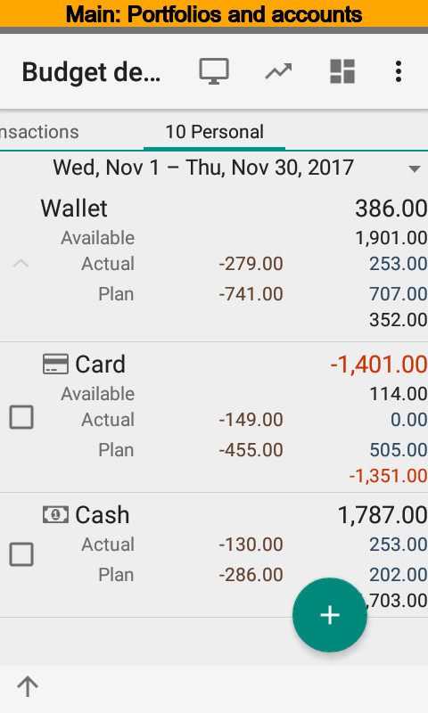
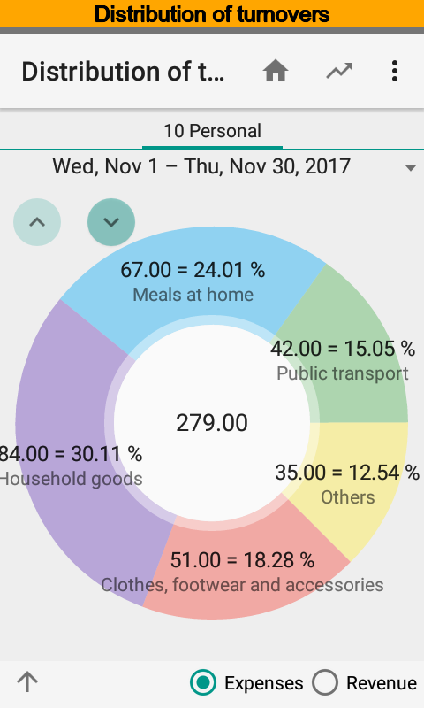
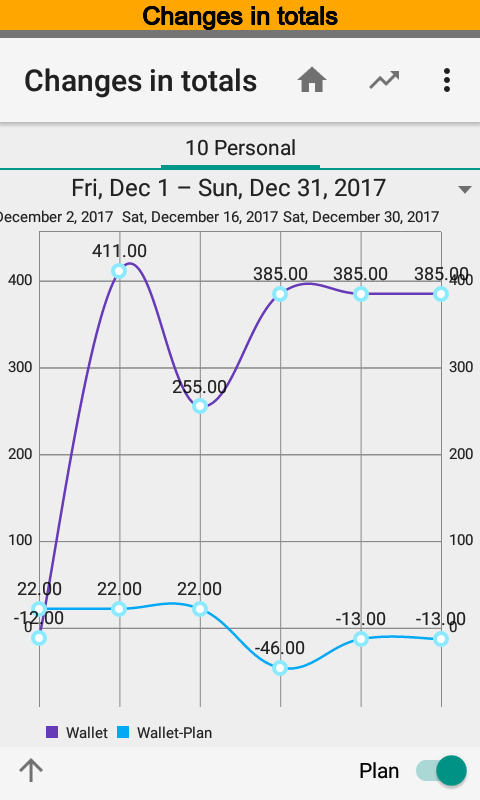

.. include:: termins.rst

=====
About
=====

|бб| is used for accounting and planning:

  * personal finances;
  * very small business finances;
  * small business finances.

------------
Key Features
------------

Combining the accounting of personal finances and finances of a company.

Comprehensive accounting of finances, i.e. categories, payers and payees, persons, projects are supported.

Automatic recognition of SMS and push notifications coming from financial institutions. Amounts, commissions, categories, projects, persons,
payers and payees detection, automatic balance adjustment, 160+ banks of different countries supported,
see. :ref:`chapter-supported-banks`.

Financial highlights on the main screen.

Smart default values for new transactions.

App widget acting as a customizable brief report.

Distributed teamwork with customizable access rights.

PC web browser driven client.

API for receiving transactions from other applications.

Various financial reports.

Reports driven notifications.

---------------------------------
Interesting Solutions Implemented
---------------------------------

Banks SMS and push notifications detection subsystem:

  *  Automatic category, payer and payee, person, project recognition;

  *  Convenient key phrases selection immediately from SMS and push notifications;

  *  Automatic calculation of rates for foreign transactions;

  *  Automatic detection of transfers between accounts;

  *  Option to create custom SMS and push notifications import tune in order to support new banks.

Reports subsystem:

  *  Simplified OLAP technology is used for reports;

  *  Drilldown feature supported;

  *  App widgets are used for brief reports;

  *  Shortcuts with predefined settings for reports.

  *  Reports driven notifications, access to the prepared report from notification.

Teamwork subsystem:

  *  Data exchange is used, no registration, no common database, each team member has own database.

  *  Flexible system of rights and data areas for exchange. You can synchronize transactions between team members for only one account, a project, and so on.

  *  Unlimited number of team members.

PC access subsystem:

  *  Windows, Linux, Mac, etc are supported by PC client. All you need is modern browser. Internet Explorer 8+, Google Chrome, Apple Safari, Mozilla Firefox, Opera supported.
