.. include:: termins.rst
.. _chapter_bulk_actions:

Bulk Actions
============

|bb| admits to make actions under the set of objects. For example you can change a category
in several transactions at once. Bulk actions are supported by any directories too.

Objects Selection
-----------------

In the example below you can see multiply selection at the transactions list. Same actions can be done in
any directory.

.. image:: images/bulkactions-010-transactions.png
  :width: 25%
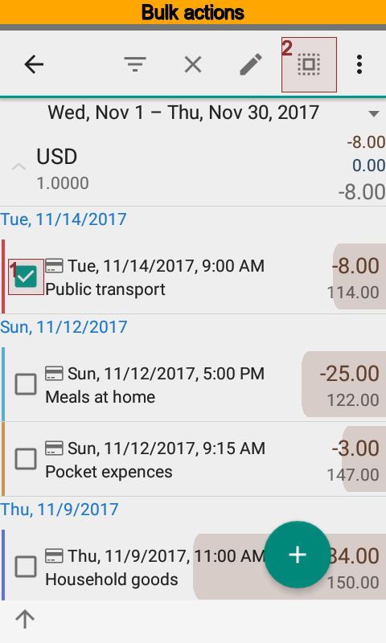
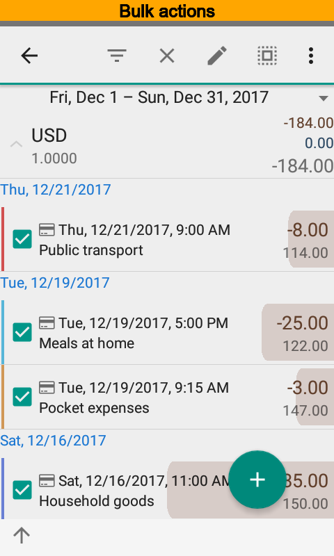

Open transactions list first of all. Then select required transactions.
To select all transactions just select one and press |button_select_all| from the top menu.

Editing
-------

Press |button_edit| button to edit selected transactions. You will see the dialog that
contains amount of objects and properties available to change. Modifications are applied
only for changed properties.

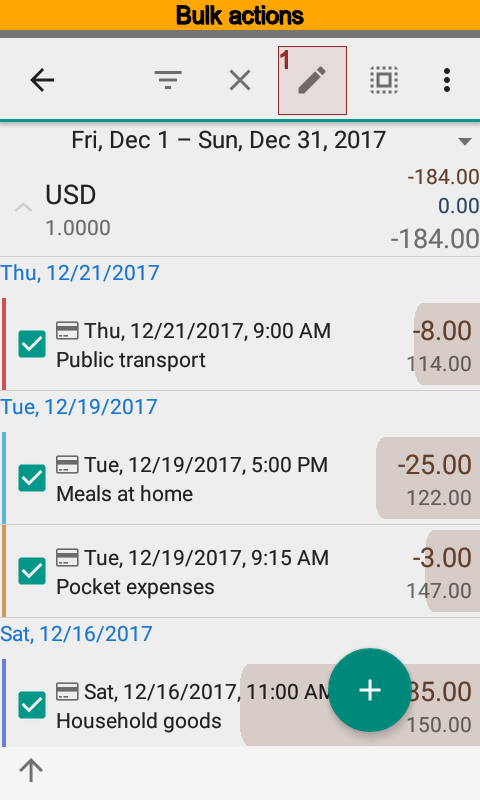
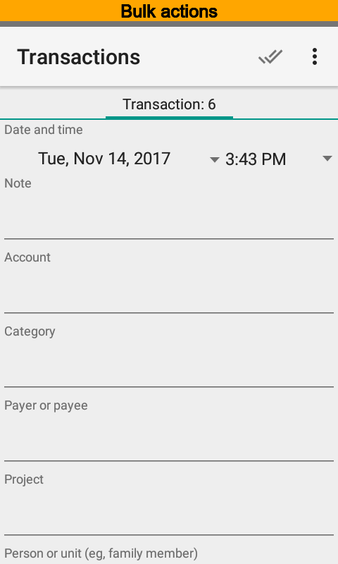

Deleting
--------

Press |button_delete| to delete selected transactions. Since confirmed the app will delete
selected items.

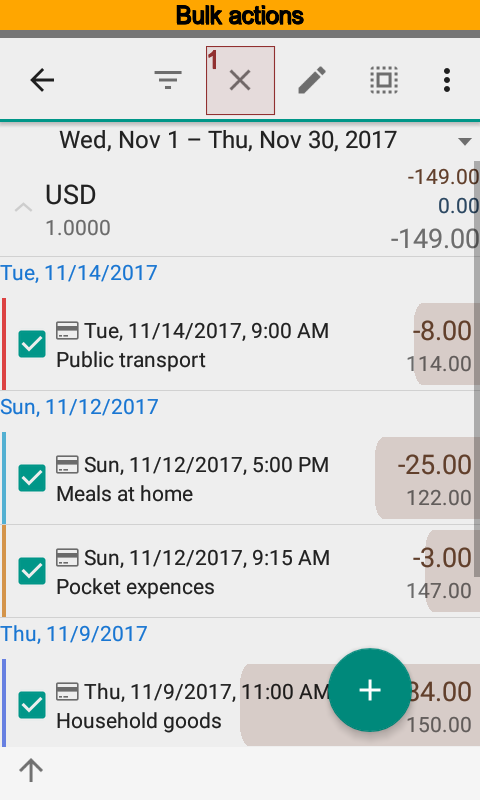
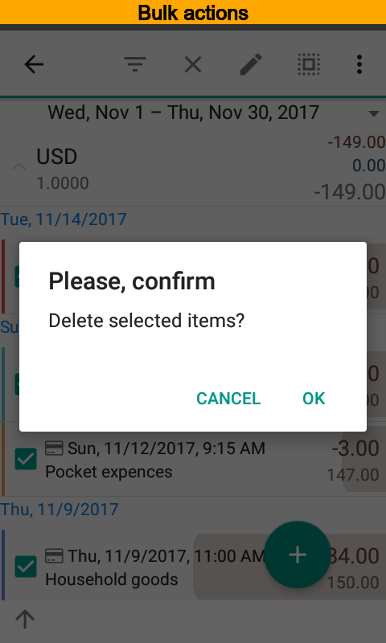

Filters
-------

You can make a filter based on selected items. It is convenient when you want, for example,
to see all transactions with the same dimensions as selected ones.

Press |button_filter| to make a filter.

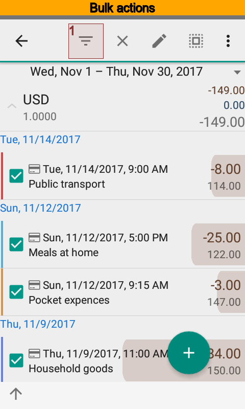
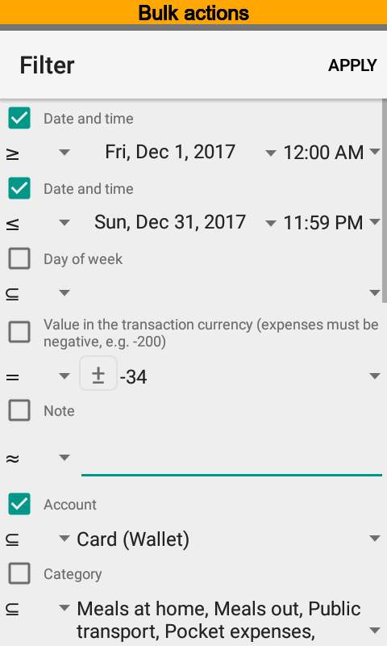

Repetitive Sending Under Teamwork
---------------------------------

Sometimes there would be a necessity to send transaction or directory item again when teamwork used.
Press |menu_send_on_exchange| menu item to do that.

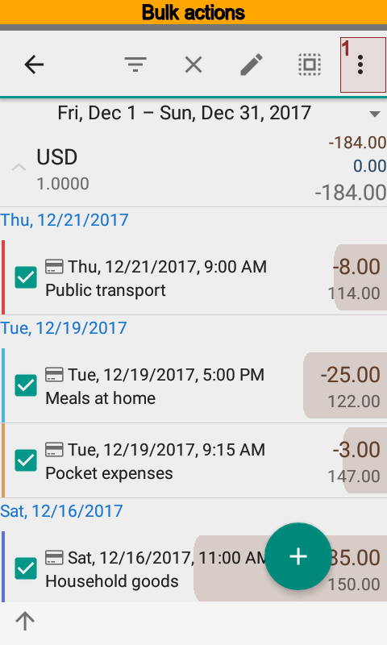
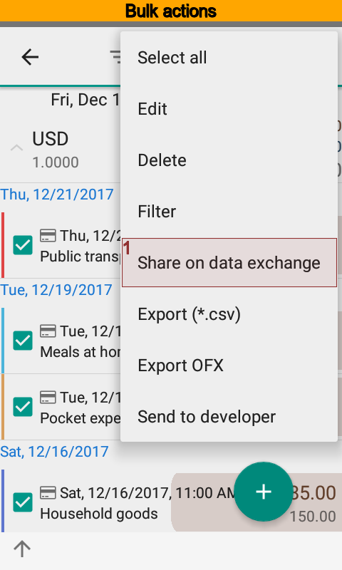
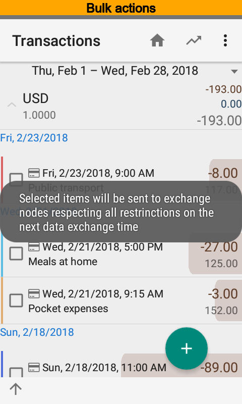

CSV and OFX Export
------------------

You can export selected transactions to CSV and OFX files. Press |menu_export_csv|
and |menu_export_ofx| to do that. In contrast to transactions directory items
can be exported to a CSV file only.

.. note:: Export transaction to an OFX file is available in the Pro version only.

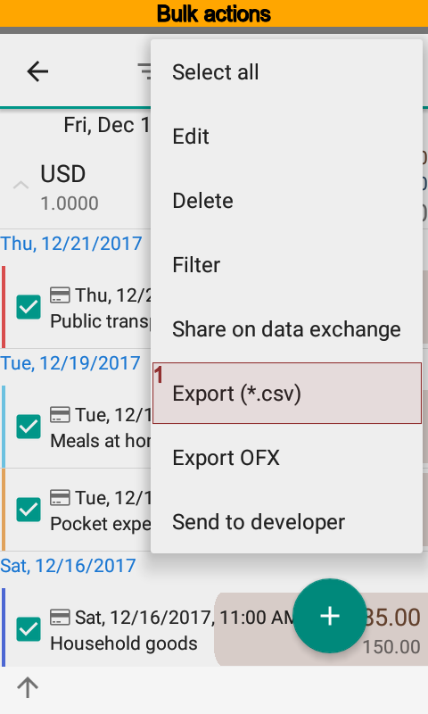
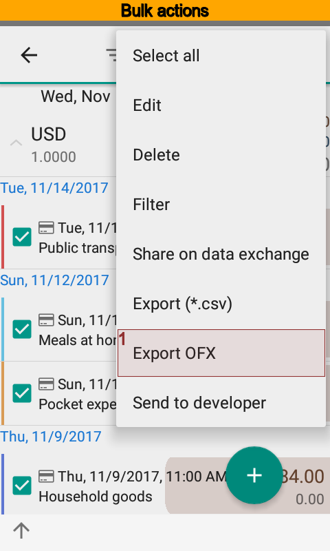
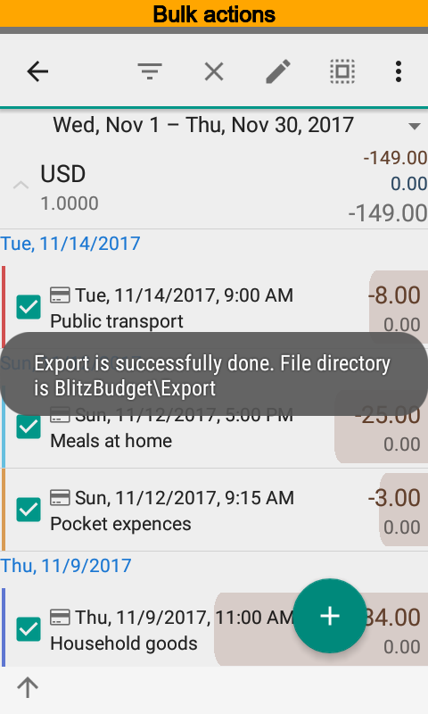

Sending Source Data to Developer
--------------------------------

Sometime you need a help to understand what is going on in the app. Usually in
order to get a help it is required to show source data to the developer.

Press |menu_sent_to_developer| menu item to send select objects. You will
see a letter before sending, so you will be able to edit some data.

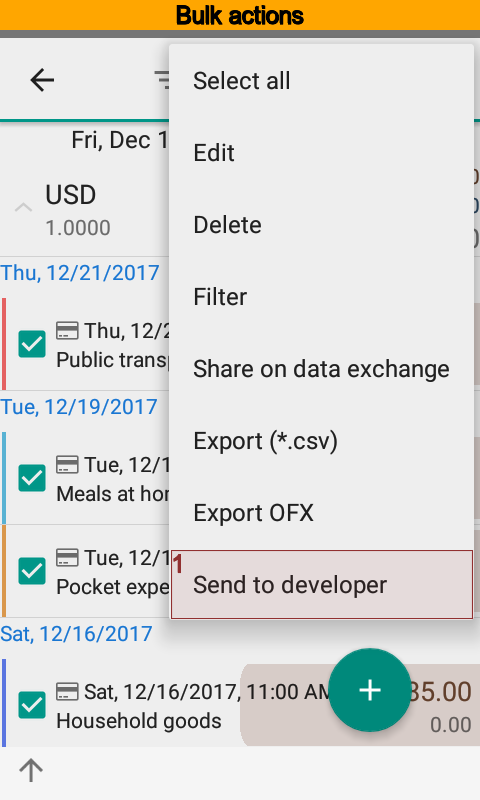
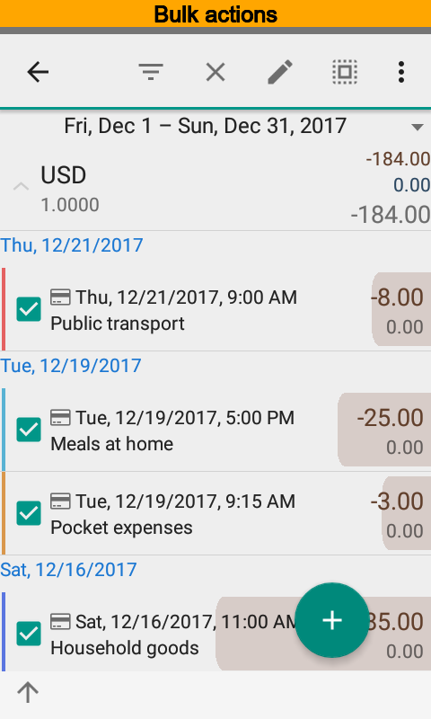
