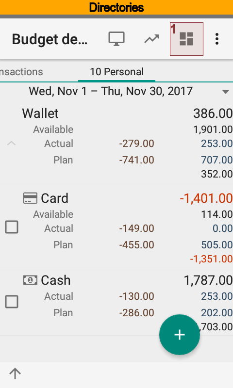
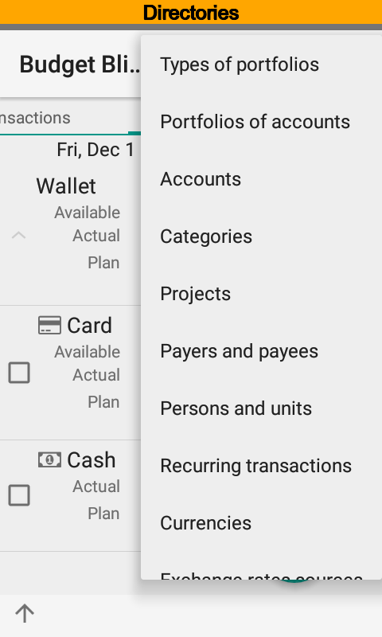
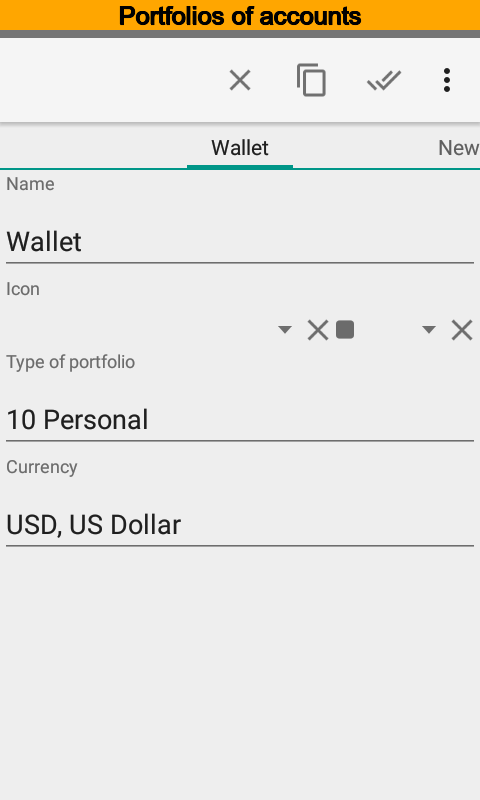
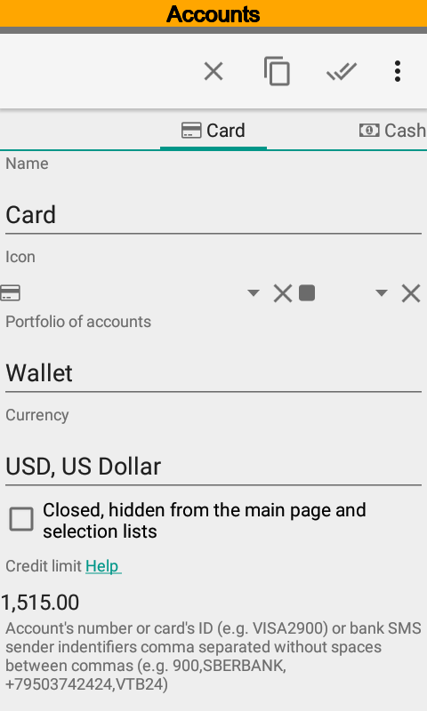
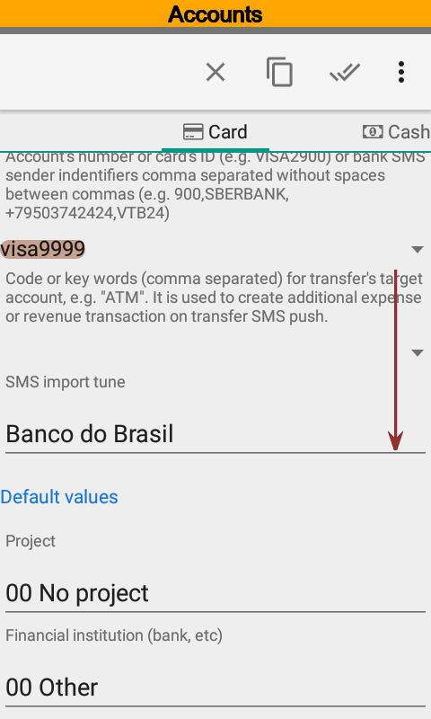
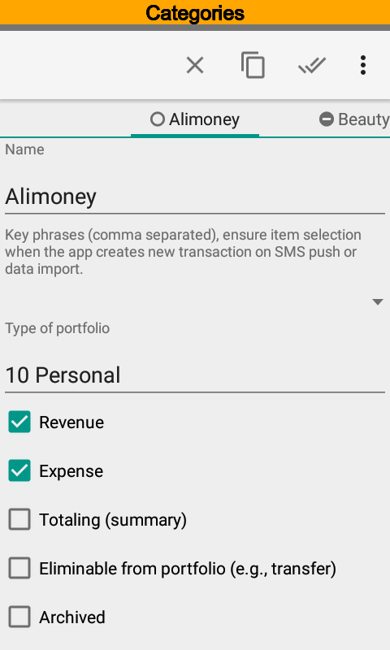
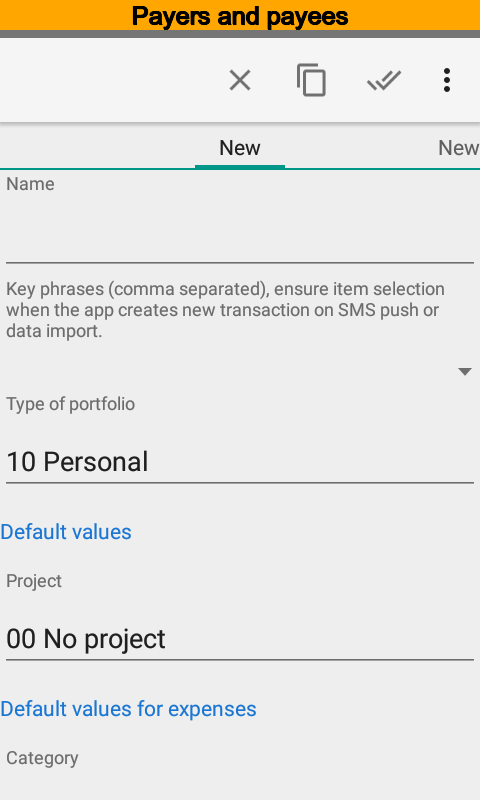
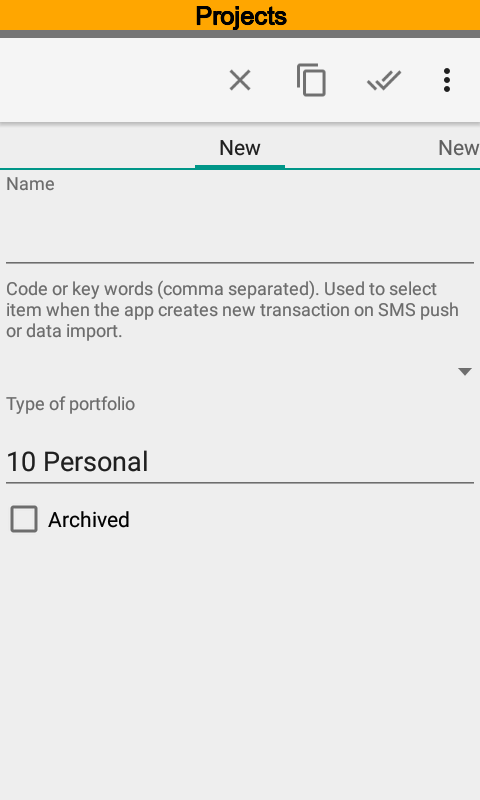
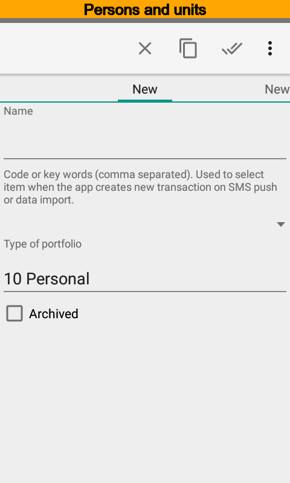
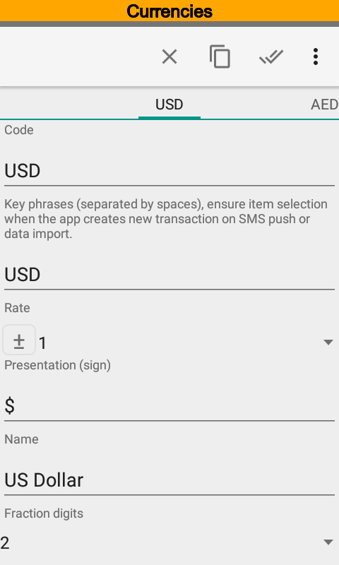

.. include:: termins.rst
.. _chapter_directories:

Справочники
===========

Любой справочник можно открыть из панели быстрых кнопок или меню Действия в зависимости от того,
какой экран открыт в данный момент

Типы портфелей
--------------

Типы портфелей служат для разделения аналитик между портфелями. Например для персонального портфеля
может использоваться один набор статей, а для малого бизнеса совсем другой.
Тип портфеля учитывается при подборе аналитик (статей, проектов, плательщиков, получателей, персон) в
момент редактирования операции.

Следует обратить внимание на портфель |item_universal|. В старых версиях этот портфель называется |item_category_empty|.
Аналитики этого портфеля доступны для использования в любом другом портфеле. Например, статья |item_category_transfer|
принадлежит портфелю |item_universal| и может быть выбрана в любой операции вне зависимости от выбранного счета и
связанного с ним типа портфеля.

.. note:: Аналитики портфеля |item_universal| доступны для всех счетов

Портфели
--------

Справочник Портфели служит для группировки счетов. Каждый портфель имеет свои валюту. Итоги и движения по портфелю
будут отображаться в указанной валюте исходя из курсов справочника Валюты.

Счета
-----

Счетом может быть банковский счет или карта, металлический счет,
наличные и пр. Каждый счет имеет свою валюту, которая может отличаться от валюты портфеля.

Идентификатор счета используется при импорте данных, см. :ref:`chapter_import`. Можно указать несколько
идентификаторов, разделенных запятой. Идентификатором может также служить телефонный номер, короткое имя отправителя SMS
или идентификатор пакета Push уведомлений.

Ключевые слова счета также используются при импорте SMS. В случае операций перевода счет, найденный по идентификатору
является отправителем, а счет найденный по ключевым словам --- получателем. Перевод может быть как положительным
(зачисление), так и отрицательным (списание). Ключевые слова используются только для переводов.

Например, от банка поступило SMS:
::

  Karta Visa2900. Proizvedeno snyatie 2000.00 RUR ATM .Ostatok:274.26 RUR. 25/03/14,15:00:00.

В этом случае Visa2900 является идентификатором счета Карта, ATM --- ключевой фразой счета Наличные. При импорте SMS приложение создаст
две операции --- операцию списания для счета Карта и операцию зачисления для счета Наличные.

Настройка импорта SMS определяет как именно будут распознаваться операции.
Подробнее о настройках импорта SMS см. :ref:`chapter_notifications`.

Значения по умолчанию, заданные для проектов, контрагентов и персон, будут использоваться при создании операций. При
импорте и обмене данными приложение также использует эти значения.

Статьи
------

Справочник Статьи является основным при классификации операций. Выбранная статья влияет на то, как будет учитываться
операция на главном экране, в отчетах и списке операций. В зависимости от признаков статья может быть доходной, расходной,
технической, переводной и архивной.

Признаки Доходная и Расходная влияют на сортировку статей при редактировании операции. Для доходный операций сначала
будут отображаться доходные операции, затем расходные и наоборот.

Статья может не быть ни доходной ни расходной. В этом случае статья считается технической. В качестве примера использования
технической статьи можно привести операцию изменения кредитного лимита на карте Сбербанка.
Движение денег для владельца карты в такой операции нет, но сумма на карте увеличивается или уменьшается.
Для такой операции следует выбрать техническую статью. Подробней  ввод кредитного лимита
рассмотрен в `вопросах и ответах (Как задать кредитный лимит)`_.

.. _`вопросах и ответах (Как задать кредитный лимит)`: http://qa.bbmoney.biz/ru/index.php?qa=93&qa_1=%D0%B7%D0%B0%D0%B4%D0%B0%D1%82%D1%8C-%D0%BA%D1%80%D0%B5%D0%B4%D0%B8%D1%82%D0%BD%D1%8B%D0%B9-%D0%BB%D0%B8%D0%BC%D0%B8%D1%82-%D0%BD%D0%BE%D0%B2%D0%BE%D0%B3%D0%BE-%D1%81%D1%87%D0%B5%D1%82%D0%B0-%D1%81%D1%87%D0%B5%D1%82%D0%B0-%D0%BA%D0%BE%D1%82%D0%BE%D1%80%D0%BE%D0%BC%D1%83-%D0%BE%D0%BF%D0%B5%D1%80%D0%B0%D1%86%D0%B8%D0%B8

По суммируемым статьям можно увидеть баланс в отчетах Долги и Исполнение плана.

Статья может иметь признак исключаемой из портфеля. Такие статьи обычно используются в операциях,
которые не изменяют остатка внутри портфеля. Если у статьи установлен такой признак,
то все движения по этой статье не будут влиять на сумму движений денежных средств за период.
В списке операций итоги по таким статьям выводятся отдельно.

Ключевые фразы используются для подбора при импорте данных. Можно указать несколько ключевых фраз, разделенных запятой,

В операции может быть указано несколько статей.

Справочник автоматически заполняется при установке приложения, однако Вы можете отредактировать его на свой вкус.

Плательщики и получатели
------------------------

Под плательщиками и получателями в программе понимается вторая сторона в денежной операции. Часто это сторону называют
контрагентом. Без контрагента операции не может быть (за исключением перевода между своими счетами). В операции может быть
указан только один контрагент.

Проекты
-------

Проектом может быть, например, отпуск, строительство дома, стартап и т.п. В операции может быть указано несколько проектов.

Ключевые фразы используются для подбора при импорте данных. Можно указать несколько ключевых фраз, разделенных запятой.

Персоны
-------

В справочник Персоны можно указать членов семьи или сотрудников предприятия. В операции может быть указано несколько персон.

Ключевые фразы используются для подбора при импорте данных. Можно указать несколько ключевых фраз, разделенных запятой.

Валюты
------

Сразу после установки приложение содержит практически все мировые валюты. При необходимости, Вы можете добавить в справочник новую валюту.

Итоговые значения в разрезе портфелей рассчитываются согласно курсам валют. Курсы валют можно указывать вручную или
загружать из интернет-источников. В зависимости от настроек курсы валют загружаются из следующих источников:
Центральный Банк РФ (валюты и драг. металлы), Центральный Европейский Банк, банк Канады, Национальный Банк Республики Беларусь,
Национальный Банк Республики Казахстан, банк Израиля, BitPay (котировки валют относительно BTC), Poloniex (биржа крипто-валют).
