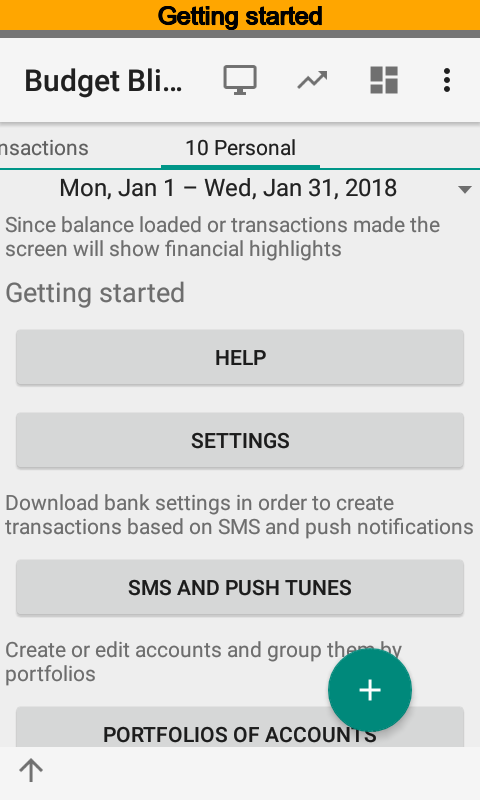
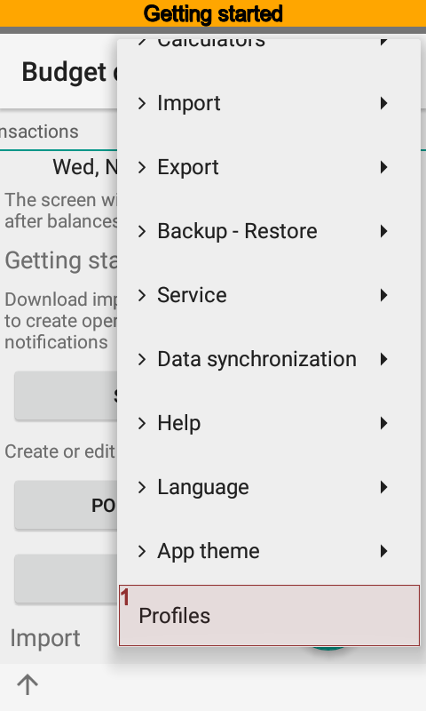
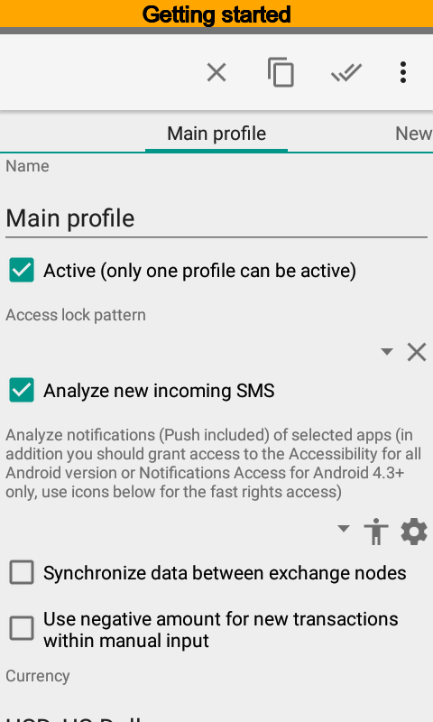
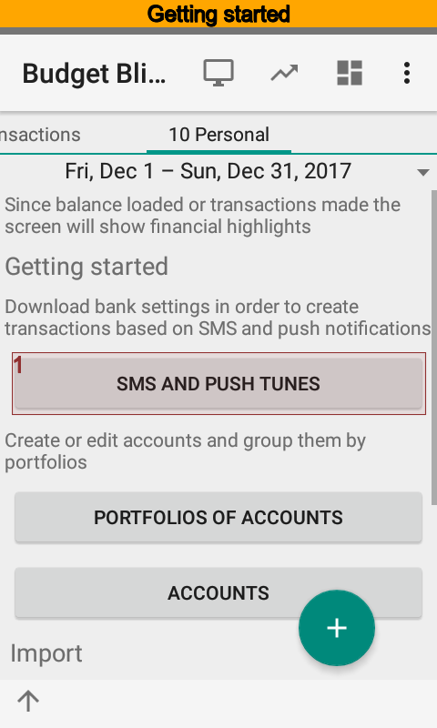
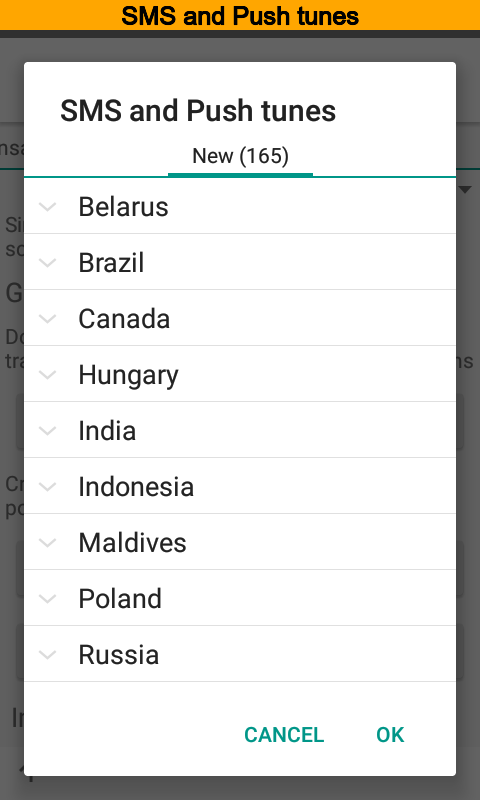
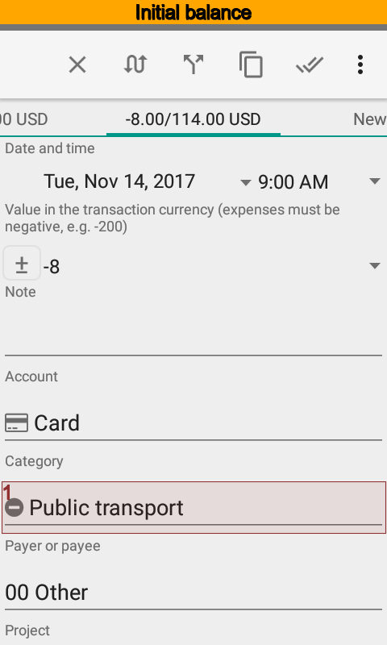
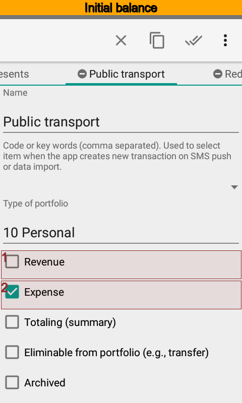
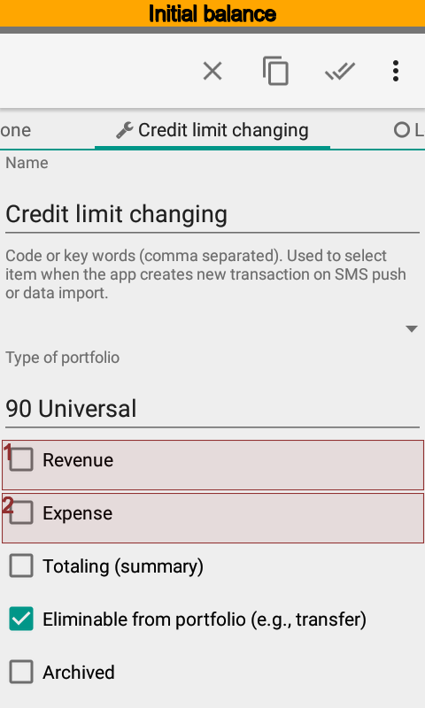

.. include:: termins.rst

Getting Started
===============

In this chapter it is suggested the certain sequence of actions for setting up the application.
If you don't like that, you don't have to.  Just remember, any option you like, you can change later.

Basic Customization
-------------------

Edit basic settings after the first start of |бб|. 

Here you can:

- set a secret key pattern to restrict app access;
- set SMS and push notifications parser on or off;
- set synchronization between devices on or off;
- set default money amount sign for new transactions;
- set main currency and a source for foreign exchange rates;
- set up automatic backups;
- set upcoming payment notifications on or off;
- set ring tones when transactions created on SMS and push notifications coming.

While basic settings are ready you can go deeper. Next steps you can see on the main screen.

Loading Bank Settings
---------------------

This section is intended for users who plan to use automatic creation of transactions on SMS or push notifications arrived
from bank or payment systems or other installed apps.

Requirements for automatic transactions creation on SMS push:

#. the option should be on, see menu |menu_actions_profile|;
#. the app should have access to SMS (Android 6+).

Requirements for automatic transactions creation on notification push (use menu |menu_actions_profile|):

#. you should select packages to import push notifications:
#. you should grant access rights to the app.

Press the button |button_sms_import_settings| to load setting for your bank or payment system. Hereafter
to do that use menu |menu_actions_import_sms_import_settings| or directory
|meta_dir_sms_import_tunes|.

Portfolio and Account Settings
------------------------------

Once installed the app has three portfolio types |item_personal|, |item_small_business|, |item_universal|,
one personal portfolio |item_wallet|, two accounts |item_card|, |item_cash| and default list of categories.

Values to show depend on the portfolio type of the transaction.  For example,
one categories list is used for personal finances and another for a small business finances.
But nevertheless there are some common categories. Universal type of the portfolio is used
for this values. Universal values shown regardless portfolio type of the transaction.

A portfolio is like a group of accounts. On the main screen the app groups accounts by portfolios and
calculates financial highlights.

Make the required amount of portfolios and accounts. See :ref:`chapter-account-identities` to use automatic transactions creation
via SMS or push notifications.

Now you can import SMS or import initial transactions from |csv| and |ofx| or just enter initial balance.
Once you have at least one transaction the main screen will show a summary and buttons will disappear.

Initial Data Import
-------------------

First of all check account settings according chapter :ref:`chapter-account-identities`. Then press |button_sms_import_items|
in the |section_import| section or select the menu |menu_actions_import_sms_import_items|, select an account
and then import notifications. See more details in the chapter :ref:`chapter_import` and `questions and answers`_.

.. _`questions and answers`: http://qa.bbmoney.biz/en/index.php?qa=3&qa_1=manual-sms-import

Also you can import initial transactions from |csv| and |ofx| file. Check and edit CSV file before import according to chapter :ref:`chapter_import`.
You have no need to modify OFX file before import.

Entering Initial Balance and Credit Limit
-----------------------------------------

You can enter initial account balance via transaction. The date of transaction can be arbitrary but it is
highly preferred to make transaction first in the transactions list.
Another important thing is to use category |item_category_initial_balance| for that transaction.

As well as initial balance you can enter a credit limit via transaction too. It is preferred that the transaction date coincide with the date of setting the limit by the bank.
Use |item_category_credit_limit| category. Please pay attention that it is a technical category with
|property_category_income| and |property_category_outcome| set off. You can see more details about such approach reasons
at `questions and answers (How to setup credit limit for new or existed account)`_.

.. _`questions and answers (How to setup credit limit for new or existed account)`: http://qa.bbmoney.biz/en/index.php?qa=27&qa_1=how-to-setup-credit-limit-for-new-or-existed-account

.. image:: images/initialbalance-040-credit-limit-transaction.png
  :width: 25%

It would be better to enter each debt or credit with two transactions. For example you have a loan of 1000 |c|. So you should

#. make a positive transaction with amount of 1000 |c| using category |item_category_credit| and a real contractor or person.
#. make a negative transaction with amount of 1000 |c| using category |item_category_empty| or real one if known.

As result the balance is equal zero, but |meta_report_debts| report will show the value of your loan.
