.. include:: termins.rst
.. _chapter_import:

Data Import
===========

Notification Import Tunes
-------------------------

Notification import tunes have the main role in the notifications import. Once
financial institution changes notification structure the import tunes should be changed too.
For that case you can download update or modify tunes by yourself, see chapter :ref:`chapter_notifications`.

.. image:: images/updateimporttunes-010-select-actions.png
  :width: 25%
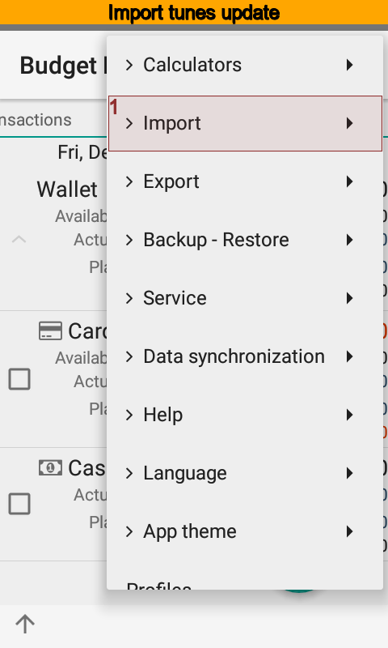
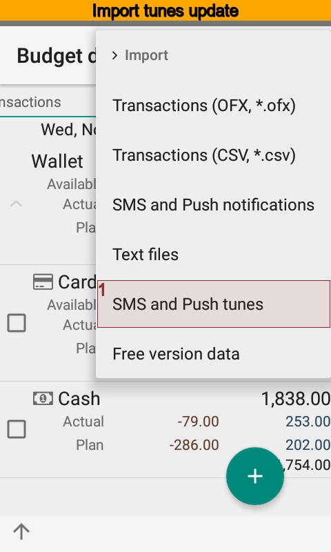

Select menu item |menu_actions_import_sms_import_settings| to get updates.

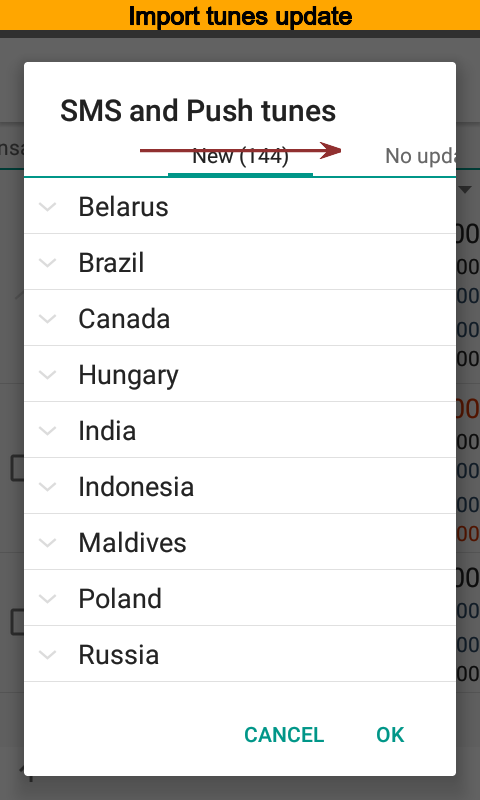
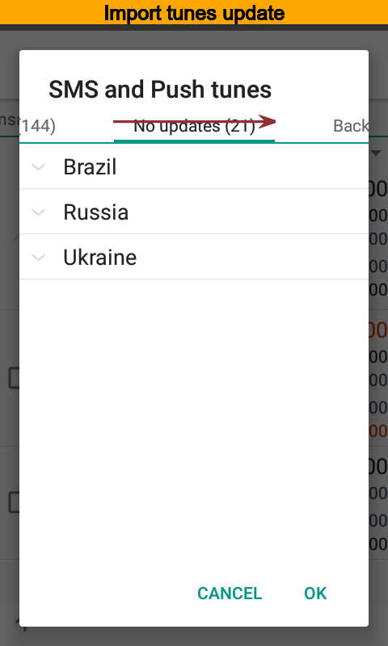
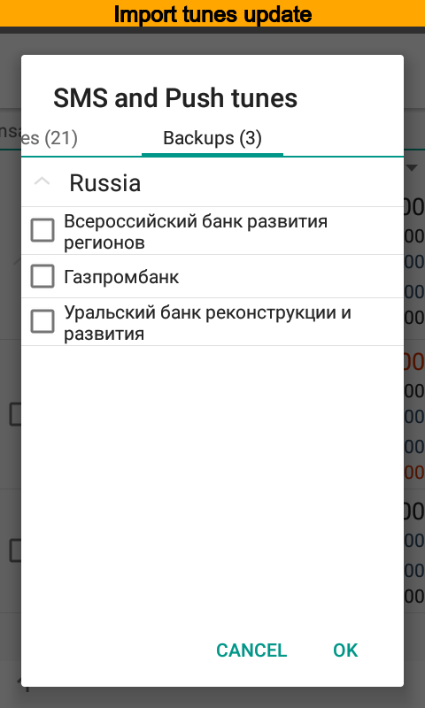

The app will show available update, also it is possible to download new ones here.

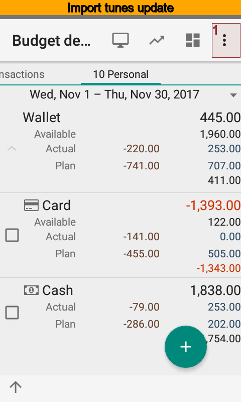
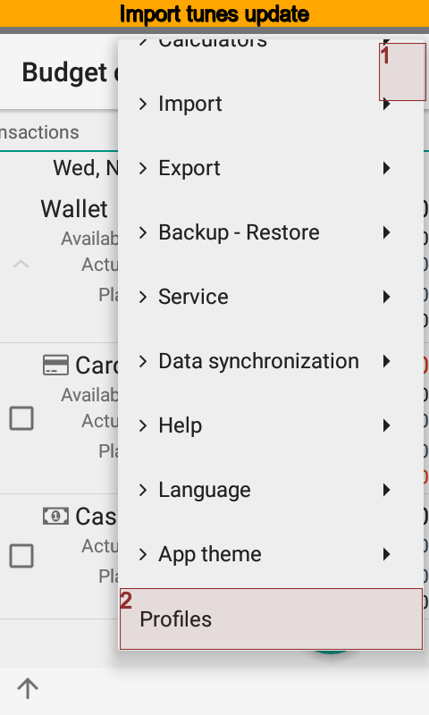
.. image:: images/updateimporttunes-085-select-notifications.png
  :width: 25%

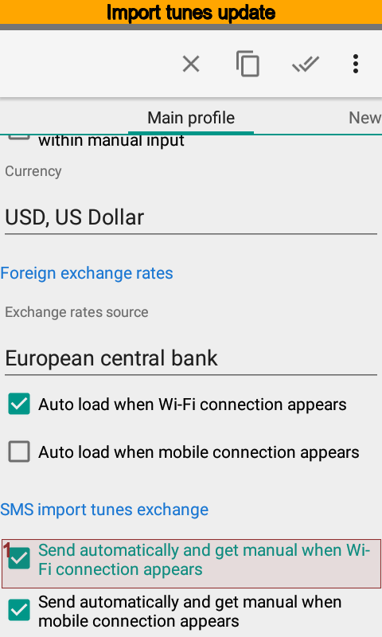

But may be you will see nothing. Check the import tunes exchange is on at settings.

SMS and Push Notifications
--------------------------

The app |bb| imports SMS and push notifications by default. But it is possible to import
certain notification by hands. To do that

#. Open the import dialog.
#. Select a required account. The account should have the identity and the import tune.
#. Select required notifications.
#. Press |button_import| button.
#. Check transactions list for the result.
#. Use event log to view issues.

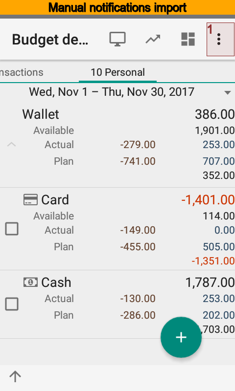
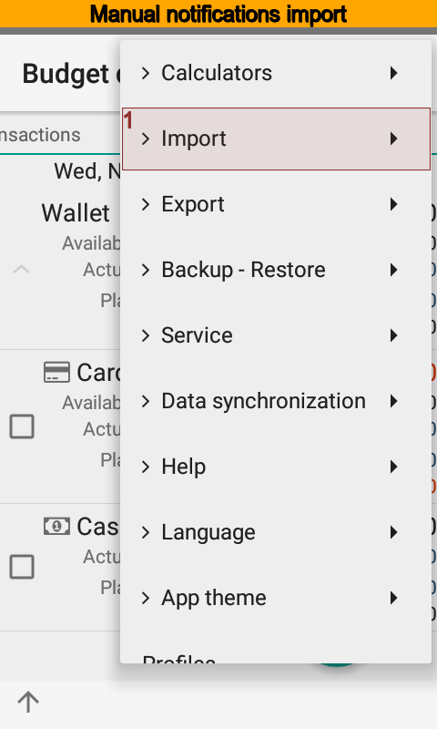
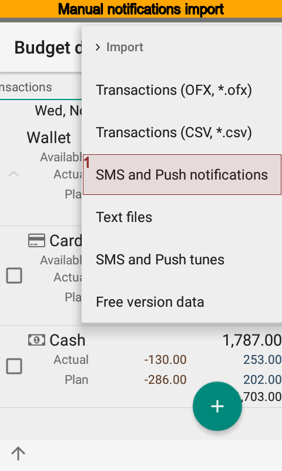

.. image:: images/manualsmsimport-040-select-account.png
  :width: 25%
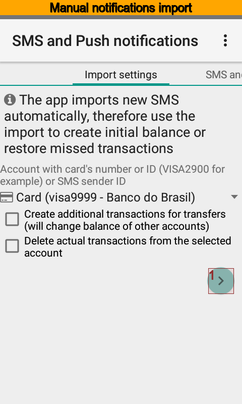
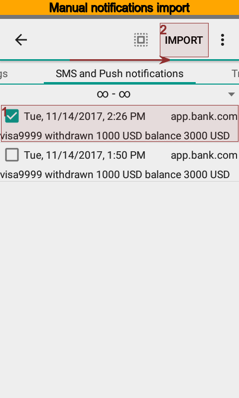

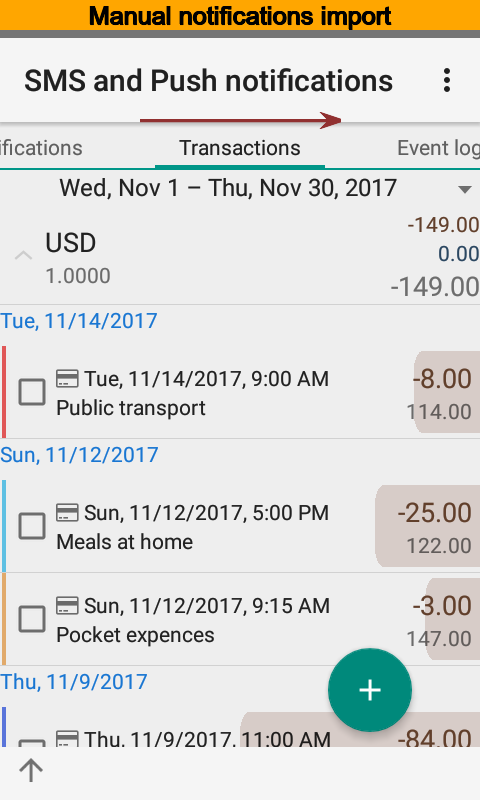
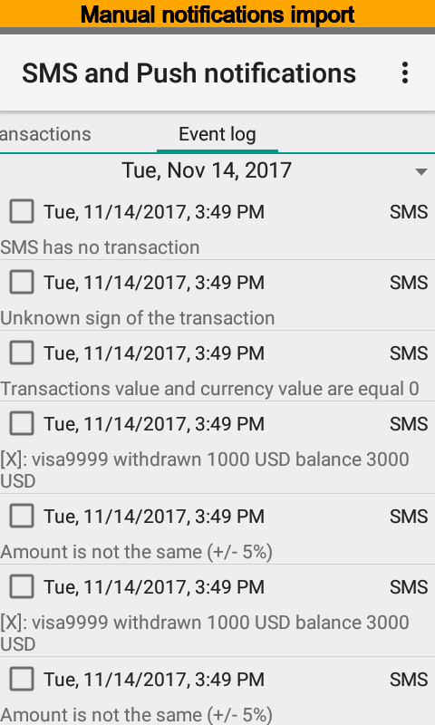

CSV files
---------

During |csv| file import the app can create new accounts, categories, payers or payees,
projects, and persons. It depends on your choice.

The column separator can be one of  ";", ",", "|", "/", "\". File must be UTF-8 encoded.

The first row of the file must have column names, case does not matter.
Since column names are placed at another row they are valid for next rows.

.. list-table:: CSV file format
   :widths: 7 5 30
   :header-rows: 1

   * - Names
     - Mandatory
     - Comment
   * - id
     - No
     - Transaction identity, the app will search existed transaction if not empty.
   * - account,incomeAccountName, Income account
     - Yes
     - Name, number, or identity of the account
   * - date
     - No
     - Date of the transaction, supported formats: "dd'd'MM'd'yyyy" (for example, 01d01d2017), "yyyy'd'MM'd'dd" (for example, 2017d01d01), "yyyyMMddHHmmss", "yyyyMMddHHmm", "yyyyMMdd", "yyyy-MM-dd HH:mm:ss", "yyyy-MM-dd HH:mm", "yyyy-MM-dd", "dd-MM-yyyy HH:mm:ss", "dd-MM-yyyy HH:mm", "dd-MM-yyyy", "dd.MM.yyyy HH:mm:ss", "dd.MM.yyyy HH:mm", "dd.MM.yyyy"
   * - time
     - No
     - Time of the transaction, supported formats: "HH:mm:ss", "HH:mm", "HHmmss", "HHmm"
   * - amount,income, Income amount
     - Yes
     - Transaction amount, can have a currency and digits delimiters, fixed point should be point or comma, can be an amount in the transaction currency or an amount in the account currency
   * - original amount
     - No
     - Amount in the currency of the transaction, if specified, the rate of the transaction is calculated automatically
   * - rate, exchange rate
     - No
     - Transaction rate
   * - currency,incomeCurrencyShorttitle
     - No
     - Transaction currency or account currency, if not specified, is used in the currency of the account
   * - original currency
     - No
     - Transaction currency
   * - payer, payee, contractor
     - No
     - Name of the contractor, the app will analyze current row keywords when empty
   * - category, categoryName
     - No
     - Name of the category, the app will analyze current row keywords when empty
   * - project
     - No
     - Name of the project, the app will analyze current row keywords when empty
   * - person, unit
     - No
     - Name of the person, the app will analyze current row keywords when empty
   * - location, place
     - No
     - Name of the location, the app will analyze current row keywords when empty
   * - notes, note
     - No
     - Note
   * - planned, plan
     - No
     - Actual (0) or planned (1), default value is 0
   * - detail, split
     - No
     - Transaction (0) or detail of transaction (1). default value is 0
   * - X
     - X
     - Second transaction from the single line
   * - outcomeAccountName, Expense account
     - Yes
     - Account
   * - outcome, Expense amoun
     - Yes
     - Amount
   * - outcomeCurrencyShorttitle
     - No
     - Currency

The row is canceled when mandatory columns are empty.

If the row contains not all mandatory columns, but amount column is not empty, then app creates split transaction. This is like column detail contains value 1.

To start the import

#. Open the import dialog.
#. Select a file.
#. Press |button_next| and select required rows.
#. Press |button_import| button.
#. Check transactions list for the result.
#. Use event log to view issues.

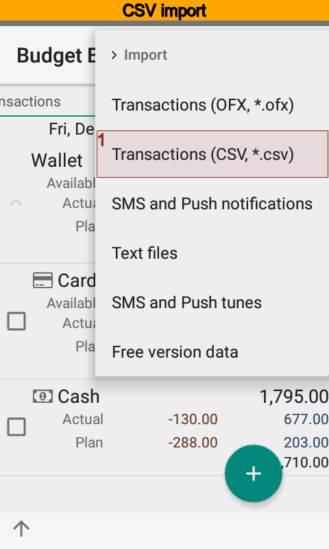
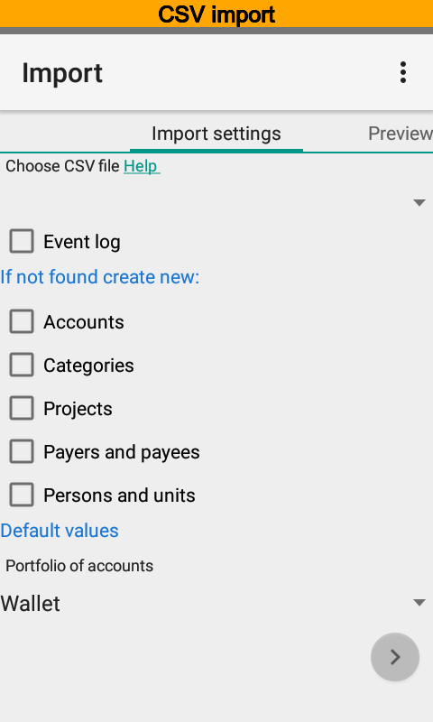

OFX files
---------

|бб| supports import of |OFX| files meet specification starting from 2.1.1.

#. Open the import dialog.
#. Select a file.
#. Press |button_next| and select required rows.
#. Press |button_import| button.
#. Check transactions list for the result.
#. Use event log to view issues.

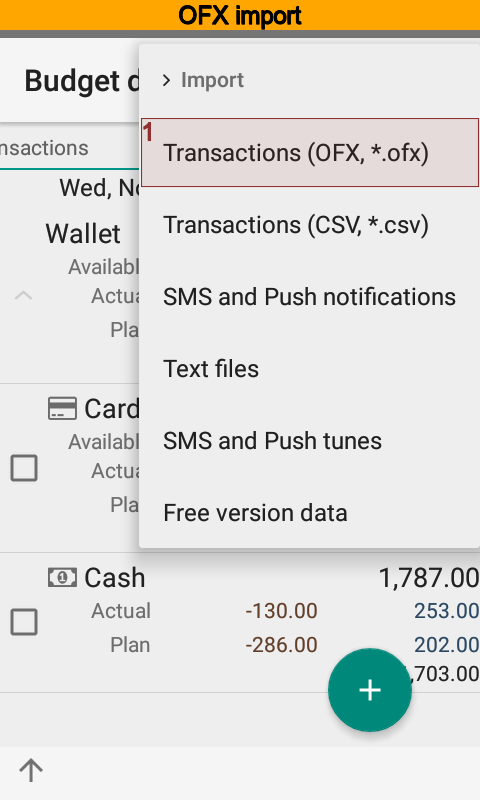
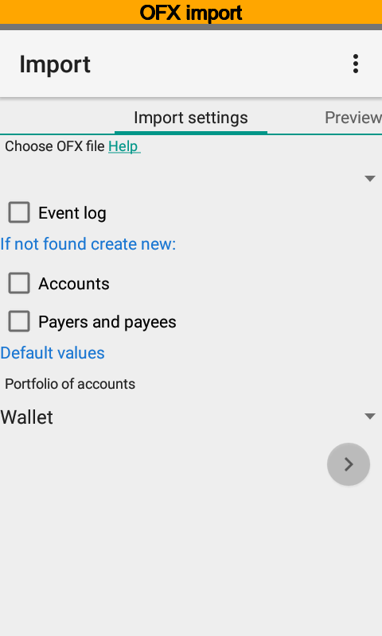

Electronic receipts
-------------------

|бб| supports electronic receipts import. Now available import for Russia and Ukraine. You can request more formats by email.

To import from other apps:

#. Open specific app.
#. Select receipt, link or text data and push Share / Send / Transmit button or some thing like that.
#. Select |бб| as receiver.
#. Follow instructions on a screen.

To import from the clipboard:

#. Open import dialog.
#. Paste data from the clipboard.
#. Follow instructions on a screen.

Use events log to identify errors.
