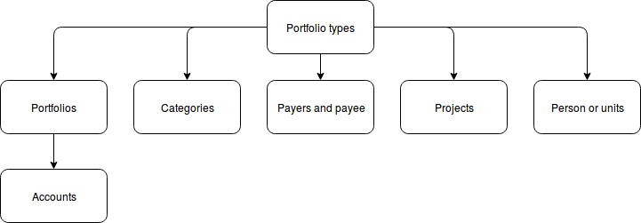

.. include:: termins.rst

How It Works
============

Funds Accounting
----------------

|бб| uses transactions to store all movement of funds. Each transaction has
four dimensions category, project, payer or payee, and person. Transactions can be
actual or planned and onetime or recurring. Recurring transactions have own customizable frequency. Generally
this ones are planned but it is possible to make actual recurring transactions too.

Any transaction can be split for details. These transactions are called split, see. :term:`split`.

Directories Structure
---------------------

Each transaction has own account. It can be account of a financial institution, or e-money account, or cash,
or something else. Each transaction has own currency that may be differ from account currency.

In its turn each account belongs to a portfolio. Each portfolio has own currency that may be differ from account currency also.

But that's not all. Portfolios have a type. It may be considered as a kind of activity. You will have only one
personal type of portfolio for personal finances. But when you a have a business then personal and
business portfolio types will be in use. For some special cases more than two portfolio types can be used.

Category, project, payer or payee, and person connected to the portfolio type. It is not really
complex as you can see on the chart below:

.. note:: You can edit any directory. For example, add a currency, a category or something else. There are no restrictions!

Difference Between Contractors and Persons
------------------------------------------

Contrary part of transaction is payer or payee. This is often called a contractor. Only transfer transactions
have no contractor. All other transactions have. For example your child is contractor
when you give him or her some money. So you should put him or her to the |meta_dir_contractors| directory.

Persons are transaction details as well as categories and projects. For a example a shop is the contractor
and your child is the person when you buy clothes to your child.

There is an option to connect contractor and person. To do so just define a person in a card
of contractor. After that the person will be selected within the contractor. For instance, in order
to combine both examples above, you should consider the child as the contractor and the person at the same time.

As the result, you will see total child expenses using a person filter and total
money delivered to the child using a contractor filter.
