.. include:: termins.rst
.. _chapter_main_screen:

Main Screen
===========

Description
-----------

Main screen of |бб| contains portfolios and accounts financial highlights. The app shows
as much highlights as you have portfolio types. Examples below have only one |item_personal| portfolio type.

Financial highlight has totals of each account and portfolio. Available amount is shown when account
has a credit limit.

Actual and planned amounts of revenues and expenses are placed below totals. Also a transfer amount is shown
if exists in the current time range.

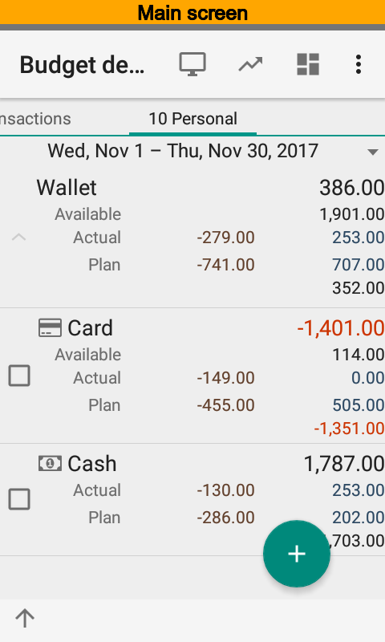
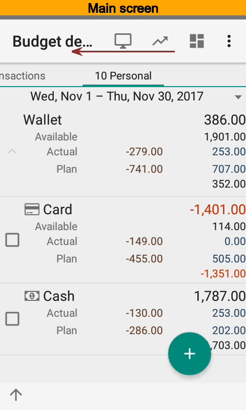
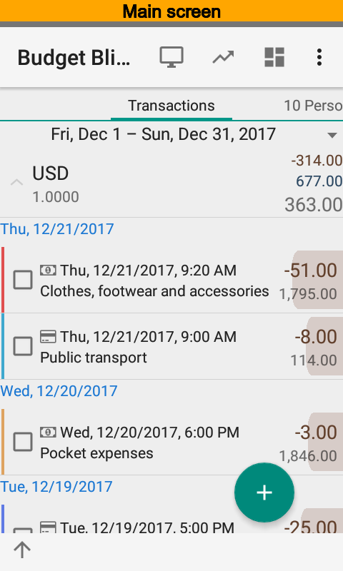

The list of all transactions according the current time range is shown at the left of summary.

Time Range Selection
--------------------

Time range editor is placed at the top of screen. Editor supports swipe and select gestures.

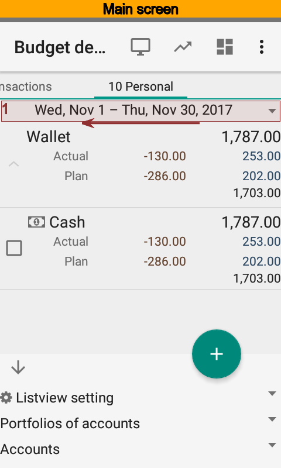
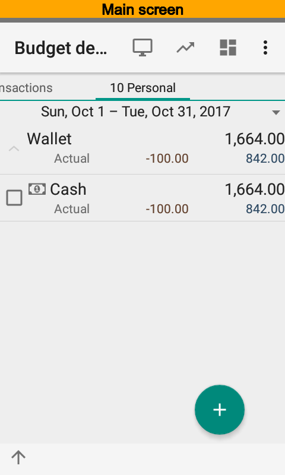
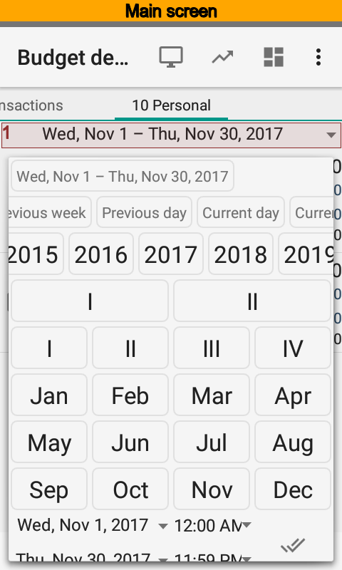

List View Settings
------------------

List view settings is placed at the bottom of screen. You can change default grouping,
edit filter, and change time range. Using filter you can setup a portfolio, account,
currency restriction, and put plan on or off.

At the pictures below you can see how to set up account filter.

.. image:: images/mainscreen-020-main-screen-bottom-sheet-opening.png
  :width: 25%
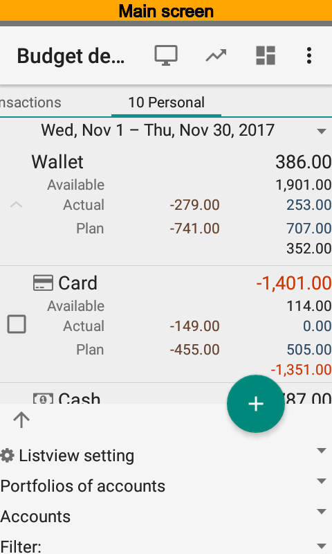
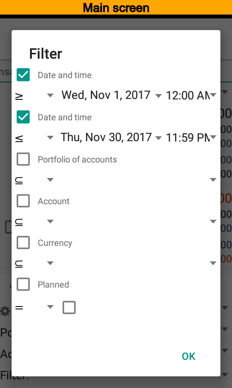

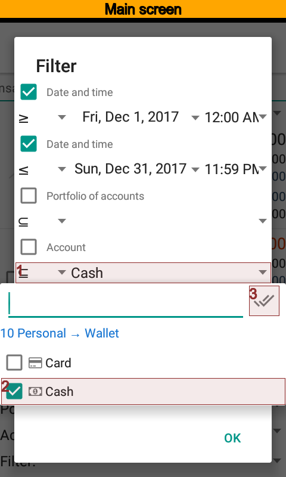
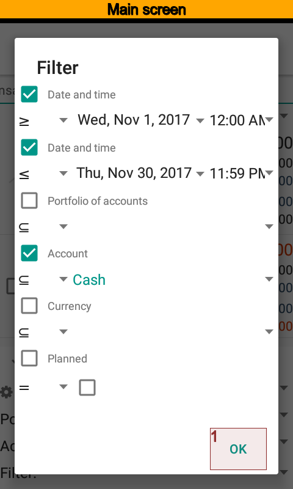
.. image:: images/mainscreen-065-main-screen-filter-applied.png
  :width: 25%

Now the main screen has only one |item_cash| account.

Saving List View Settings
-------------------------

You can save modified list view settings in order to use them in the future. Select
|spinner_list_view_settings| and create new setting. Filters will be copied to the new setting.
So, you need to put a name of the setting, for example, |value_summary_one_account|, and
press |button_save|.

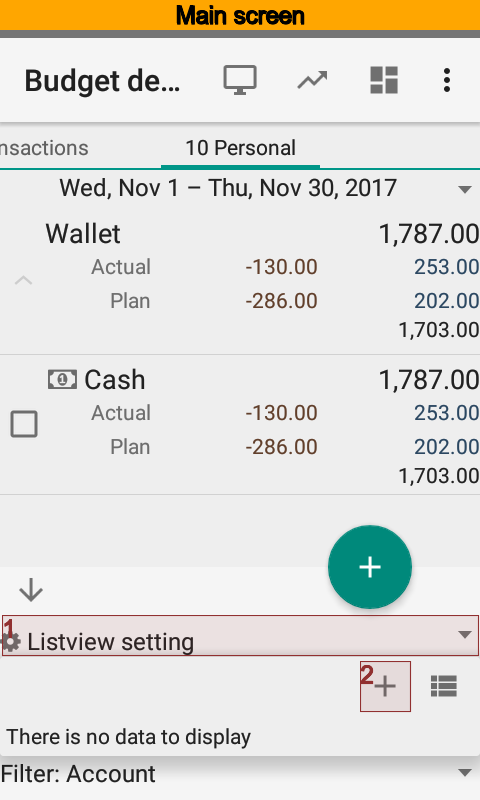
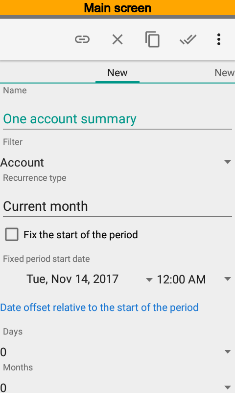

It is possible to have several settings. The app will use last setting for the main screen
after run.
