.. include:: termins.rst
.. _chapter_reports:

Reports
=======

The top menu is the place where reports are available. Each report has the options to filter,
grouping and saving of settings. Use the bottom sheet to manage a report.
When you open a report from the transactions list or another report filter inherits.

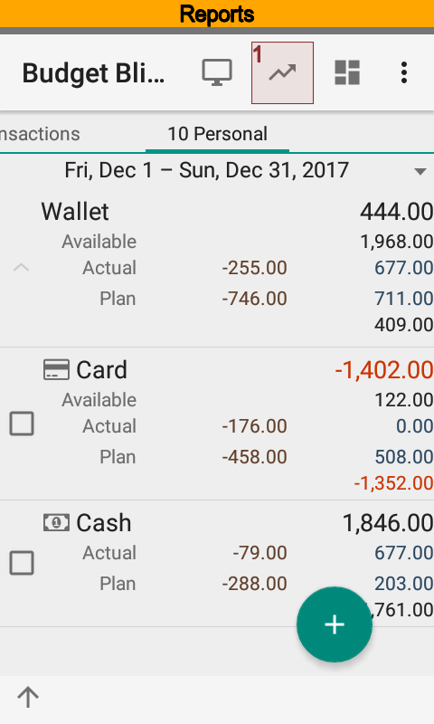
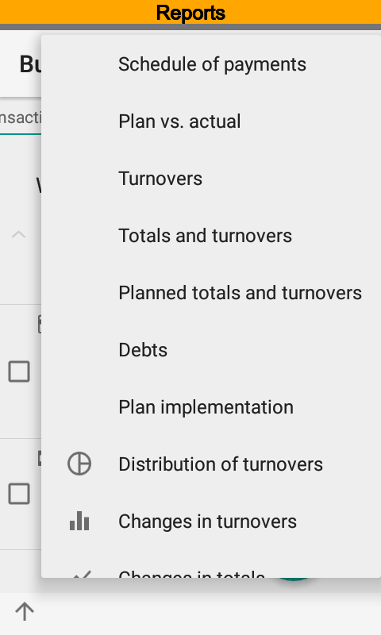
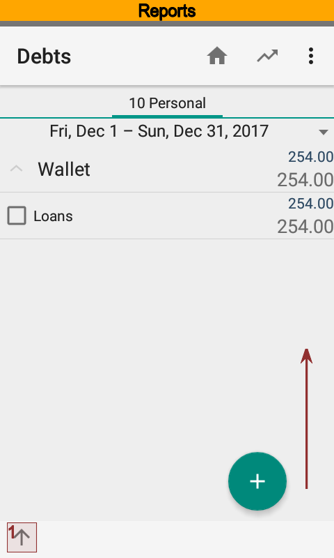

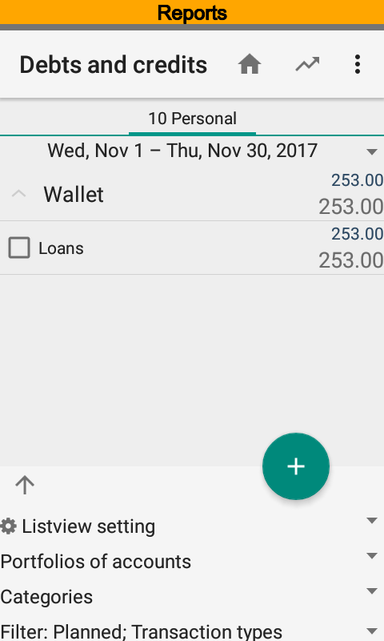
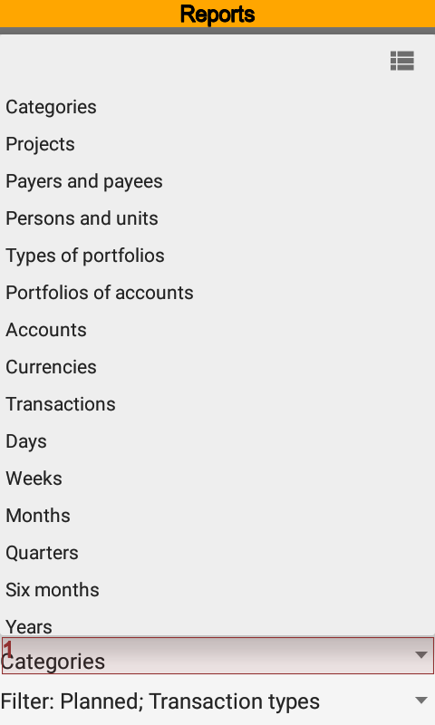

You can always drill down from row of report to look at source transactions.

Also it is possible to make shortcuts for having fast access to a report with predefined settings.
Once you have created shortcuts, they are available from the Android launcher screens.

Payment Schedule
----------------

The report is intended to display upcoming payments planning. The schedule contains planned and actual transactions
of the current time range. Hence, you can see not only planned but remunerated transactions as well.

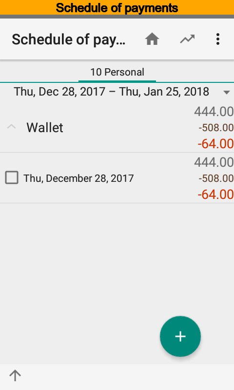
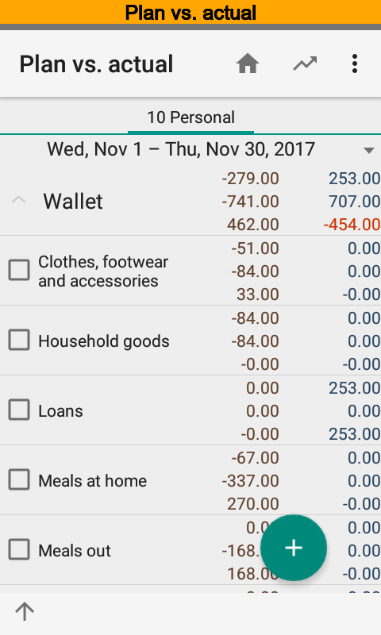
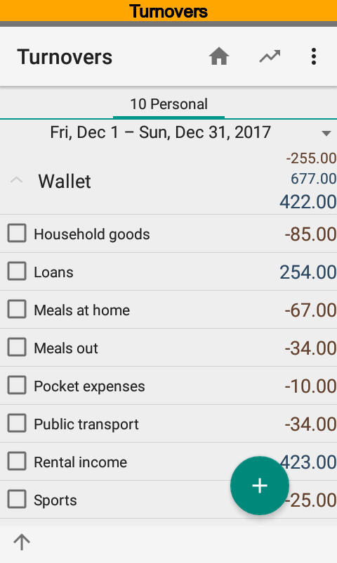

Plan vs. Actual
---------------

.. описательная часть отличается от оригинала, т.к. из-за отличий в сортировке
.. отчетов невозможно сделать одинаковые скриншоты

The report is intended to show deviations between planned and actual transactions of the current time range.
Top row is an actuals and next row is a plan. For example, you can see that there is unplanned credit
transaction under |item_category_credit| category, and planned amount
under |item_category_clothes| category is remunerated.

You can get the report grouped by dimensions and periods as well.

Turnovers
---------

The report is intended to analyze aggregated turnovers of the current time range.
For example, you can see that there are a credit transaction under |item_category_credit| category,
debit transaction under |item_category_pocket_expenses| one, and so on.

The report is able to show actual and planned transaction as well. The report displays actual transactions
by default.

Totals and Turnovers
--------------------

The report is intended to analyze opening, closing balances and aggregated turnovers of the current time range.
The report is based on actual transactions only.

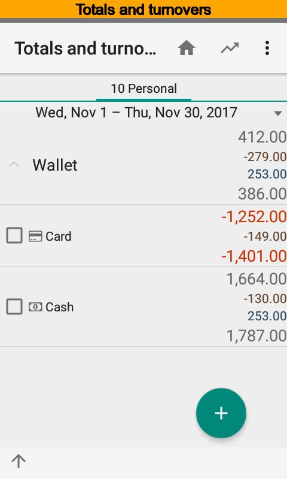
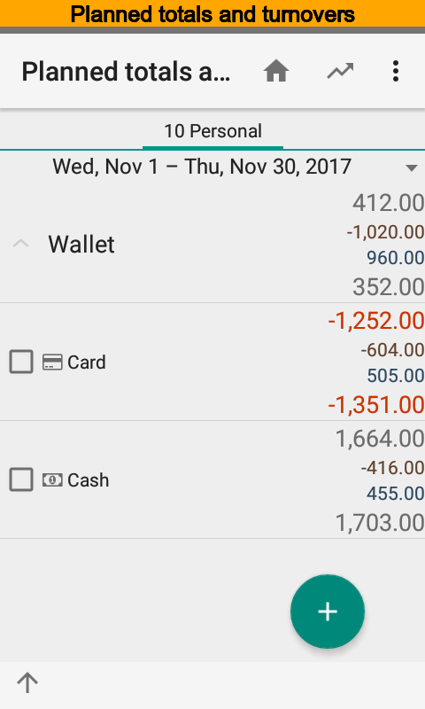
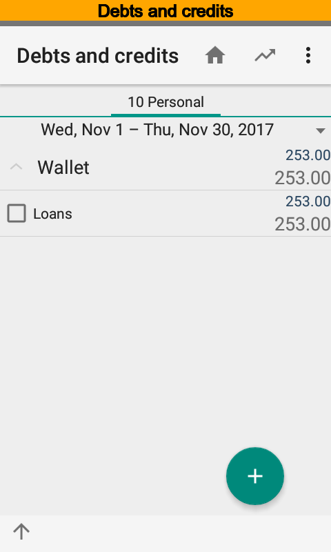

Planned Totals and Turnovers
----------------------------

The report is intended to analyze opening, closing balances and aggregated turnovers of the current time range.
The report is based on planned transactions only.

Debts
-----

The report is based on transactions that contain categories having |property_category_summary|,
|property_category_income|, and |property_category_outcome| options are on. The report
shows opening, closing balances and aggregated turnovers. Zero amounts are hidden.

For example, you can see that |item_category_credit| category has no opening balance.
During the time range there was a loan transactions. And there was no repayment because
closing balance is equal to the credit amount.

Plan Implementation
-------------------

The report is based on planned and actual transactions that contain categories having
|property_category_summary| option is on, and one of |property_category_income|
and |property_category_outcome| options only is on. The report evaluates a total
amount of planned transactions and deduct a total amount of actual transactions.
|meta_report_plan_implementation| shows opening,
closing balances and aggregated turnovers. Zero amounts are hidden.

For example, you can see that |item_category_salary| category has the opening balance.
Hence, it is not completed, i.e. actual amount is less than planned.
Also it is expected an actual credit transaction. But there is no
actual transaction yet.

.. image:: images/reports-090-plan-implementation.png
  :width: 25%
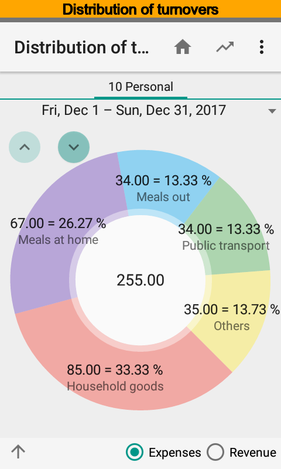
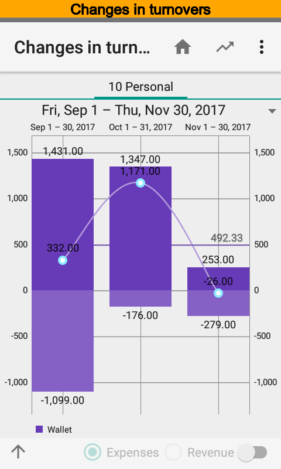

Distribution of Turnovers
-------------------------

The chart is intended to analyze turnovers distribution by dimension and time ranges. You can view
expenses or revenues separately. Rotate chart counterclockwise when names are not fully shown.

Changes in Turnovers
--------------------

The chart is intended to analyze tends of turnovers. Positive part of the chart contains
credits and negative part contains debits.

Changes in Totals
-----------------

The chart is intended to analyze how totals change within the time range. At the same time
it is possible to look at actual and planned totals.

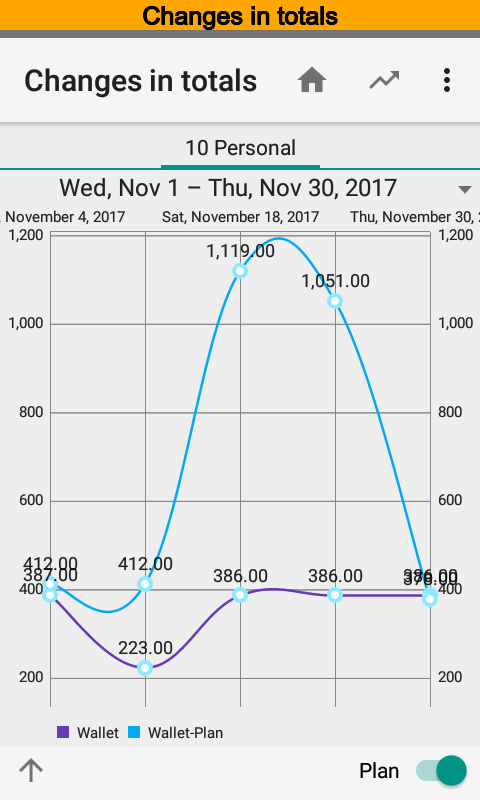
