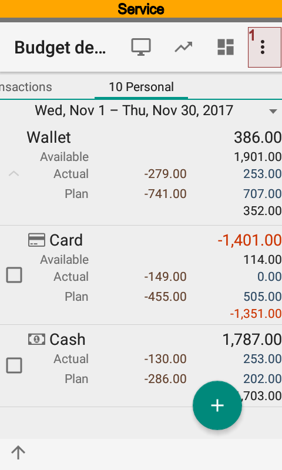
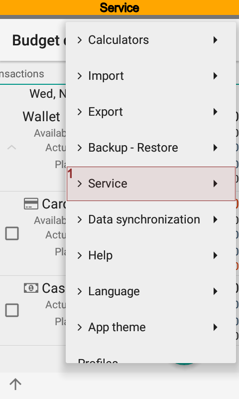
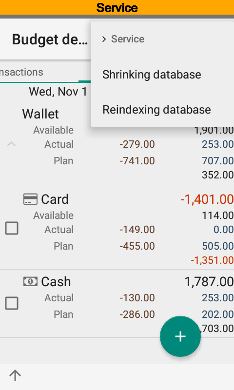

.. include:: termins.rst
.. _chapter_service:

Сервисное обслуживание
======================

Как правило приложение |бб| не требует сервисного обслуживания. Тем не менее, если Вы замечаете
падение скорости работы программы, то запуск сервисных операций может решить проблему.

Сжатие данных освобождает захваченное и неиспользуемое место в памяти, дефрагментирует таблицы и индексы.
Это способствует увеличению производительность работы приложения. Технически, сжатие данных вызывает команду `VACUUM`_.

.. _`VACUUM`: https://sqlite.org/lang_vacuum.html

Сжатие данных работает только с базой данных и не удаляет файлы, которые также могут располагаться в данных приложения.

Переиндексация может помочь в случае резкого падения производительности. Технически, переиндексация данных вызывает
команду `REINDEX`_.

.. _`REINDEX`: https://sqlite.org/lang_reindex.html

.. warning::
   Не забывайте делать резервные копии, особенно перед выполнением сервисных операций. Если установлен пароль шифрования, то обязательно убедитесь, что Вы его помните. Иначе восстановить данные из резервной копии будет невозможно.
