.. include:: termins.rst
.. _chapter_shortcuts:

Report Settings and Shortcuts
=============================

Report Settings
---------------

|bb| can store custom grouping and filters for reports and transactions list. Let us
look into the matter using an example of |meta_report_turnovers| report. You can save
settings for other reports and transactions list by the same way.

Since started the report has default grouping, filter and time range.

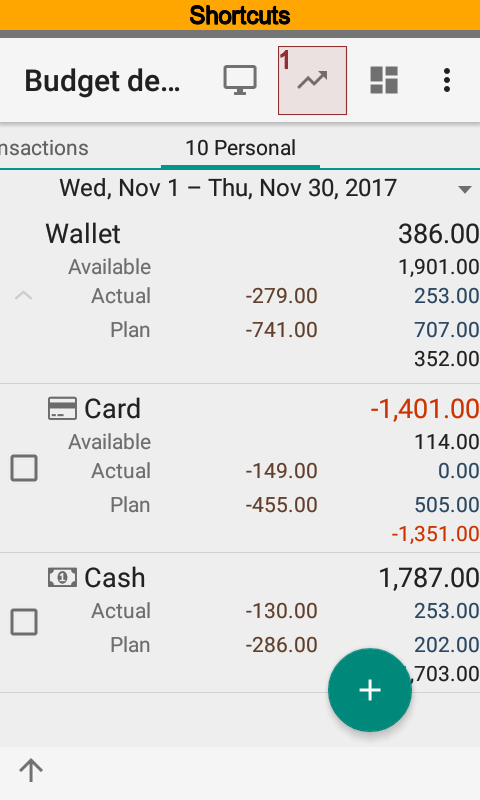
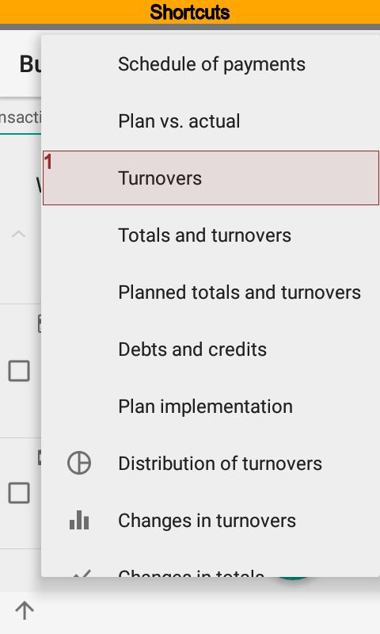
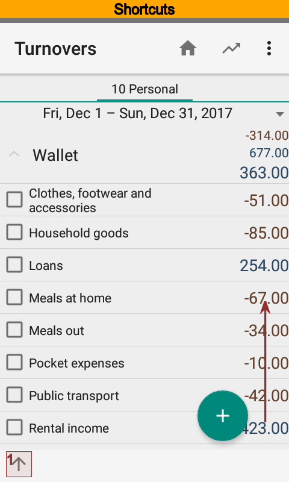

We will try to make fast access to |meta_report_turnovers| report based on a filter having one account only.

Edit filter settings. To do that pull bottom sheet and press |spinner_filter|. Select only one account
and save changes.

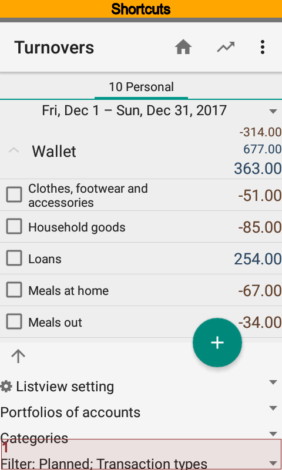
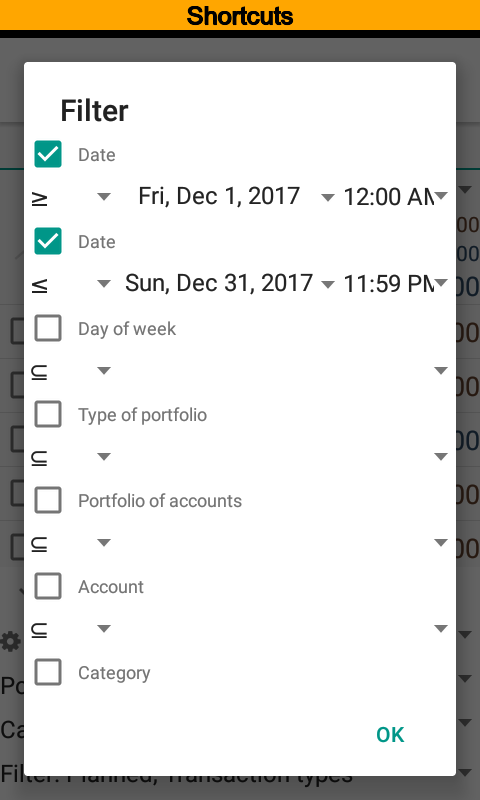
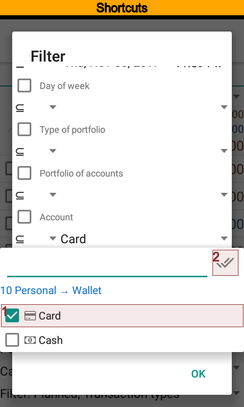

You can see at the pictures that report contains data of the only one account. To create
a persistent setting press |spinner_list_view_settings| at the bottom sheet
and choose create new setting from the drop down list.

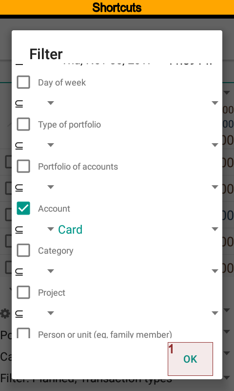
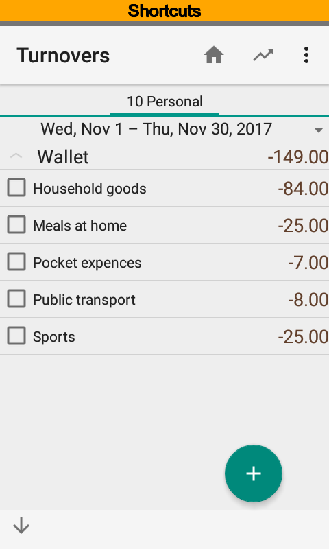
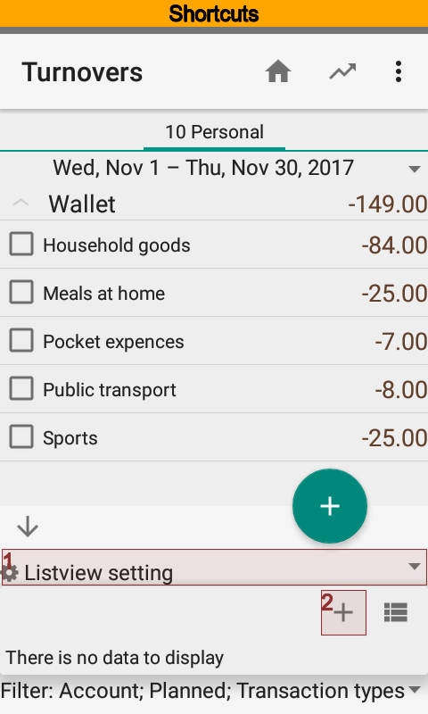

Put the name |value_turnovers_one_account| for the new setting and save. Now
|item_turnovers_one_account| is ready to use. A report will have
grouping and filter values of the setting when you choose it from the
drop down list.

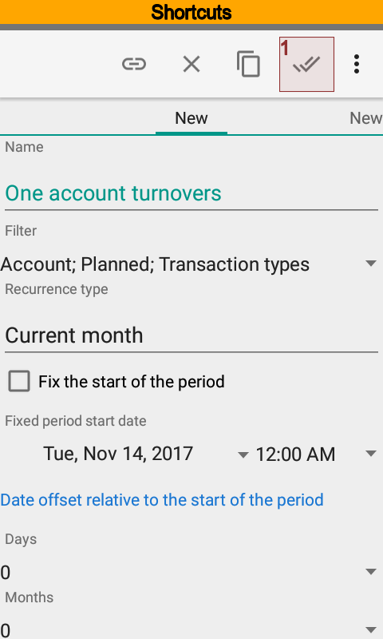
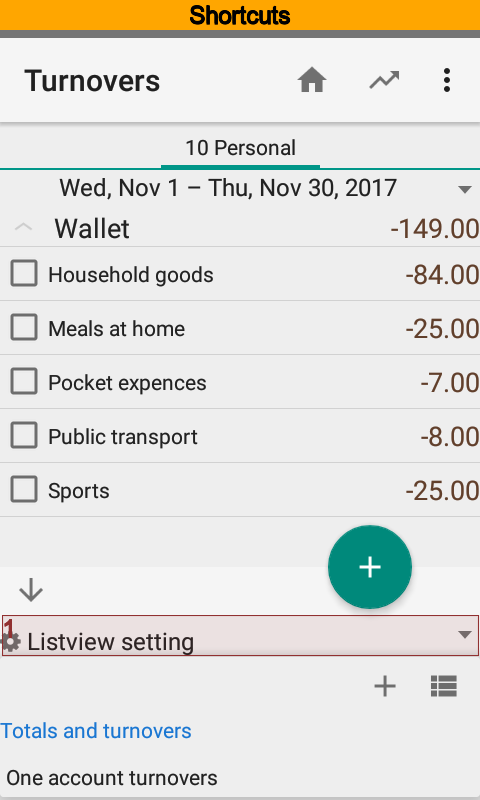

Creating Shortcuts
------------------

Using |bb| you can open reports and transactions list from the Android launcher screen. At the previous
section you have got the new persistent setting. Let us suppose that you want to create a shortcut for it.

.. note::
  Shortcuts available in the Pro version.

Let us go back to the setting card. Please keep in mind that setting has a frequency. The time range of the
new report depends on that frequency. Current month is the default value and you can put another one.

Press |button_create_shortcut| to create the shortcut.

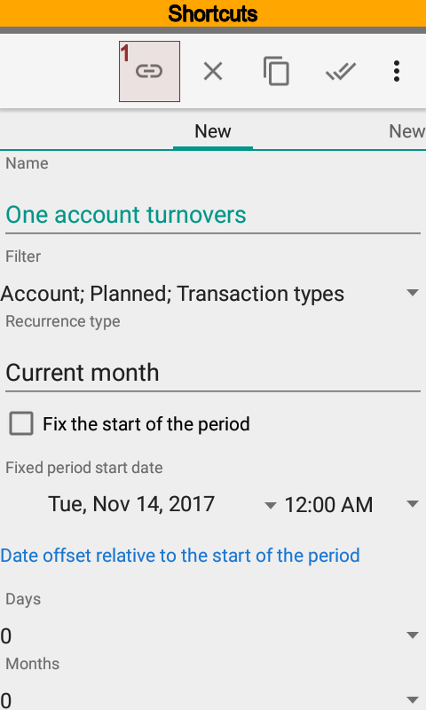
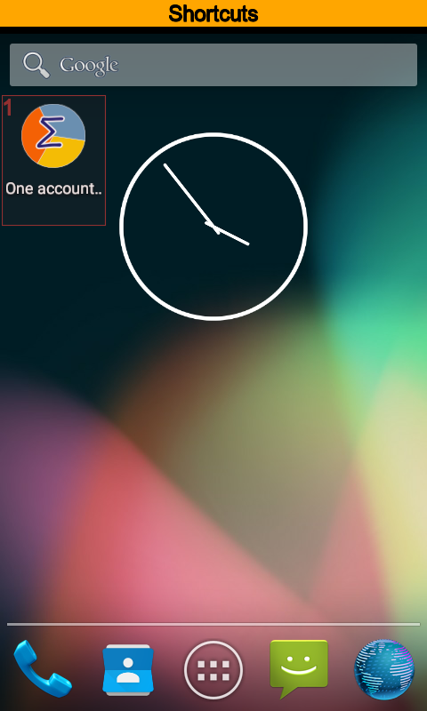

New shortcut will appear at the free space of the one of Android launcher screens.

.. note:: The shortcut is connected with list view setting. The shortcut will be broken when setting has removed.

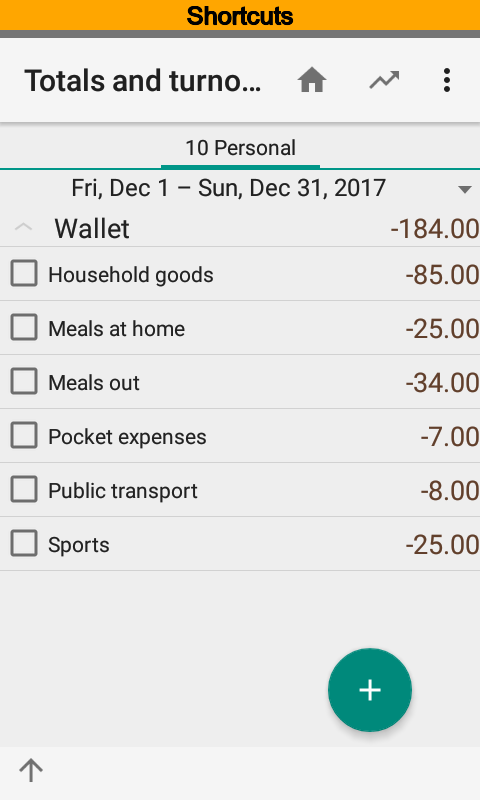
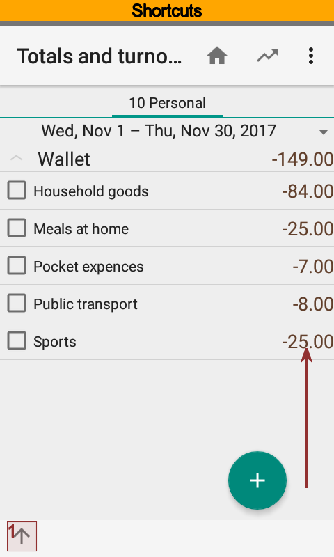
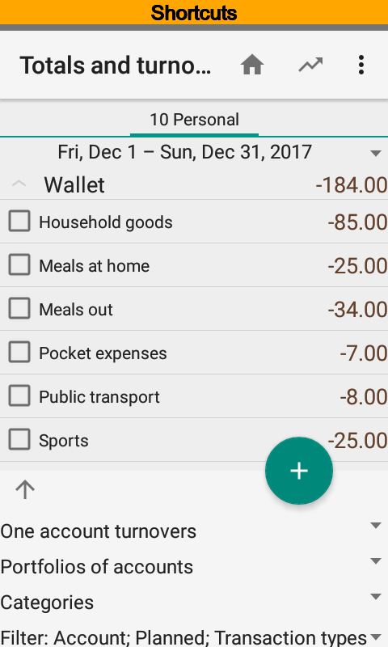

Let us check the shortcut. Press it and make sure that report started. As you can see at pictures the app
applied filter of the shortcut.

A shortcut is just a link to persistent setting. Modify setting properties if you want to modify shortcut.
