.. include:: termins.rst
.. _chapter_teamwork:

Teamwork
========

Introduction
------------

|bb| ensures the collaborative accounting of revenues and expenses. Here are a few examples:

#. Full synchronization between devices;
#. Collaborative financial accounting restricted by selected accounts, projects, persons, payers, payees, or even categories;
#. Collecting data on a single device, in a case of, for example, parents track children expenses.

Any device can become an exchange node, see :term:`exchange node` and receive or transmit changes.
Each exchange node can communicate with other ones.

.. note:: Free version can transmit messages only. The Pro version has no restrictions.

The app has flexible settings to control exchange. For example, you can allow to accept only new transactions
from one node, and forbid modified ones. Each node has own settings.

Messages between nodes are encrypted in order to improve safety. For each node you can specify
own password that will be used for encryption and decryption of a transmitted information.

Collaboration does not require Dropbox account or other ones.

Getting Started
---------------

Initial Database
~~~~~~~~~~~~~~~~
Suppose that Alice and Bob want to use a collaborative financial accounting.
Then, they need to decide what is the best suited case:

#. At the beginning Alice and Bob will have similar database.
#. Alice and Bob already use the app, they do not want to combine their databases, and plan to synchronize selected accounts only.

For the first case Alice or Bob, let it be Alice, makes a backup. Further, Alice gives the
backup to Bob and he restores database on his device. Now Alice and Bob have similar database.
The teamwork requires databases have different identities. Hence, Bob generates new identity
for his database.

.. note:: Ii is required to make a new database identity when database restored from backup of another teamwork member.

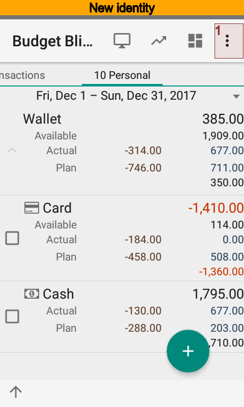
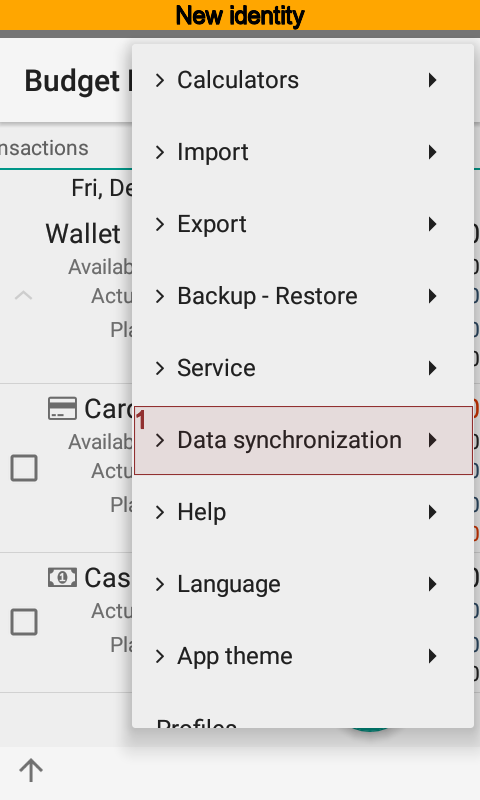
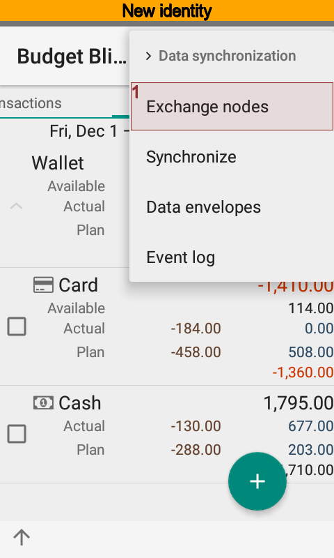
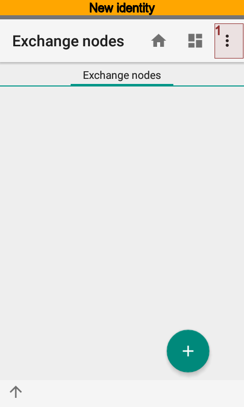
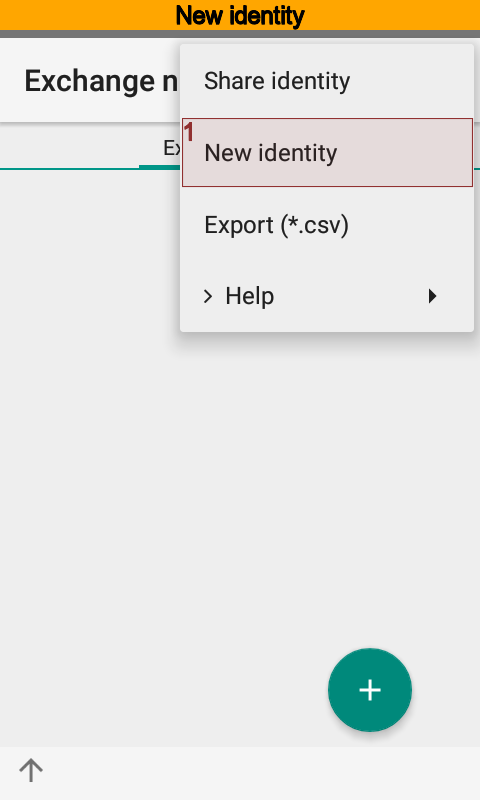

Now Alice and Bob are ready for next steps.

In the second case there is no need to preliminary actions. Alice and Bob are ready for next steps at once.

Identities Interchange
~~~~~~~~~~~~~~~~~~~~~~

The most important step under preparing teamwork is an identities interchange. To do that
Alice opens |meta_dir_nodes| directory using |menu_actions_exchange_nodes| menu. Then,
Alice presses |menu_send_identity| and sends identity to Bob by email.

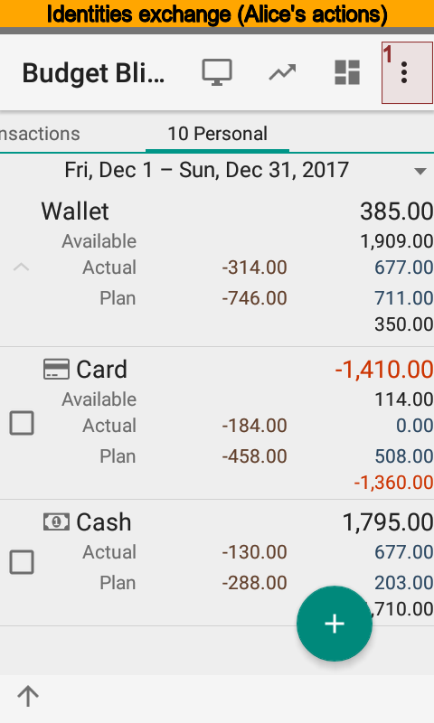
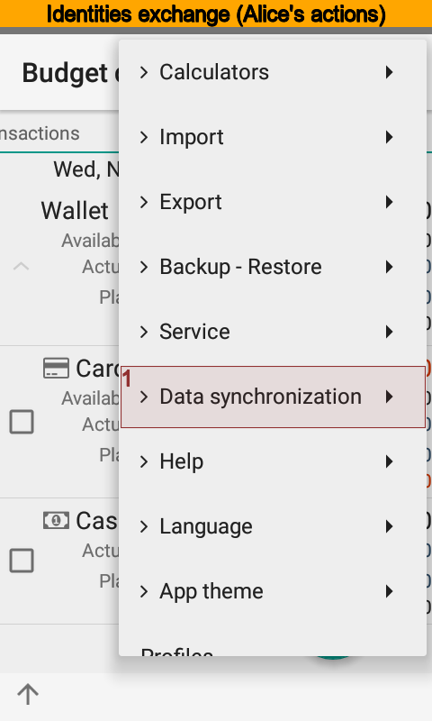
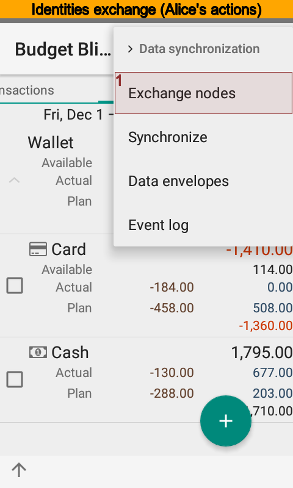
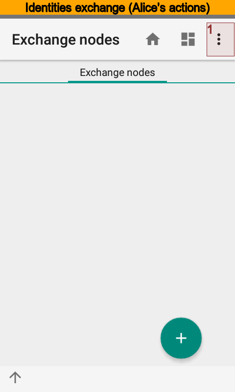
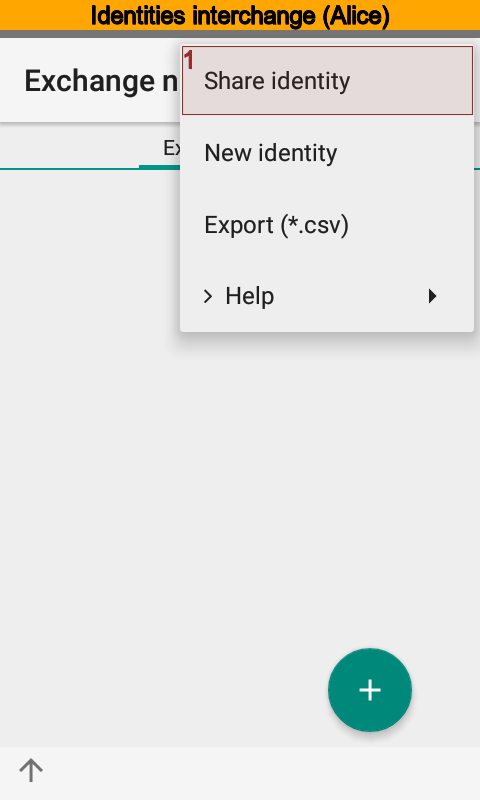

Bob receives the message, creates new exchange node putting the name and identity from the message.
After that he sends his own identity to Alice.

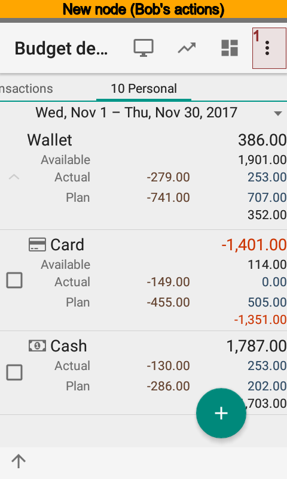
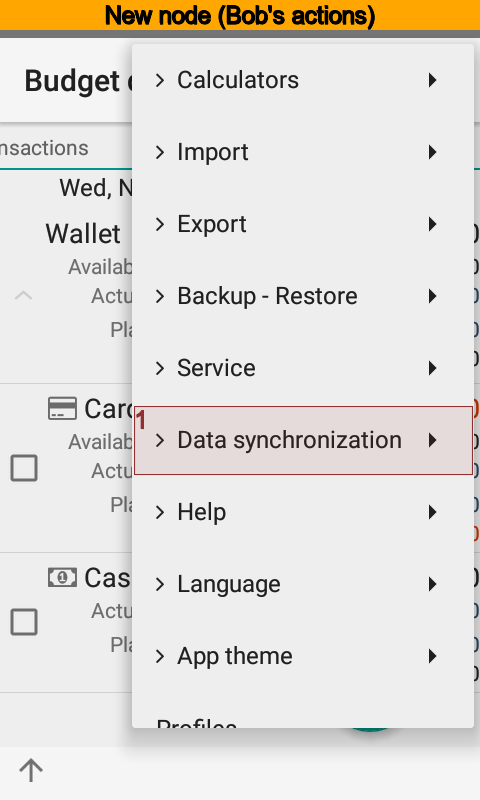
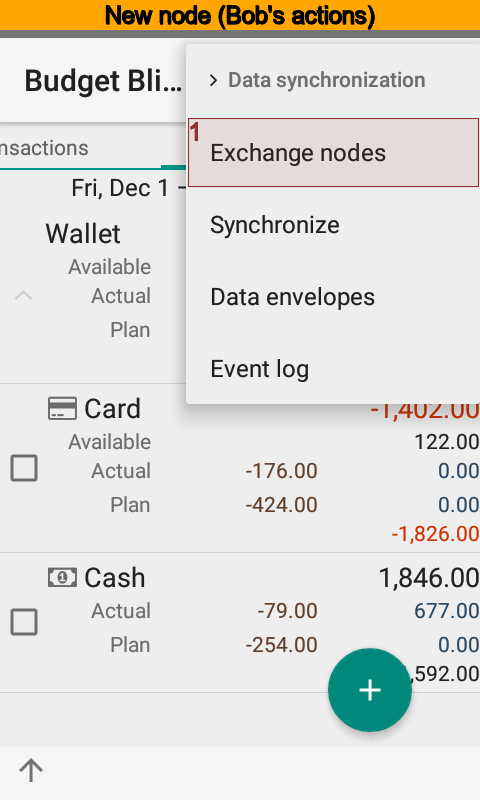

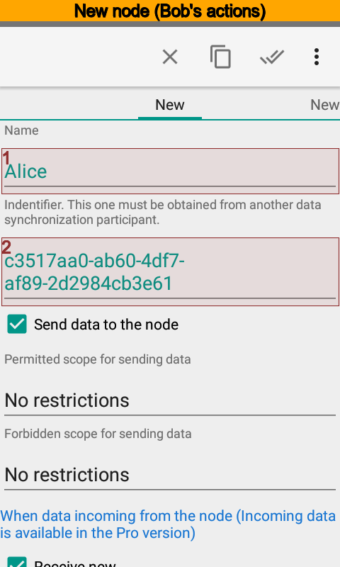

Now, there is a turn of Alice to receive Bob message. She creates new node and puts identity
from the message of Bob.

Setting Teamwork On
-------------------

When identities interchange completed, Alice and Bob set synchronization on at the app settings.

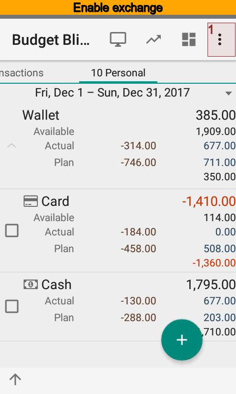
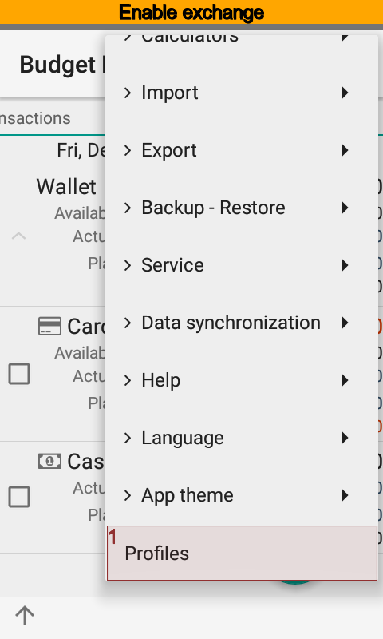
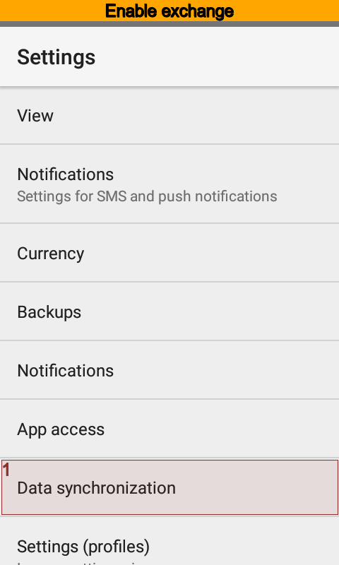

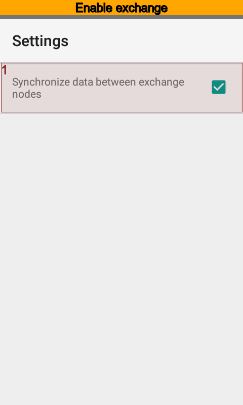

Now the app sends all changes from the database of Alice to the database of Bob and vice versa.
The app synchronizes changes every five minutes when Wi-Fi or mobile network is on. Synchronization
is off when device falls asleep or network is off. This ensures to save network traffic and
battery power.

This is how exchange works:

#. Since exchange started the app checks whether screen is on or not.

   #. Next time to start synchronization is 5 minutes after, if screen is on.
   #. Next time to start synchronization is 60 minutes after, if screen is off.
   #. Synchronization is canceled when phone falls asleep.

#. Since main screen started the app checks next time of synchronization.

   #. Nothing happen if next time is within 10 minutes.
   #. Synchronization starts if next time is greater then 10 minutes.

#. Synchronization is off when where is no network until network is on.

You can run synchronization by hands if you want to.

How Synchronization Works
-------------------------

The app |bb| stores every directory items and transactions changes. Node sends changes
that occur starting from the time last message sent or node created itself. The sequence
of exchange matters. Alice sends changes to Bob. Then Bob sends changes to Alice and so on.
The node of Alice will await response from the node of Bob. Thus, the node of Alice will send
no anymore messages until response from the Bob coming.

The app synchronizes directories using rules below:

#. syncing by the unique id;
#. syncing by key phrases;
#. syncing by the name.

When syncing fails the app goes to the next step. The app will create new item or use default value
if all steps fail. You can edit default values at the node card.

Transactions sync by the unique id only.

Advanced Settings
-----------------

Alice and Bob can restrict the amount of information transmitted. There are two types of constraints:

#. permitted data scope;

#. forbidden data scope.

Scopes specified in the |meta_dir_scopes| directory. It is possible to specify any combination of accounts,
categories, payers, payees, projects, and persons.

Forbidden scope has a higher priority, when the permitted and forbidden data scopes contain
same item simultaneously.

Transactions, recurring transactions, and directory items to transmit are based upon data scopes.

Alice and Bob can restrict items to receive. For example, Alice can refuse all new, modified
or removed items. Another case is to specify certain type of directory to refuse.

Data Transfer Settings
----------------------

To improve the security of data transmission Alice should specify a password that will
be used to encrypt messages between exchange nodes. Alice's password must match the Bob's one.

Alice also should indicate what type of communications is used for messaging with Bob.
Available types are Wi-Fi and mobile network.

Default Values
--------------

Alice and Bob can have a different app content. For example, Bob has a long time using |bb|,
and Alice has just installed the app. Bob can create transaction and specify, for example,
a project that Alice does not have. When a message from Bob arrives, Alice's node will
create a transaction, but could not find a proper project. In that case the app will
use a default value Alice set to the node of Bob.

Moving Database to a New Device
-------------------------------

Suppose that Alice decides to move onto new phone. Then, Alice should follow steps:

#. Set synchronization off for an old device.
#. Make backup.
#. Restore backup on a new device.
#. Set synchronization on for a new device.
