.. include:: termins.rst
.. _chapter_widgets:

Widgets and Templates
=====================

Widgets
-------

|bb| has the convenient widget to show actual balance, turnovers and to create new transaction.

.. image:: images/widget-480.png
  :width: 25%
  :align: center

Available size of widget are 1x1, 1x2, and 1x4. The widget theme and the app theme are equals.

You can use widget not only like a financial highlights. Other ways of usage are short report
and template of new transaction.

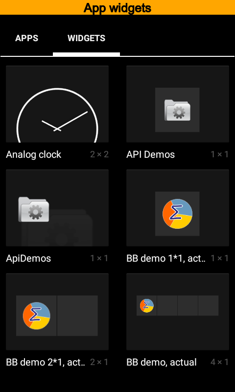
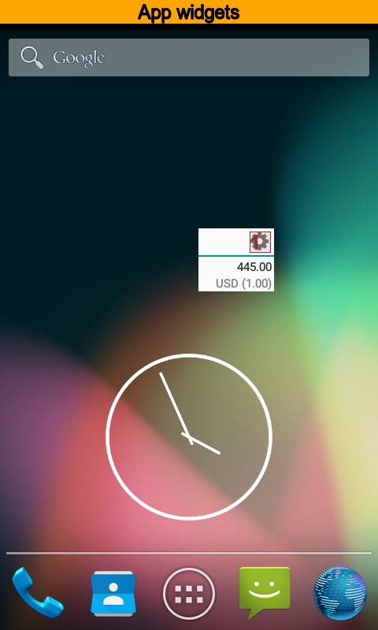
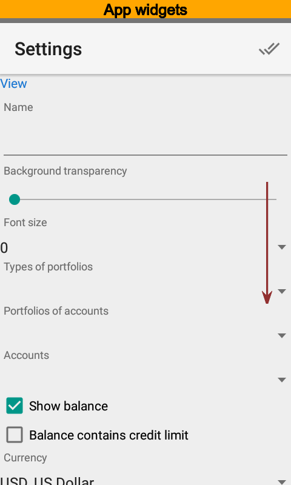

A new widget contains a balance and turnovers for the current day. Press |button_settings|
to modify widget.

The |section_view| section has main widget options.

Use the |property_name| when you have more than one widget. You can keep it empty if you want to.

Use the |property_portfolio_types|, the |property_portfolios| and the |property_accounts| options
to restrict information of widget. You can put one or more values. Different widgets
can have different options. For example you can have two widgets, one for
certain account, and another for another one.

Use the |property_show_balance| to set balance visibility on or off. Also you can specify
whether credit limit is ignored or not when balance is calculated.
Balance is free of credit limit by default and for credit cards
you will have a negative balance.

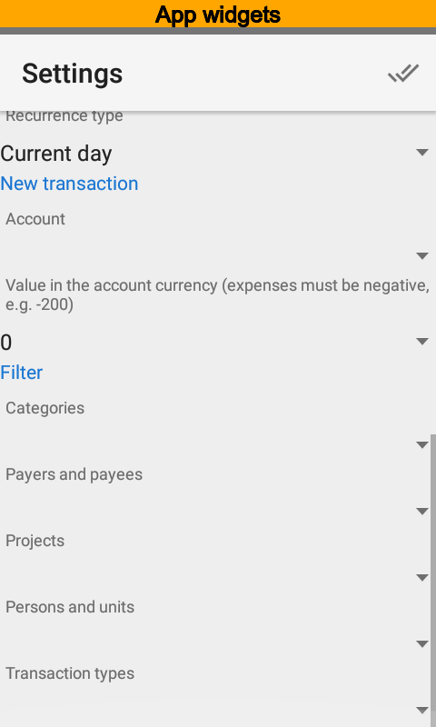
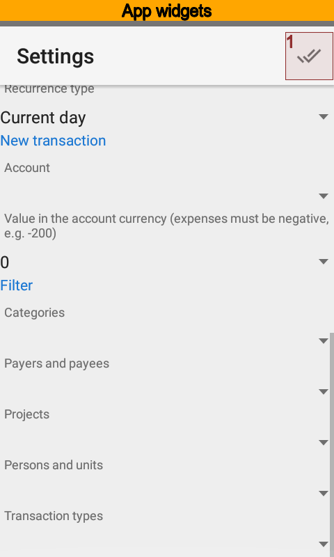

Using Widgets as Transaction Templates
--------------------------------------

The |button_new_transaction| button is available in the widget since account for new transactions specified in
settings. Also you can set an amount for new transaction. That amount will be copied to a new transaction.

Values of a filter will be copied to a new transaction as well.

Thus, you can use widget like a new transaction template.

.. note:: Templates are available in the Pro version. Free version ignores an amount and values of filter.

Using Widgets as Reports
------------------------

Since widget has flexible settings you can use it as a report with persistent settings. The
|section_filter| section is the key.

.. note:: Widgets as reports are available in the Pro version.

Widgets as Reports Example
--------------------------

Let us make a widget setup to show public transport expenses during current month.
Open widget settings and put the |value_public_transport| name.

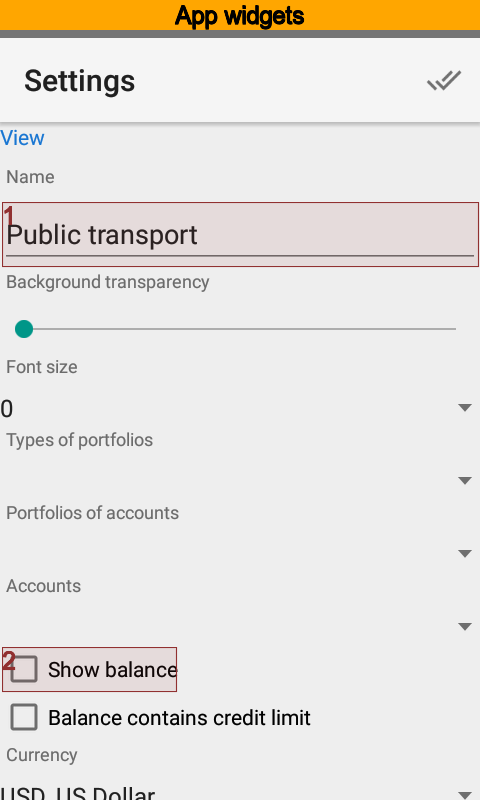
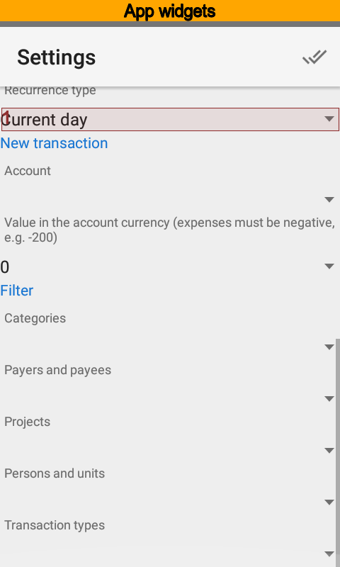
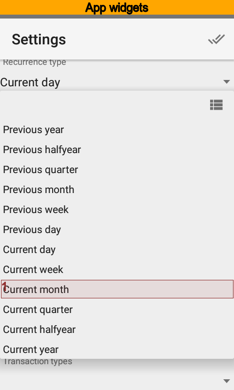

Set balance off, because we do not need to see totals. Select current month as the time range.

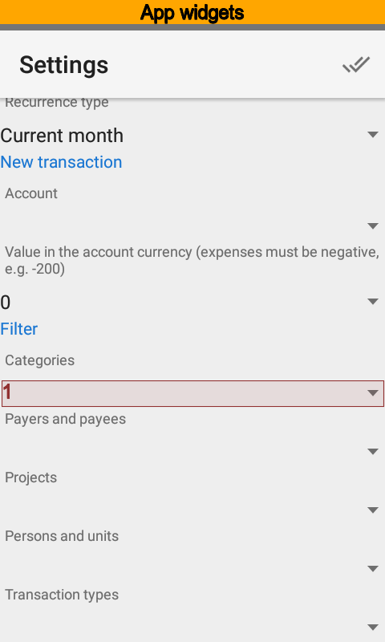
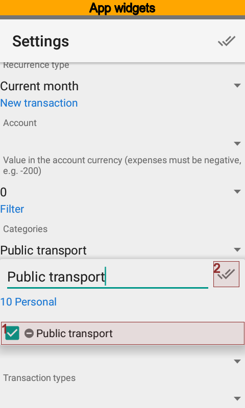
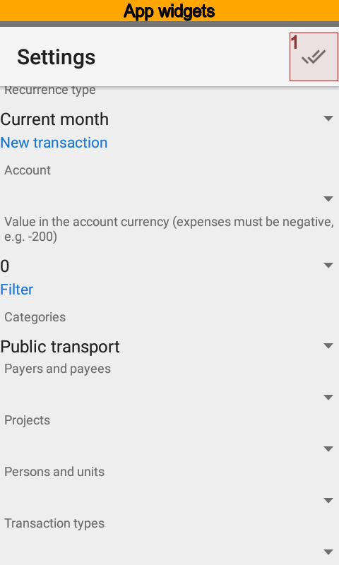

Set the |item_category_public_transport| category and save settings.

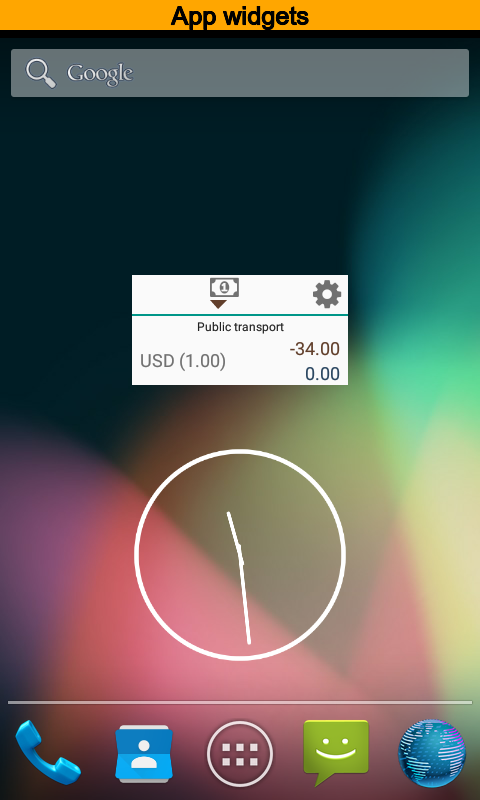

Now you can see turnovers under |item_category_public_transport| category for the current month,
expenses amount, and accounts that are the source of payments.

Widgets as Templates Example
----------------------------

Now, modify settings the way you can fast create expenses. Open the setting to do that.

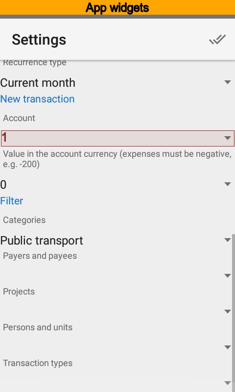
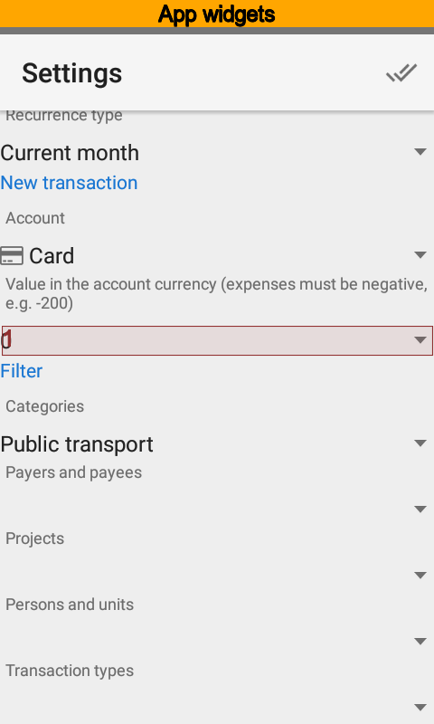
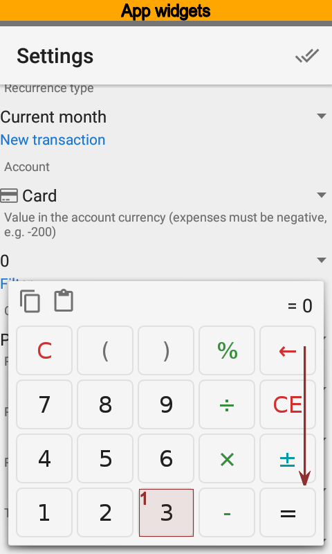

Set the account you will pay often for public transport. Also put the most frequent amount.

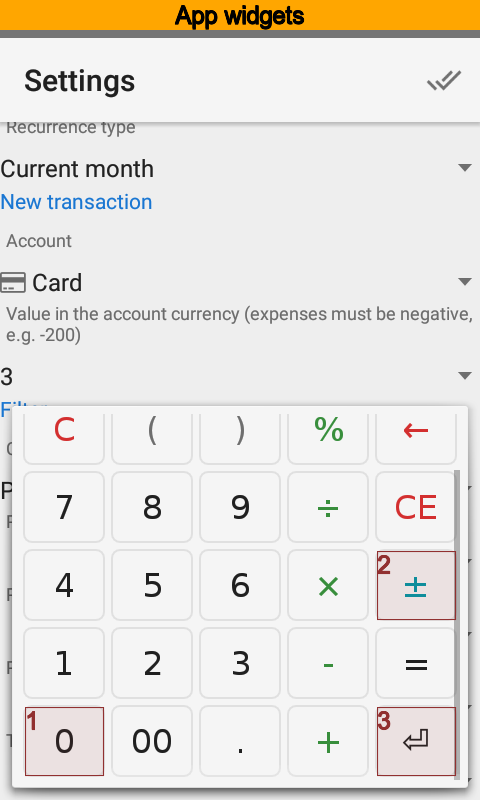
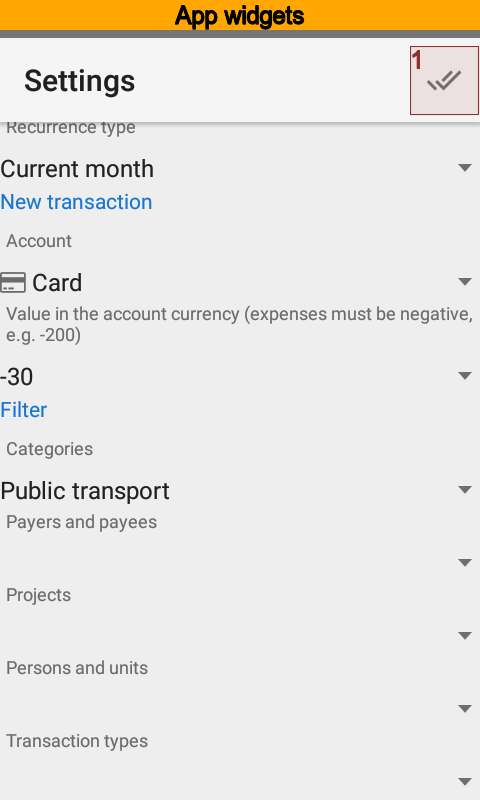
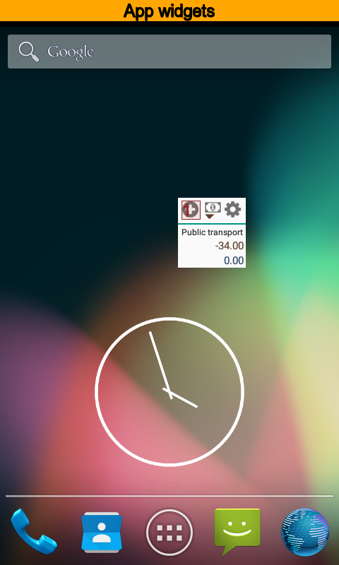

Save settings. Now the button to create new transaction appeared.

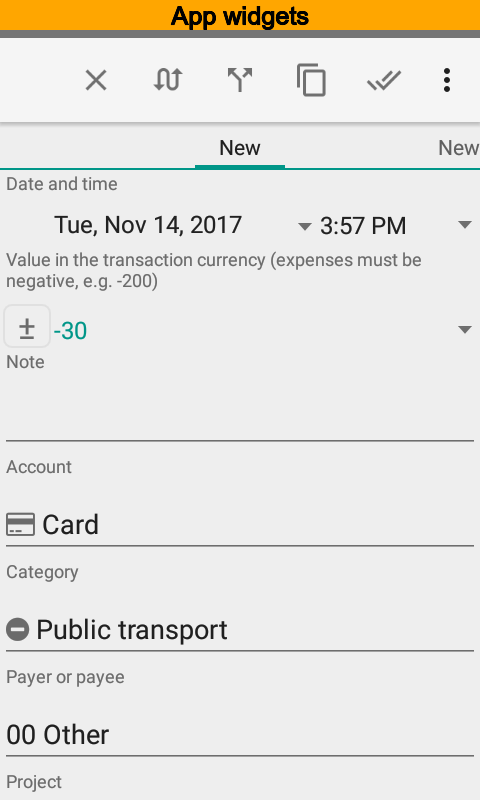

Create new transaction and you will see one contains the account, the amount and the category already.
All you have left to do is save the new transaction.

Using same way you can put payer, payee, project, and person for a new transaction. Each new
template should have a new widget.
