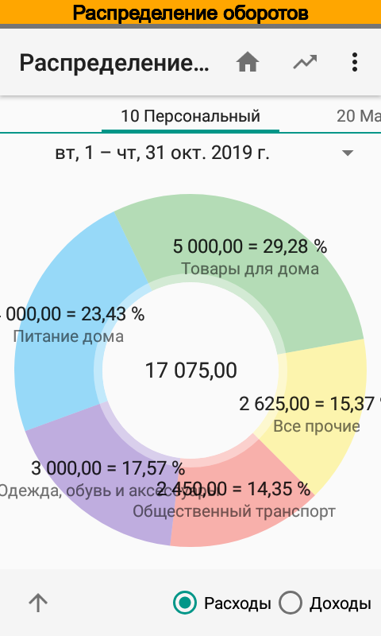
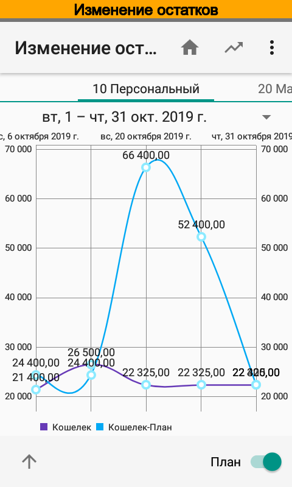

.. include:: termins.rst

============
О приложении
============

Приложение |бб| служит для автоматизации учета и планирования:

  * персональных финансов;
  * финансов очень малого бизнеса (индивидуальные предприниматели);
  * финансов малого бизнеса.

--------------------
Ключевые особенности
--------------------
Совмещение учета личных финансов и финансов предприятия.

Тщательный учет финансов --- поддержка статей, контрагентов (плательщиков и получателей), персон и проектов.

Автоматическое распознавание SMS и Push уведомлений банков --- определение сумм, статей, проектов, персон,
получателей и плательщиков, выделение комиссий из суммы платежа, автоматическая корректировка баланса,
поддержка 160+ банков разных стран, см. :ref:`chapter-supported-banks`.

Отображение ключевых показателей на главном экране.

"Умные" значения по умолчанию при вводе операций.

Виджет для быстрого ввода и редактирования операций, с возможностью вывода настраиваемого среза данных (виджет как отчет).

Децентрализованная коллективная работа с настраиваемыми правами доступа.

Клиент для ПК (доступ к данным программы через web браузер).

API для приема данных от других приложений.

Разнообразные аналитические отчеты.

---------------------------------------------
Интересные решения, реализованные в программе
---------------------------------------------

Подсистема распознавания уведомлений (SMS и Push) банков

  *  Автоматическое распознавание аналитик (статья, контрагент, проект, персона);

  *  Удобный подбор ключевых слов непосредственно из SMS и Push-уведомлений;

  *  Автоматический расчет курсов для валютных операций;

  *  Автоматическое занесение переводов между счетами;

  *  Возможность создания собственной настройки импорта SMS и Push-уведомлений.

Подсистема отчетности

  *  Поддержка упрощенной технологии OLAP при формировании отчетов, т.е. возможности выбирать одновременно несколько срезов данных, включая временные периоды;

  *  Поддержка функции "Drilldown", т.е. возможности расшифровки и редактирования исходных данных;

  *  Использование виджетов для отображения коротких сводных отчетов;

  *  Использования ярлыков для быстрого запуска отчетов с сохраненными настройками.

Подсистема коллективной работы

  *  Использование механизма обмена данными для коллективной работы, регистрация на сайте разработчика не требуется. Общей базы данных не существует, у каждого участника обмена своя база данных.

  *  Гибкая система настройки прав и областей данных для обмена. Можно синхронизировать операции между участниками обмена только по одному счету, проекту и т. д.

  *  Неограниченное количество участников обмена данными.

Подсистема доступа с персонального компьютера

  *  Клиент работает на операционных системах Windows, Linux, Mac и пр. Все что нужно для работы - это современный браузер. Поддерживаются Internet Explorer 8+, Google Chrome, Apple Safari, Mozilla Firefox, Opera.
