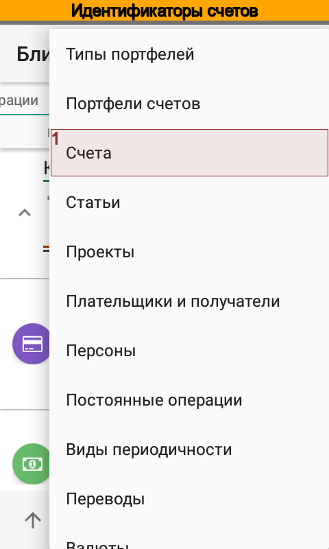
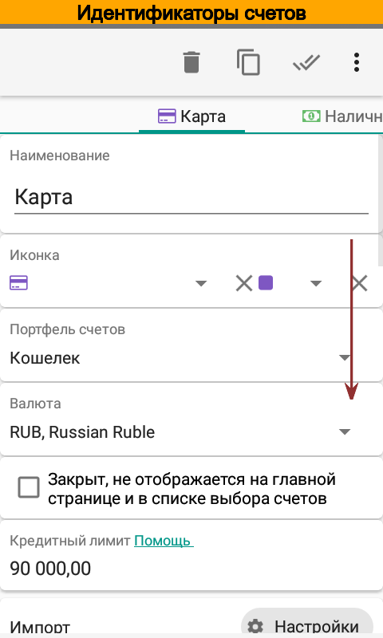

.. _chapter-account-identities:

Настройка счетов для импорта SMS и push-уведомлений
===================================================

Выбор идентификатора
--------------------

Перед импортом SMS и Push-уведомлений в карточке счета необходимо указать идентификатор. Это нужно для того,
чтобы приложение смогло определить, какому счету принадлежит импортируемая операция. Обычно банки
указывают  в сообщениях последние четыре цифры карты. Именно их лучше всего указать в качестве идентификатора счета.

Например, в сообщении вида
::

  VISA1234: 08.08.13 14:05 oplata uslug 5000.00 rub. dostupno 1000.00 rub.

в качестве идентификатора следует выбрать VISA1234. Бывает так, что в сообщении банка номер карты или счета не указан.
Например в сообщении вида
::

 Операция >> -6000 руб.	Atm-msk-001

невозможно выбрать идентификатор. В этом случае следует указать отправителя сообщения. Для SMS это будет номер или
имя. Например, Сбербанк отправляет все сообщения с номера 900. Для Push-уведомлений отправителем является идентификатор пакета.
Например, для РокетБанка это ru.rocketbank.r2d2.

Чтобы задать идентификатор, откройте карточку счета. Перейдите к полю Идентификатор счета или карты и выберите его из любого
сообщения банка. Если Вы хотите указать отправителя, то отредактируйте идентификатор вручную.
Также укажите настройку для Вашего банка.

.. image:: images/accountidenties-005-select-references.png
  :width: 25%

.. image:: images/accountidenties-020-open-card-account.png
  :width: 25%

.. image:: images/accountidenties-035-select-identity.png
  :width: 25%
.. image:: images/accountidenties-040-set-identity.png
  :width: 25%

Выбор ключевой фразы для перевода
---------------------------------

Приложение может автоматически создавать переводы на основании сообщения банка. Например, при получении сообщения вида
::

  VISA1234: 08.08.13 14:05 выдача наличных 2000.00р. ATM 10010001 Баланс 500.00 rub.

приложение может создать не только списание на 2000.00 руб. со счета VISA1234, но и поступление на счет Наличные. Для этого в карточке
счета Наличные следует задать ключевые фразы, по которым приложение будет идентифицировать этот счет. Для приведенного примера
это может быть `выдача наличных` или `ATM`.

.. note:: Для автоматического создания переводов необходимо также, чтобы приложение смогло правильно идентифицировать операцию как перевод. См. Настройки импорта.

Чтобы задать ключевую фразу, откройте карточку счета. Перейдите к полю Ключевые слова и выберите его их сообщения банка. Также, при необходимости, можно отредактировать фразы вручную.

.. image:: images/accountidenties-050-open-cash-account.png
  :width: 25%

.. image:: images/accountidenties-070-set-keywords.png
  :width: 25%

Обычно для счетов, по которым приходят уведомления, поле ключевые слова остается пустым и наоборот, в наличных счетах
остается пустым поле идентификатор. Однако есть случаи, когда для счетов используются оба поля. В качестве примера можно привести настройку
импорта сообщений РокетБанка_.

.. _РокетБанка: http://qa.bbmoney.biz/ru/index.php?qa=67&qa_1=%D0%BA%D0%B0%D0%BA-%D0%BD%D0%B0%D1%81%D1%82%D1%80%D0%BE%D0%B8%D1%82%D1%8C-%D0%B8%D0%BC%D0%BF%D0%BE%D1%80%D1%82-%D1%83%D0%B2%D0%B5%D0%B4%D0%BE%D0%BC%D0%BB%D0%B5%D0%BD%D0%B8%D0%B9-%D1%80%D0%BE%D0%BA%D0%B5%D1%82%D0%B1%D0%B0%D0%BD%D0%BA%D0%B0&show=68#a68
