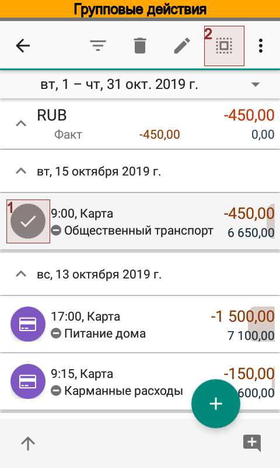
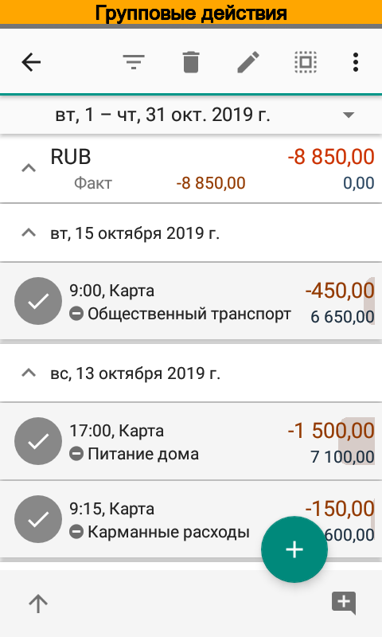
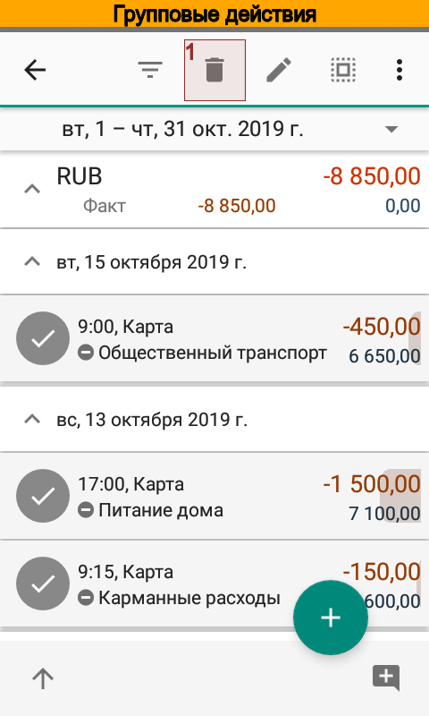
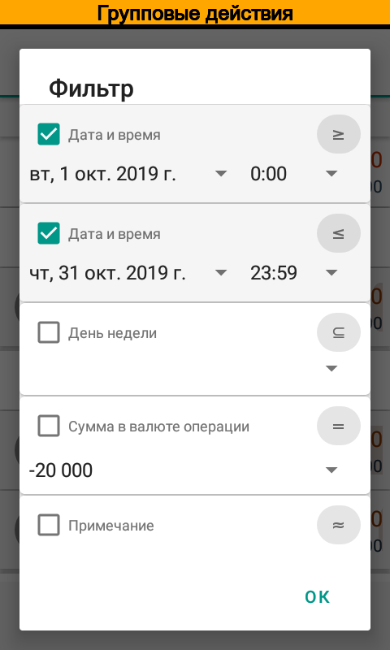
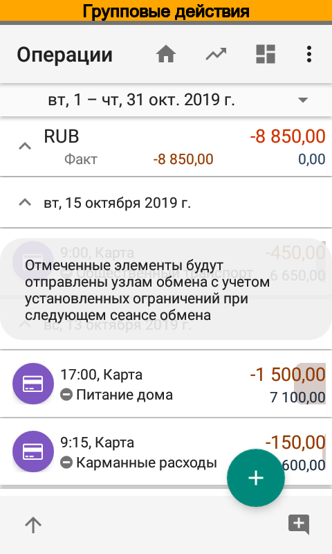
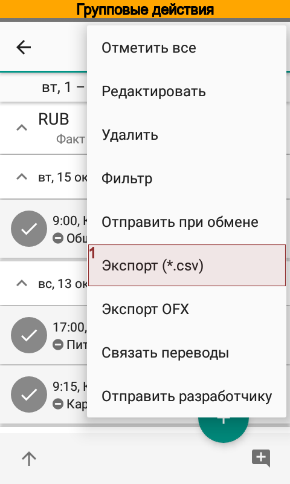
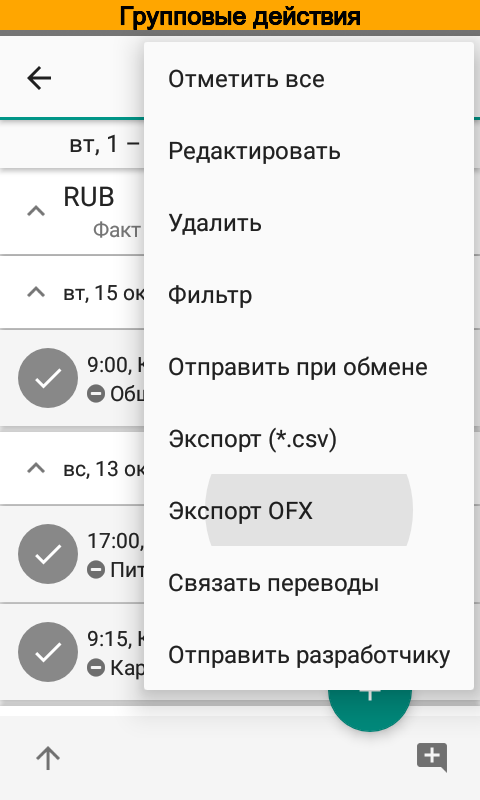

.. include:: termins.rst
.. _chapter_bulk_actions:

Действия с группами объектов
============================

|бб| позволяет выполнять действия сразу со множеством объектов. В качестве примера можно привести замену
статьи сразу для нескольких операций. Групповые действия можно выполнять не только с операциями, но и с
любыми справочниками.

Выбор объектов
--------------

Разберем выбор нескольких объектов на примере списка операций. Точно такие же действия можно выполнить в
любом справочнике.

.. image:: images/bulkactions-010-transactions.png
  :width: 25%

Первом делом следует открыть список операций. Затем отметим галочками нужные операции. Если необходимо выбрать все
операции, то достаточно отметить любую операцию из списка, а затем в панели действий выбрать |button_select_all|.

Редактирование
--------------

Для редактирования выбранных операций следует нажать |button_edit|. Приложение откроет диалог, в котором
указано количество выбранных элементов и поля, которые в этих элементах можно изменить. Так, для операций можно изменить
дату и время, примечаний, аналитики и пр. поля. Изменения применяются только для модифицированных в диалоге редактирования
полей.

.. image:: images/bulkactions-050-transactions-edit-dialog.png
  :width: 25%

Удаление
--------

Для удаления выбранных операций следует нажать |button_delete|. После подтверждения приложение удалит выбранные элементы.

.. image:: images/bulkactions-070-transactions-delete-dialog.png
  :width: 25%

Фильтр
------

На основании нескольких элементов можно создать фильтр. Это удобно, когда например, необходимо увидеть все операции с
такими же как и отмеченных операций, статьями, контрагентами, проектами или персонами. В поля фильтра сразу будут скопированы
значения из выбранных операций, останется лишь отметить нужные поля отбора галочками.

Для создания фильтра на основании выбранных элементов следует нажать |button_filter|.

.. image:: images/bulkactions-080-transactions-filter.png
  :width: 25%

Повторная отправка объектов при обмене
--------------------------------------

Иногда в случае коллективной работы необходимо повторить отправку операции или элементов справочника. Для этого служит
пункт меню |menu_send_on_exchange|.

.. image:: images/bulkactions-100-transactions-more.png
  :width: 25%
.. image:: images/bulkactions-110-transactions-exchange-send.png
  :width: 25%

Экспорт в CSV и OFX
-------------------

Выделенные операции можно экспортировать в файлы формата CSV и OFX, используя пункты меню |menu_export_csv|
и |menu_export_ofx|. В отличие от операций, элементы справочников можно экспортировать только в файлы формата
CSV.

.. note:: Экспорт операций в OFX доступен только в версии Pro.

.. image:: images/bulkactions-150-transactions-export-ofx.png
  :width: 25%

Автоматическое связывание операций
----------------------------------

Для точного учета переводов иногда требуется дополнительно связать операции. Например,
такая операция может потребоваться, если перевод занесен вручную или в результате импорта
в виде двух отдельных несвязанных операций. Для связывания операций отметьте хотя бы
одну операцию и приложение автоматически определит завершающую операцию в переводе.

.. image:: images/bulkactions-190-transactions-connect.png
  :width: 25%

.. note::
  Начиная с версии 6 при вводе перевода вручную обе операции автоматически связываются, поэтому нет
  необходимости дополнительно связывать такие операции. Связанные операции помечаются специальным значком. 

Отправка исходных данных разработчику
-------------------------------------

Иногда требуется помощь разработчика для выяснения причин того или иного поведения приложения. В этих
случаях для анализа обычно требуются исходные данные.

Отправить исходные данные можно через пункт меню |menu_sent_to_developer|. Перед отправкой
приложение откроет предварительный просмотр письма и Вы можете увидеть и отредактировать содержание
отправляемых данных. Таким образом можно избежать передачи конфиденциальной информации.

.. image:: images/bulkactions-170-transactions-developer-send.png
  :width: 25%

