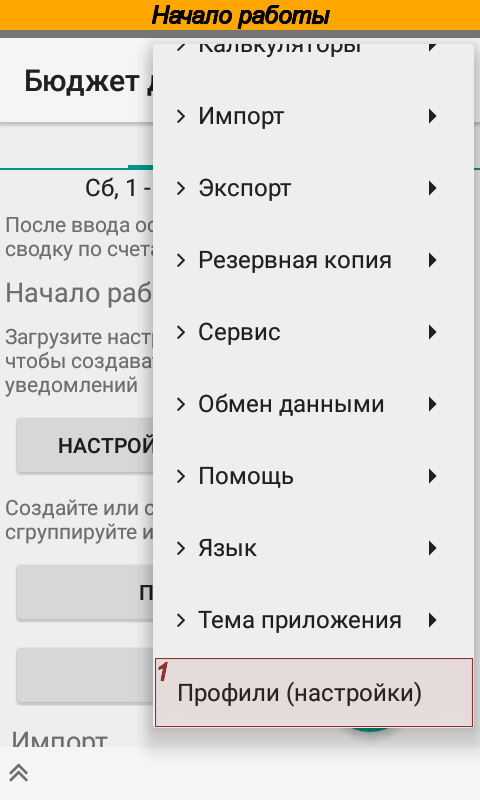
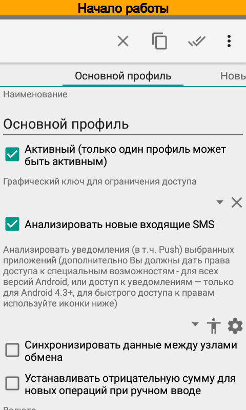
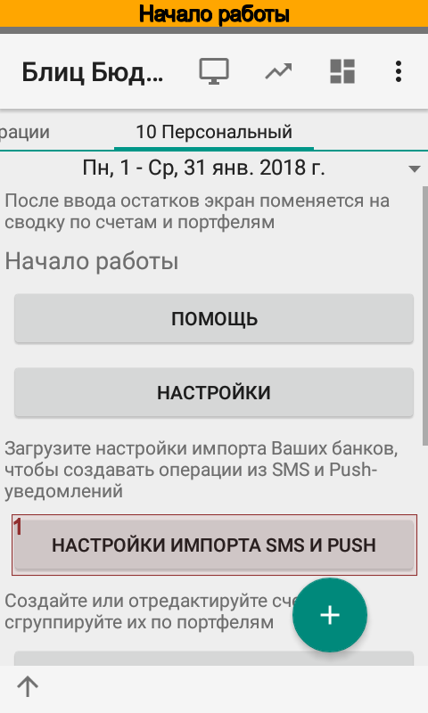
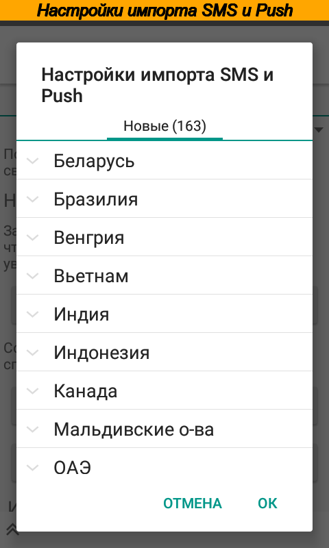
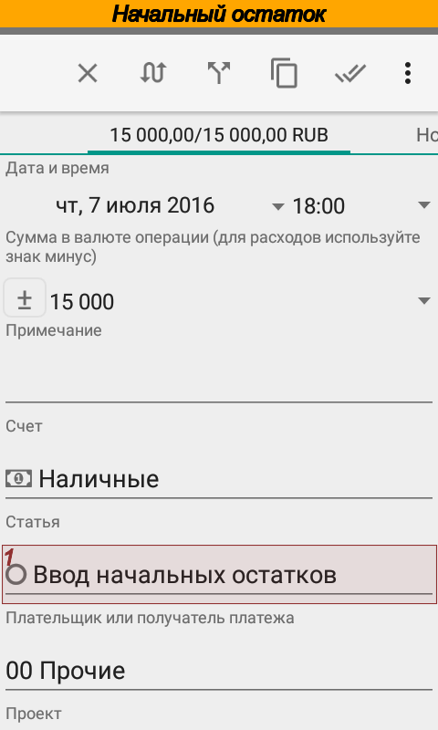
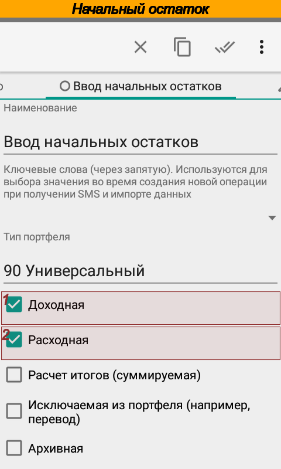
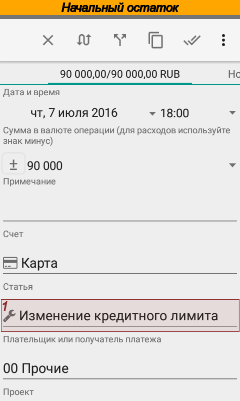
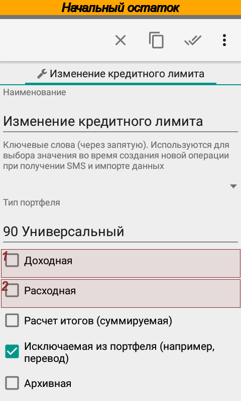

.. include:: termins.rst

Начало работы
=============

В этой главе предлагается определенная последовательность действий по настройке приложения. Следовать предлагаемому порядку совсем не обязательно. Помните, что любой из параметров всегда можно изменить позже.

Настройка основных параметров
-----------------------------

После первого запуска отредактируйте основные настройки приложения. Для этого через меню :menuselection:`Действия --> Профили (Настройки)`
откройте справочник настроек.

.. image:: images/gettingstarted-010-main-screen.png
  :width: 25%

Здесь можно:

- задать графический ключ для входа в приложение (наподобие ключа, который используется для разблокировки меню смартфона);
- включить/выключить анализ входящих SMS и push-уведомлений банков;
- включить/выключить синхронизацию между различными устройствами;
- установить/отключить по умолчанию отрицательную сумму для новых операций (для тех, кто расходы заносит чаще, чем доходы);
- установить основную валюту для профиля, а также источник загрузки курсов валют;
- настроить автоматические резервное копирование с отправкой данных в сервис Dropbox;
- включить/отключить напоминания о предстоящих платежах;
- задать звуковые уведомления при обработке смс от банков.

После настройки основных параметров можно приступать ко второму этапу настройки, основные пункты которого
расположены прямо на главном экране.

Загрузка настроек банков
------------------------

Этот раздел предназначен для тех кто планирует использовать функцию автоматического создания операций из коротких сообщений банков,
платежных систем или установленных на устройстве приложений.

Для автоматического импорта SMS уведомлений:

#. должен быть отмечен соответствующий флажок в активном профиле, меню :menuselection:`Действия --> Профили (Настройки)`;
#. приложению должен быть предоставлен доступ к SMS (Android 6 и выше).

Для автоматического импорта push-уведомлений в активном профиле, меню :menuselection:`Действия --> Профили (Настройки)`:

#. должны быть выбраны пакеты, уведомления которых |бб| будет импортировать:
#. должны быть предоставлены дополнительные разрешения.

Чтобы загрузить настройки Вашего банка нажмите кнопку :guilabel:`Настройки импорта SMS и PUSH`. В дальнейшем загрузить
настройки можно будет через меню :menuselection:`Действия --> Импорт --> Настройки импорта SMS и PUSH` или из справочника
:samp:`Настройки импорта SMS`.

Настройка портфелей и счетов
----------------------------

После установки программа содержит три типа портфелей :dfn:`Персональный`, :dfn:`Малый бизнес` и :dfn:`Универсальный`,
один персональный портфель :dfn:`Кошелек`, два счета :dfn:`Карта` и :dfn:`Наличные` в портфеле :dfn:`Кошелек` и предзаполненный
список категорий.

В зависимости от того, какому типу портфеля принадлежит операция, при редактировании отображаются те или иные аналитики.  Так например,
при ведении домашней бухгалтерии используется один список статей, а при учете финансов малого бизнеса --- другой.
Тем не менее, есть и общие для обоих учетов статьи и другие аналитики. Они принадлежат универсальному типу портфеля и
отображаются всегда, вне зависимости от того, какому типу портфеля принадлежит операция.

Портфель можно рассматривать как группу счетов. Приложение группирует счета на главном экране по портфелям и рассчитывает
по ним сводные итоги.

Создайте нужное количество портфелей и счетов. Для использования функции автоматического создания операций из коротких
сообщений см. :ref:`chapter-account-identities`.

Теперь можно импортировать SMS, данные из файла в форматах |csv| и |ofx|, или просто внести начальные остатки. Обратите внимание, что как только будет занесена хотя
бы одна операция, главный экран примет вид сводки по счетам. Тем менее все функции настройки параметров будут доступны из главного меню приложения.

Первоначальный импорт данных
----------------------------

Перед импортом ранее полученных уведомлений от банков проверьте настройки счетов согласно главе :ref:`chapter-account-identities`. Затем нажмите :guilabel:`SMS и PUSH уведомления`
в разделе Импорт или выберите пункт меню :menuselection:`Действия --> Импорт --> SMS и PUSH уведомления`, укажите счет
и импортируйте SMS. Подробней процесс импорта разобран в главе :ref:`chapter_import` и `вопросах и ответах`_.

.. _`вопросах и ответах`: http://qa.bbmoney.biz/ru/index.php?qa=13&qa_1=%D0%BA%D0%B0%D0%BA-%D0%B2%D1%80%D1%83%D1%87%D0%BD%D1%83%D1%8E-%D0%B8%D0%BC%D0%BF%D0%BE%D1%80%D1%82%D0%B8%D1%80%D0%BE%D0%B2%D0%B0%D1%82%D1%8C-sms&show=13#q13

Кроме того, приложение может импортировать первоначальные данные из файлов в формате |csv| или |ofx|. Перед импортом данных в формате CSV
проверьте и при необходимости отредактируйте исходный файл согласно главе :ref:`chapter_import`. Файл в формате OFX не
требует каких-либо предварительных манипуляций.

Ввод начальных остатков и кредитного лимита
-------------------------------------------

Начальный остаток по счету заносится операцией. Дата операции может любой, но желательно, чтобы операция была первой в списке операций. В качестве статьи
следует указать статью :dfn:`Ввод начальных остатков`.

Кредитный лимит также заносится операцией. Желательно, чтобы дата операции совпадала с датой установки лимита банком. В качестве статьи
следует указать статью :dfn:`Изменение кредитного лимита`. Обратите внимание, что это техническая статья,
у нее отключены признаки :dfn:`Доходная` и :dfn:`Расходная`. Подробней причины ввода кредитного лимита операциями
рассмотрены в `вопросах и ответах (Как задать кредитный лимит)`_.

.. _`вопросах и ответах (Как задать кредитный лимит)`: http://qa.bbmoney.biz/ru/index.php?qa=93&qa_1=%D0%B7%D0%B0%D0%B4%D0%B0%D1%82%D1%8C-%D0%BA%D1%80%D0%B5%D0%B4%D0%B8%D1%82%D0%BD%D1%8B%D0%B9-%D0%BB%D0%B8%D0%BC%D0%B8%D1%82-%D0%BD%D0%BE%D0%B2%D0%BE%D0%B3%D0%BE-%D1%81%D1%87%D0%B5%D1%82%D0%B0-%D1%81%D1%87%D0%B5%D1%82%D0%B0-%D0%BA%D0%BE%D1%82%D0%BE%D1%80%D0%BE%D0%BC%D1%83-%D0%BE%D0%BF%D0%B5%D1%80%D0%B0%D1%86%D0%B8%D0%B8

Остатки по каждому долгу лучше внести двумя операциями. Например, если Ваш долг составляет 1000 |c|, то следует:

#. ввести приходную (положительную) операцию на сумму 1000 |c| по статье :dfn:`Кредиты (Я должен)` и указать плательщика или персону --- кому должны.
#. ввести расходную (отрицательную) операцию на сумму 1000 |c| по статье :dfn:`Не указано`, либо задать статью, если известно, на что были потрачены средства.

В итоге баланс будет 0, а отчет Долги покажет долг.
