.. include:: termins.rst
.. _chapter_import:

Импорт данных
=============

Настройки импорта уведомлений
-----------------------------

Настройки импорта уведомлений играют важную роль в процессе импорта уведомлений. Если банк меняет
структуру уведомлений, то вместе со структурой меняются и настройки импорта. В этом случае Вы можете
загрузить обновление настроек или отредактировать настройки самостоятельно, см. главу :ref:`chapter_notifications`.

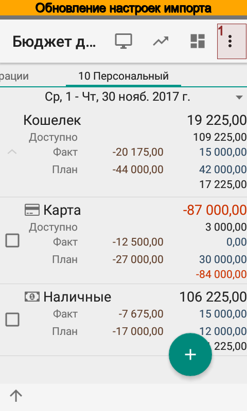
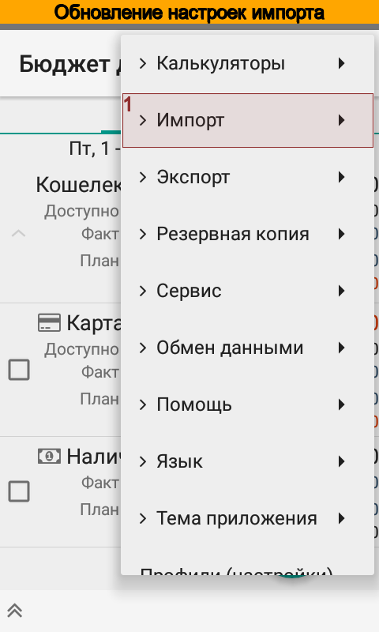
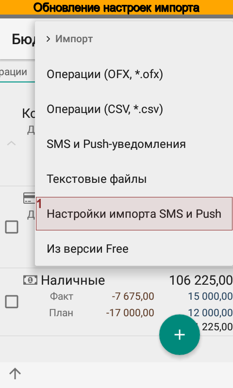

Для загрузки обновлений выберите пункт меню |menu_actions_import_sms_import_settings|.

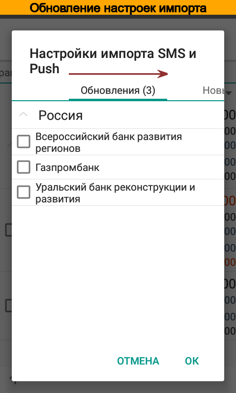
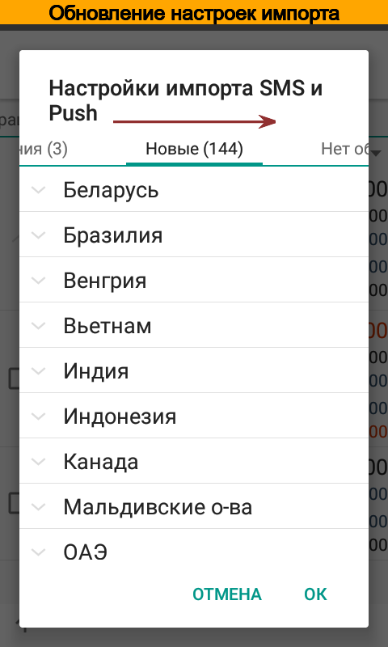
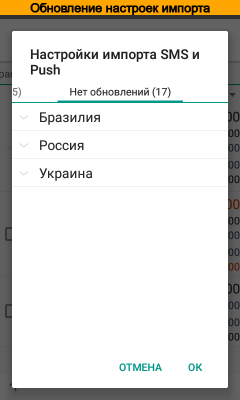

Приложение покажет доступные обновления. Здесь же можно загрузить настройки для новых банков.

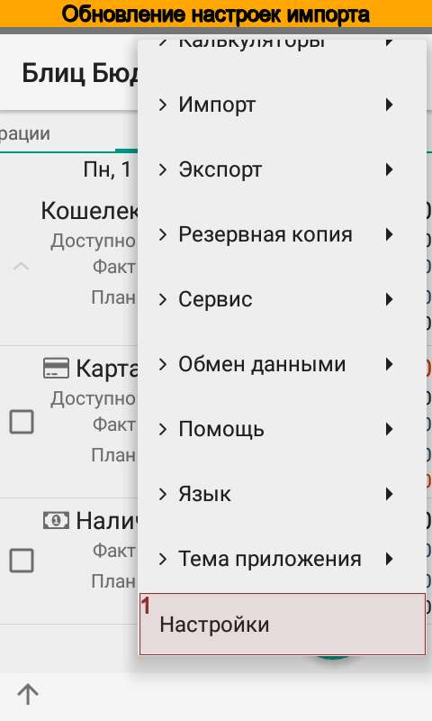
.. image:: images/updateimporttunes-085-select-notifications.png
  :width: 25%

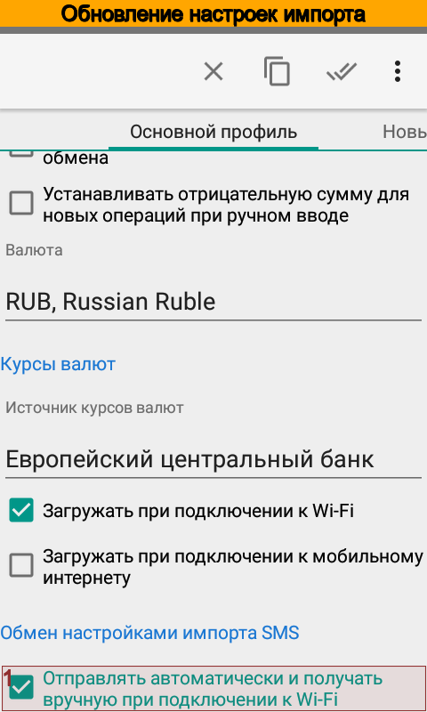

Возможно, что приложение не покажет доступные настройки импорта уведомлений. В этом случае проверьте, что
в настройках включен обмен настройками импорта SMS.

SMS и Push уведомления
----------------------

По умолчанию |бб| автоматически импортирует SMS и Push уведомления. Тем не менее, в приложении есть возможность
в любой момент импортировать вручную SMS и push-уведомления. Для этого:

#. Откройте диалог импорта.
#. Выберите счет, для которого нужно импортировать SMS. В счете должны быть указаны идентификатор и настройка импорта SMS.
#. Отметьте галочками SMS для импорта.
#. Нажмите |button_import|. Кнопка будет доступна, если есть отмеченные SMS.
#. Проверьте результат в списке операций.
#. Проблемы, возникшие при импорте, можно увидеть в журнале событий.

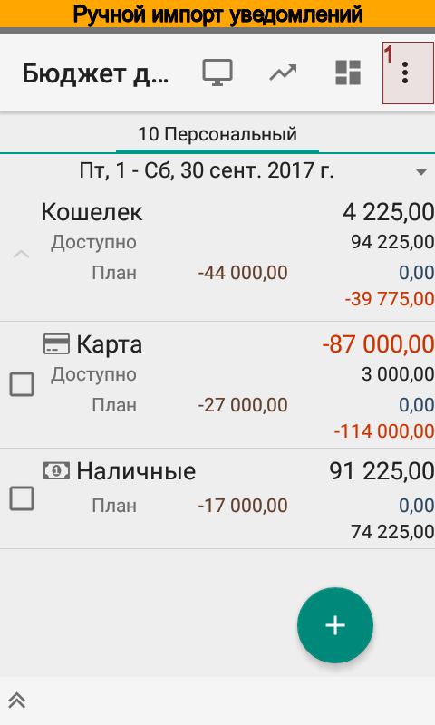
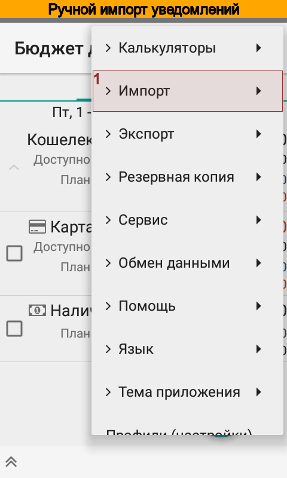
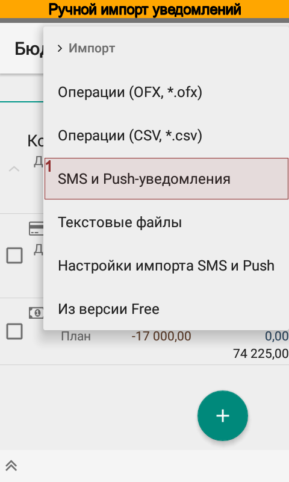

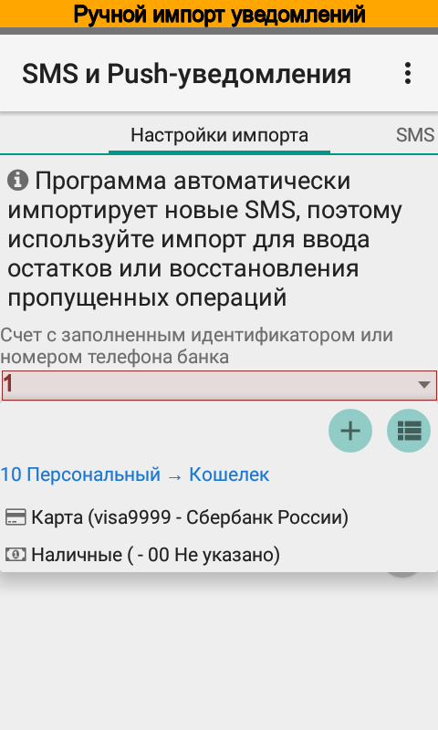
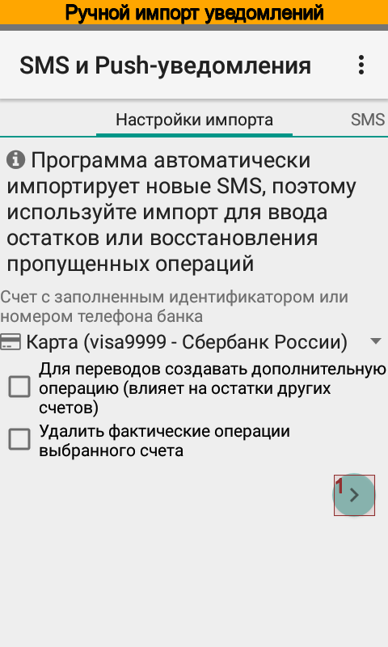
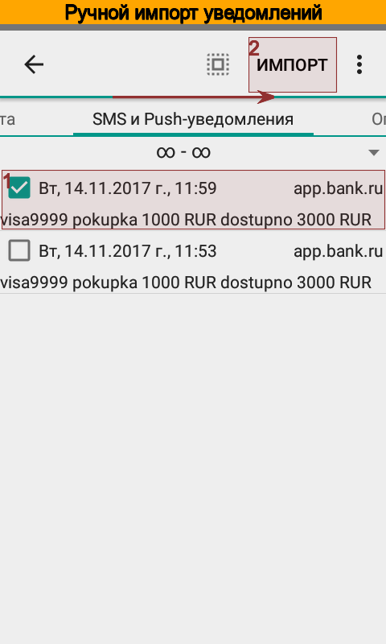

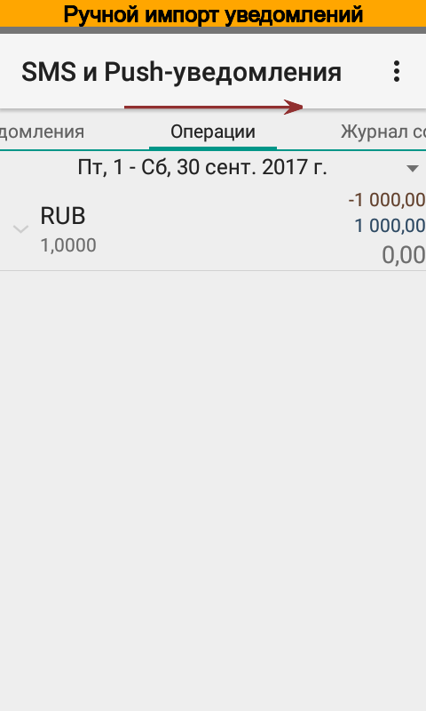
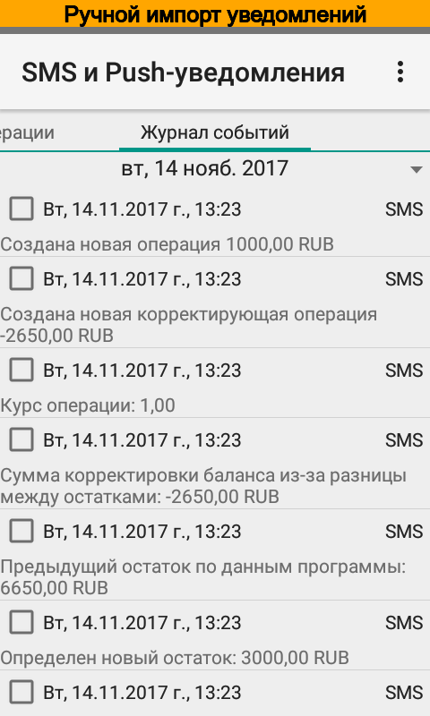

CSV файлы
---------

Во время импорта данных из файлов в формате |csv|, помимо операций, могут быть созданы новые
счета и элементы справочников статей, плательщиков / получателей, проектов и персон.

Программа автоматически определяет разделитель колонок, который может быть одним из символов ";", ",", "|", "/", "\".
Файл должен быть в кодировке UTF-8.

Первая строка файла должна содержать имена колонок на английском языке, регистр не имеет значения. Помимо этого, имена
колонок могут быть заданы в любой другой строке, тогда они будут иметь силу для последующих строк. Поддерживаются имена:

.. list-table:: Формат CSV файла
   :widths: 7 5 30
   :header-rows: 1

   * - Имена
     - Обязательный
     - Комментарий
   * - id
     - Нет
     - Идентификатор операции, если указан, то будет выполнен поиск существующей операции
   * - account
     - Да
     - Наименование или номер счета
   * - date
     - Нет
     - Дата в одном из форматов: "dd'd'MM'd'yyyy" (например, 01d01d2017), "yyyy'd'MM'd'dd" (например, 2017d01d01), "yyyyMMddHHmmss", "yyyyMMddHHmm", "yyyyMMdd", "yyyy-MM-dd HH:mm:ss", "yyyy-MM-dd HH:mm", "yyyy-MM-dd", "dd-MM-yyyy HH:mm:ss", "dd-MM-yyyy HH:mm", "dd-MM-yyyy", "dd.MM.yyyy HH:mm:ss", "dd.MM.yyyy HH:mm", "dd.MM.yyyy"
   * - time
     - Нет
     - Время в одном из форматов: "HH:mm:ss", "HH:mm", "HHmmss", "HHmm"
   * - amount
     - Да
     - Сумма операции (может содержать валюту и разделители групп разрядов), десятичный разделитель может быть точкой или запятой
   * - rate, exchange rate
     - Нет
     - Курс операции
   * - currency
     - Нет
     - Валюта операции, если не указано, то используется в валюта счета
   * - payer, payee, contractor
     - Нет
     - Наименование плательщика или получателя платежа
   * - category
     - Нет
     - Наименование категории, если не указано, то программа дополнительно выполняет поиск по ключевым словам текущей строки
   * - project
     - Нет
     - Наименование проекта, если не указано, то программа дополнительно выполняет поиск по ключевым словам текущей строки
   * - person, unit
     - Нет
     - Наименование персоны/подразделения, если не указано, то программа дополнительно выполняет поиск по ключевым словам текущей строки
   * - notes, note
     - Нет
     - Примечание
   * - planned, plan
     - Нет
     - Фактическая (0), или плановая (1) операция. Если колонка не задана, создается фактическая операция

Если строка не содержит обязательных колонок, или значение обязательной колонки не задано, то такая
строка будет пропущена. Для импорта:

#. Откройте диалог импорта.
#. Выберите файл для импорта.
#. Нажмите |button_next| и отметьте галочками строки для импорта.
#. Нажмите |button_import|. Кнопка будет доступна, если есть отмеченные строки.
#. Проверьте результат в списке операций.
#. Проблемы, возникшие при импорте, можно увидеть в журнале событий.

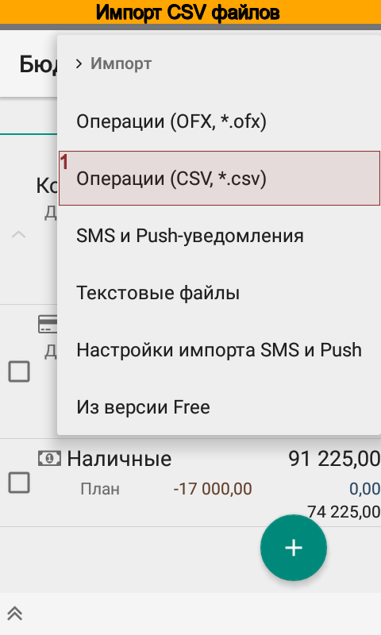
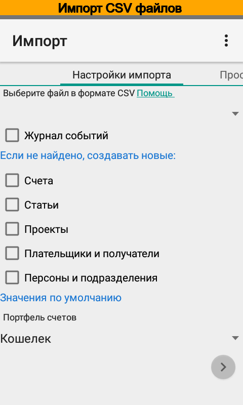

OFX файлы
---------

|бб| поддерживает импорт |OFX| файлов. Поддерживается спецификация начиная с версии 2.1.1. Для импорта:

#. Откройте диалог импорта.
#. Выберите файл для импорта.
#. Нажмите |button_next| и отметьте галочками строки для импорта.
#. Нажмите |button_import|. Кнопка будет доступна, если есть отмеченные строки.
#. Проверьте результат в списке операций.
#. Проблемы, возникшие при импорте, можно увидеть в журнале событий.

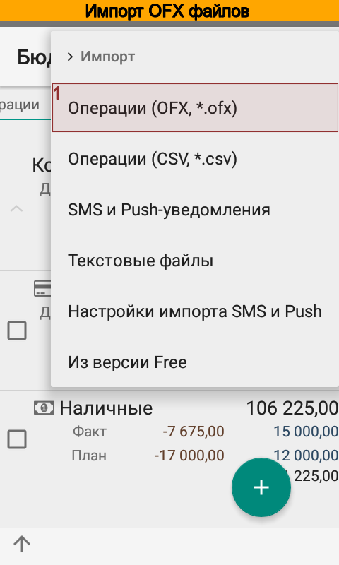
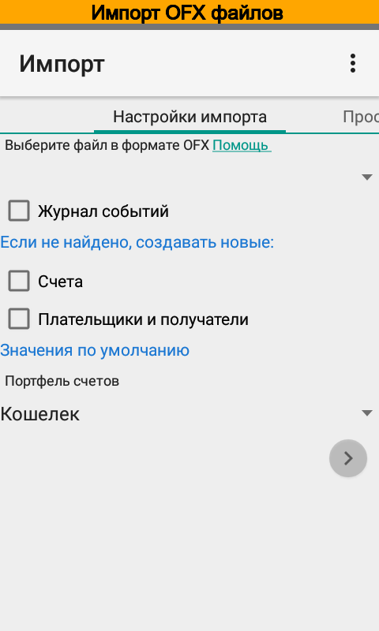
