.. include:: termins.rst
.. _chapter_main_screen:

Главный экран
=============

Описание
--------

Главный экран |бб| содержит сводку по портфелям и счетам. Если в приложении используется несколько
типов портфелей, то на экране будет выведено несколько сводок. В примерах ниже рассматривается вариант с
одним типом портфеля :dfn:`Персональный`.

В сводке отображаются остатки по каждому счету и всему портфелю в целом. Если для счета задан кредитный лимит,
то также отображается доступная сумма.

Ниже остатков расположены фактические и планируемые суммы расходов и доходов. Также отдельно выводятся суммы переводов,
если таковые были в выбранном периоде.

Выбор периода
-------------

Период можно изменить при помощи редактора периодов, который расположен в верхней части экрана. Редактор
поддерживает жесты перелистывания и выбора.

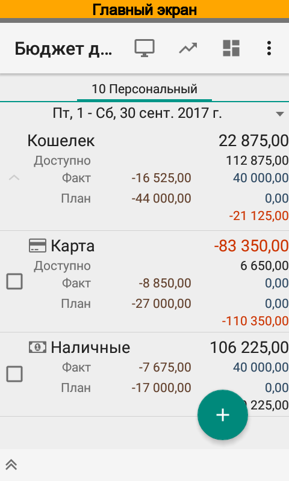
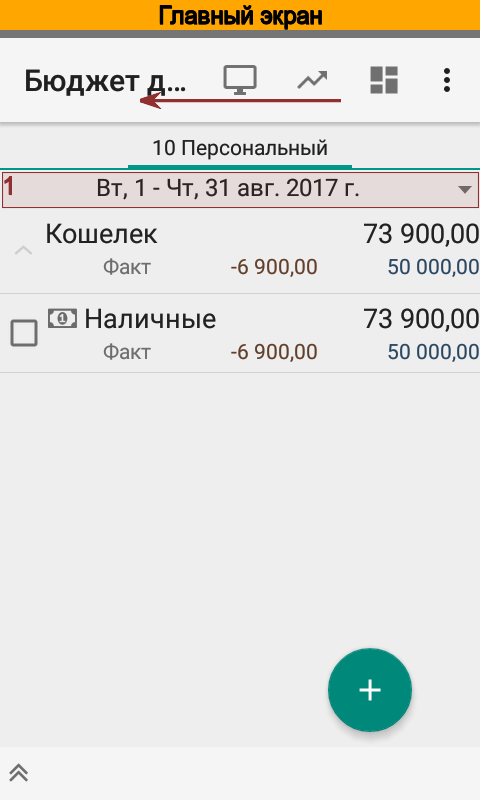
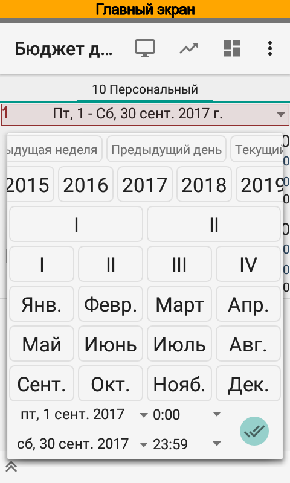

Настройки
---------

Настройки сводки расположены в нижней части экрана. В настройках можно изменить группировку, заданную по умолчанию,
и отредактировать фильтр. В фильтре можно задать отбор по портфелям, счетам, валютам и отключить отображение плана.

В следующем примере задается фильтр по счетам.

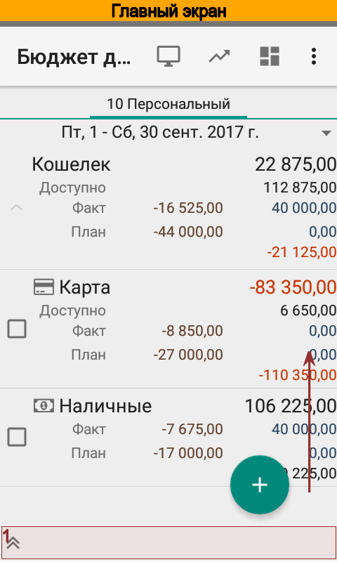
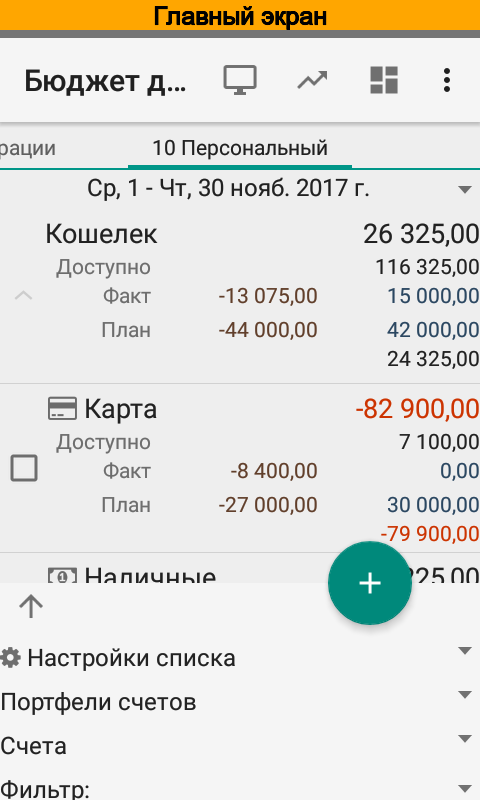
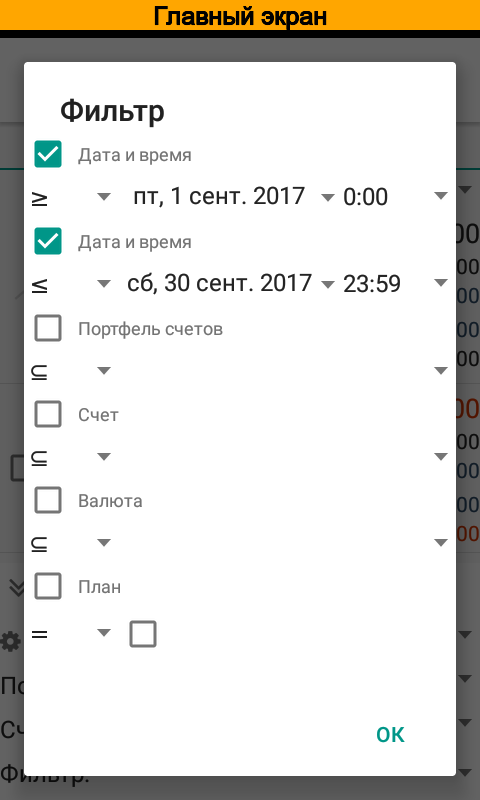

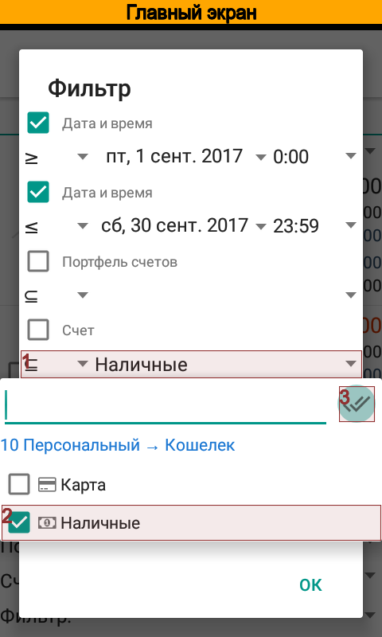
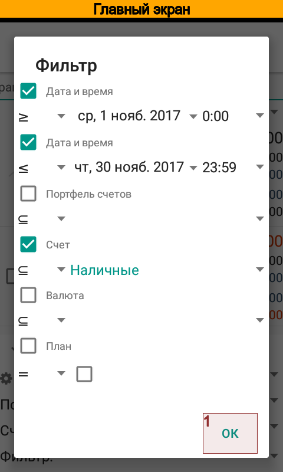
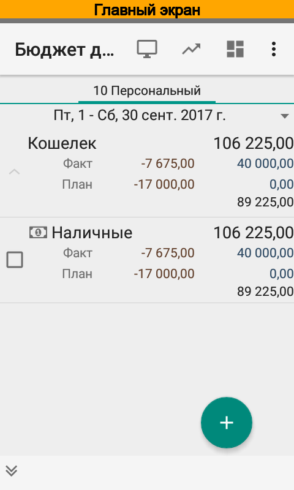

Теперь на главном экране отображается только счет :dfn:`Наличные`.

Сохранение настроек
-------------------

Измененные настройки можно сохранить для последующего использования. Для этого следует выбрать
:guilabel:`Настройки списка` и создать новую настройку. Значения фильтра будут автоматически
скопированы. Остается указать название настройки, например :dfn:`Сводка по одному счету`, и
нажать :guilabel:`Сохранить`.

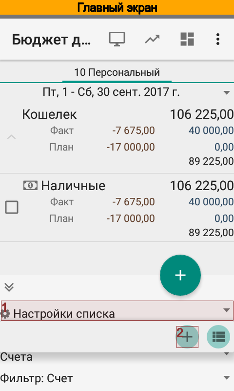
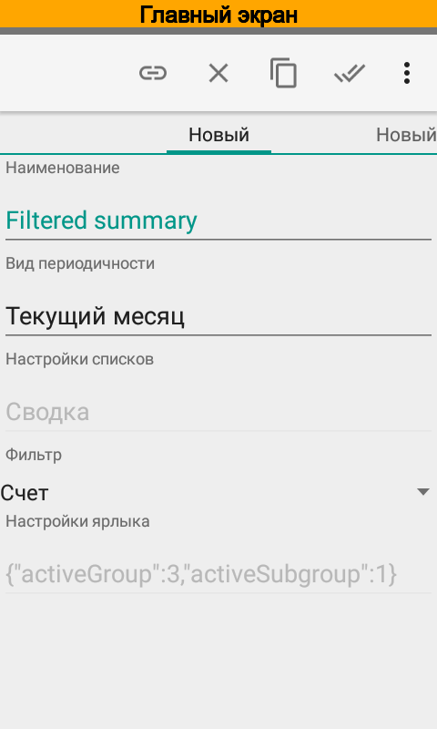

Приложение позволяет иметь одновременно несколько сохраненных настроек и
при запуске загружает для главного экрана последнюю использованную настройку.
