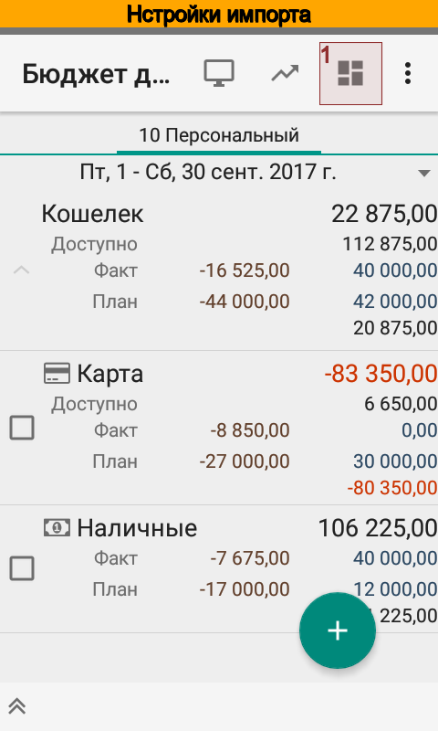
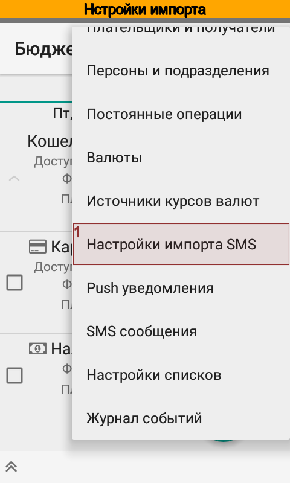
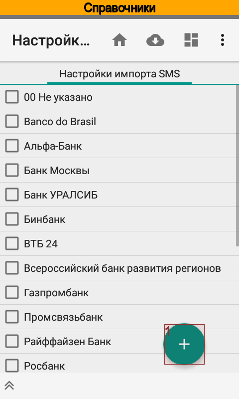
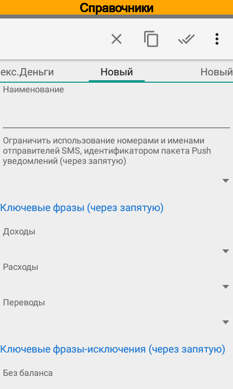
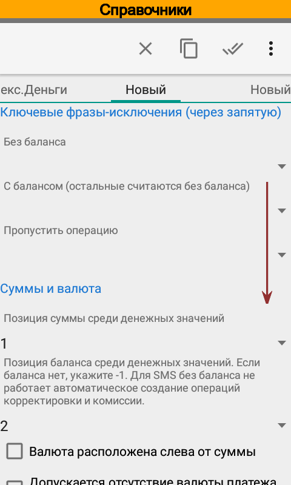

.. include:: termins.rst
.. _chapter_notifications:

Расширенная настройка импорта SMS и push-уведомлений
====================================================

Алгоритм распознавания уведомлений
----------------------------------

Основную роль при импорте SMS и push-уведомлений играет настройка импорта. Именно от нее зависит
как приложение распознает операцию, будет ли операция доходной, расходной или переводом, нужно ли
рассчитать баланс и курс операции и т.д.

Алгоритм распознавания операции показан на рис ниже.

.. image:: images/sms-import-algorithm-ru.png
  :width: 75%
  :align: center

При поступлении нового уведомление приложение пытается определить счет исходя из идентификаторов,
которые указаны в справочнике счетов. Если счет найден и он является единственным, то приложение
загружает связанную со счетом настройку импорта.

Далее, на основании настройки выполняется классификация типа операции --- доходная, расходная или перевод.
Для переводов, приложение пытается подобрать счет-получатель исходя из ключевых фраз,
которые указаны в справочнике счетов. Если корреспондирующий счет найден и он является единственным, то
приложение создаст вторую операцию и перевод будет завершенным.

Следующий этап --- определение аналитик. По соответствующим ключевым фразам приложение пытается подобрать
контрагента, статью, проект и персону. При подборе учитывается тип операции. Если какую-либо из
аналитик не удалось подобрать то используются значения по умолчанию.

Наконец, приложение вычисляет сумму и баланс после операции. Если баланс по данным приложения не совпадает
с указанным в тексте уведомления, то могут быть созданы дополнительные операции комиссии, корректировки баланса
или же будет рассчитан курс операции. Это зависит от контекста и валюты операции.

Иногда бывает так, что уведомления приходят не в том порядке, как были совершены операции. В этом случае приложение
будет создавать автоматические корректировки баланса до тех пор, пока порядок не восстановится. После восстановления
правильного порядка приложение по возможности удалит лишние корректировки.

Например:

1. 13.04.2016, 10:00, остаток = 1000

Пришли SMS в неправильном порядке (правильный порядок: 4, 3, 5, 2)

2. 13.04.2016, 15:00, списание = -50, баланс = 500, => автокорректировка = -450
3. 13.04.2016, 15:05, списание = -90, баланс = 800, => автокорректировка = +390
4. 13.04.2016, 15:10, списание = -110, баланс = 890, => автокорректировка = +200
5. 13.04.2016, 15:15, списание = -250, баланс = 550, => автокорректировка = -90

Поступила SMS в правильном порядке

6. 13.04.2016, 15:20, списание = -100, баланс = 400, => автокорректировка = 0, автокорректировки 2 - 5 удалены

Создание новой настройки импорта
--------------------------------

На момент написания руководства приложение имеет более 160 готовых настроек импорта бля банков различных стран.
Конечно, это не очень много, однако Вы с легкостью можете добавить настройку импорта для своего банка.
Поверьте, это совсем не сложно.

Наименование новой настройки может быть любым, оно необходимо только Вам. Конечно, лучше чтобы название совпадала с
названием банка или платежной системы.

Ограничение по отправителю (номерами или именами отправителей SMS, идентификаторами пакетов push-уведомлений)
используется в редких случаях, когда приложение не может корректно определить счет. Оно отрабатывает раньше
подбора счета, ограничивая выбор счета только среди счетов с подходящей настройкой импорта.

Например, пусть в приложении занесено два счета
  #. РокетБанк, идентификатор ru.rocketbank.r2d2, настройка импорта РокетБанк;
  #. ВТБ, идентификатор \*\*\*1234, настройка импорта ВТБ.

РокетБанк, отправитель ru.rocketbank.r2d2, присылает уведомления о зачислении средств в виде
::

  Операция >> +18 000 руб.
  Пополнение с карты «ВТБ-24 ***1234»

В этом уведомлении нет идентификатора счета, зато указан счет-источник перевода. Если ограничение не указано,
то приложение не может корректно выбрать счет, т.к. подходят оба счета.

Если задано ограничение ru.rocketbank.r2d2, то приложение по совпадению отправителя и заданного ограничения
находит настройку импорта РокетБанк. Эта настройка указана только в одном счете, поэтому приложение правильно выбирает
счет РокетБанк.

Основные параметры импорта задаются ключевыми фразами. Каждый параметр может содержать несколько ключевых фраз.
Ключевая фраза может содержать пробелы, между собой ключевые фразы должны быть разделены запятыми.

Ключевые фразы для доходов и расходов определяют знак операции. Если знак операции не определен, то импорт такой операции невозможен.

Ключевые фразы для перевода сигнализируют приложению о том, что нужно создать не одну, а две операции. Направление
перевода зависит от знака операции.

Например, пусть:
  #. Ключевые фразы для доходов: "пополнение наличными,кредит,поступление"
  #. Ключевые фразы для переводов: "пополнение наличными"
  #. Идентификатор счета Карта: Visa2900
  #. Ключевые фразы счета Наличные: ATM

От банка поступило SMS:
::
    Karta Visa2900. Пополнение наличными 2000.00 RUR ATM .Ostatok:2740.26 RUR. 25/03/14,15:00:00.

В результате программа создаст две операции:
  #. Операцию зачисления на счет Карта;
  #. Операцию списания со счета Наличные.

Иногда бывает так, что некоторые уведомления содержат баланс, некоторые --- нет. Соответствующие ключевые фразы
подскажут приложению, когда нужно определять баланс, а когда --- нет.

Банковские сообщения о том, что не может быть выполнена та или иная операция носят информационный характер,
однако содержат ключевые фразы для доходов или расходов. Ключевые фразы в параметре Пропустить операцию позволяют
прервать обработку импорта уведомления.

Например:
  #. Ключевые фразы для зачисления: "пополнение наличными,кредит,поступление"
  #. Ключевые фразы для неудачной операции: "ошибка"
  #. Идентификатор счета Карта: Visa2900

От банка поступило SMS:
::
    Karta Visa2900. Пополнение наличными 2000.00 RUR ATM .Ostatok:740.26 RUR. Произошла ошибка. 25/03/14,15:00:00.

В результате программа не создаст операцию зачисления средств на счет Карта. И это будет соответствовать действительности,
т.к. по какой-то причине банкомат вернул деньги, вместо зачисления на счет.

Позиция суммы операции среди числовых значений указывает программе на наиболее вероятное
расположение суммы. В процессе разбора уведомления приложение примет окончательное решение.

Позиция остатка операции среди числовых значений указывает приложению на наиболее вероятное
расположение баланса. Также как и в случае с суммой операции, в процессе разбора уведомления
приложение самостоятельно примет окончательное решение.

Если все уведомления банка не содержат информацию о балансе, то следует указать "-1".

Если задана позиция баланса, отличная от "-1", то приложение будет игнорировать все сообщения, в которых нет баланса.

Сумма операции и значение баланса используются для расчета курса операции, комиссий и автоматических корректировок.

Для правильной работы программы необходимо, чтобы рядом с суммой была указана валюта. Валюта может быть указан как
слева от суммы так и справа. Для подбора валюты используются название и ключевые слова, указанные для каждой валюты
в справочнике Валюты.

Однако некоторые банки не всегда указывают валюту, например, Росбанк. В этом случае отметьте флажок
"Иногда валюта платежа может быть не указана". В этом случае программа будет использовать валюту счета.
