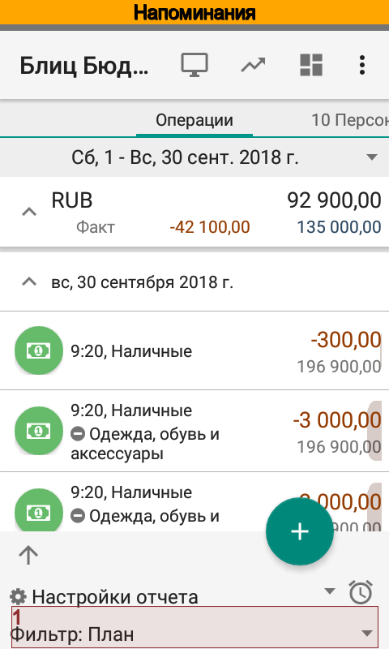
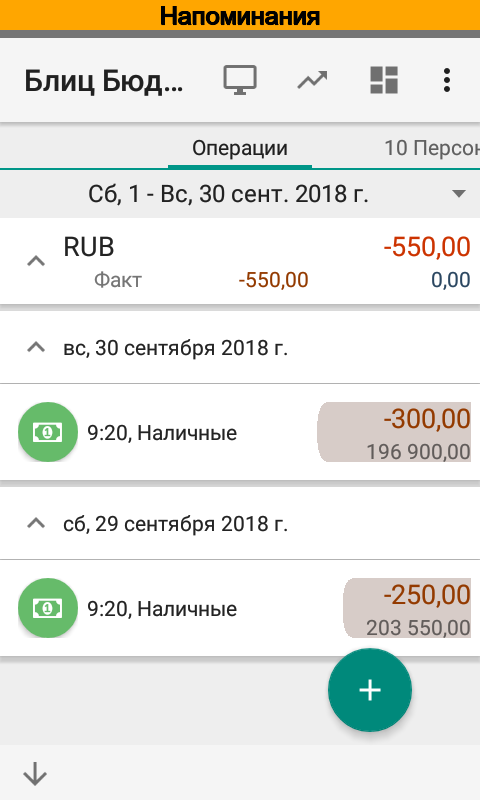
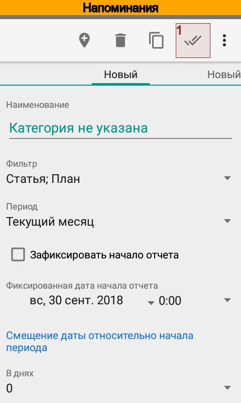
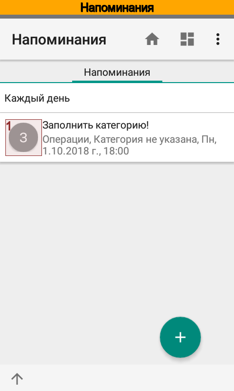

.. include:: termins.rst
.. _chapter_reminders:

Напоминания
===========

|бб| позволяет создавать напоминания на основании отчетов или списка операций. Напоминание может быть разовым
или иметь заданную периодичность. Механизм напоминаний позволяет:

  *  Настроить напоминания о незаполненных операциях.

  *  Настроить напоминания об особенных операциях.

  *  Настроить предупреждения о расхождении плана и факта.

  *  Настроить предупреждения о любом событии, которое можно выявить с помощью отчета.

  *  Автоматически формировать отчеты по расписанию.

.. note::
   В версии Pro из напоминания можно сразу перейти в отчет

Перед созданием напоминания необходимо сформулировать условия, при наступлении которых Вы хотите увидеть
уведомление о возникновении того или иного события. Для этого создайте и сохраните настройку
отчета, в которой укажите нужные значения фильтра и группировку отчета, см.
:ref:`chapter_shortcuts`.

Как только настройка будет готова, создайте для нее напоминание кнопкой |button_reminders| или из справочника |meta_dir_reminders|.

.. note::
   Начиная с версии Android 4.4 точность срабатывания напоминаний составляет +/- 15 мин.

Разберем создание напоминания на примере напоминания об операциях с незаполненной категорией. На главном экране
перейдем в список операций.

.. image:: images/reminders-010-main-screen.png
  :width: 25%
.. image:: images/reminders-020-main-screen-swipe-left.png
  :width: 25%
.. image:: images/reminders-030-main-screen-transactions.png
  :width: 25%

Отредактируем фильтр так, что бы в список попадали только операции с незаполненной категорией.

.. image:: images/reminders-040-transactions-bottom-sheet-opening.png
  :width: 25%

.. image:: images/reminders-060-report-filter.png
  :width: 25%

.. image:: images/reminders-070-report-filter-category.png
  :width: 25%
.. image:: images/reminders-080-report-filter-apply.png
  :width: 25%

После установки фильтра список операций изменился, теперь он содержит только две операции. Сохраним фильтр
в настройке отчета. Для этого откроем подвал и щелкнув по |spinner_list_view_settings| создадим
новую настройку. Оставим период настройки без изменений, однако Вы можете отредактировать его нужным образом.

.. image:: images/reminders-100-report-select-new-setting.png
  :width: 25%

.. image:: images/reminders-110-report-view-settings-alarms.png
  :width: 25%

Теперь на основании новой настройки создадим напоминание. Для этого перейдем в список напоминаний и
откроем карточку нового напоминания. Зададим дату начала и время выполнения напоминания, периодичность и название. Название
отображается в уведомлении, которое будет сформировано по напоминанию.

.. image:: images/reminders-120-alarms-new.png
  :width: 25%
.. image:: images/reminders-130-alarms-edit.png
  :width: 25%
.. image:: images/reminders-140-alarms.png
  :width: 25%

Напоминание готово, осталось только проверить, как оно работает. Для этого отмечаем напоминание и выбираем
|button_reminders_run|. В строке состояния мы видим уведомление о наличии операций с незаполненной категорией.

.. image:: images/reminders-160-alarms-run.png
  :width: 25%
.. image:: images/reminders-170-alarm_notification.png
  :width: 25%

Для просмотра списка операций достаточно щелкнуть по уведомлению.

.. note::
   Переход к данным уведомления доступен только в версии Pro

Теперь при появлении операций с незаполненной категорией мы каждый день в назначенное время
будем видеть уведомление о необходимости заполнить категорию.
