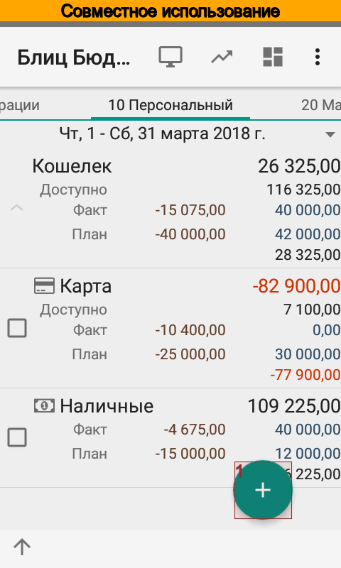
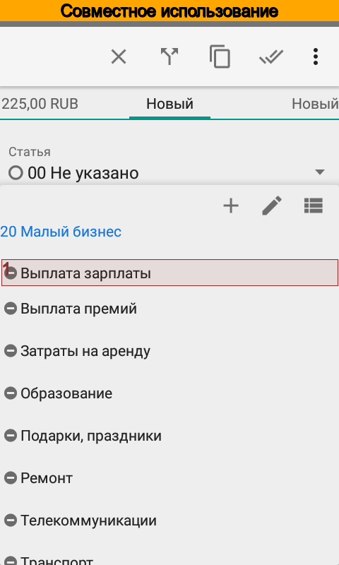
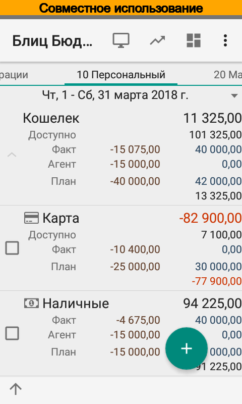

.. include:: termins.rst
.. _chapter_shared_transactions:

Совместное использование типов портфелей
========================================

Совместное использование типов портфелей предназначено в основном для предпринимателей
и решает проблему "агентских" платежей. Например, пользователь является
индивидуальным предпринимателем и имеет два типа портфеля, персональный и малый бизнес.
Часто бывает так, что часть расходов за малый бизнес оплачивается с личной
карты, которая принадлежит персональному типу портфеля. Т.е. персональный тип портфеля
выступает в роли агента для типа портфеля Малый бизнес, т.к. действует в его интересах.
Но по умолчанию такие расходы отражаются в персональном типе портфеля, что, конечно,
не удобно для формирования отчетности. Более того для таких расходов необходимо
использовать аналитики малого бизнеса, которые недоступны для личной карты.

Для решения этой проблемы в приложении предусмотрен режим совместного использования типов
портфелей.

Чтобы включить режим совместного использования отредактируйте тип портфеля.
Флажок |property_budget_types_share| предназначен для того, чтобы аналитики данного типа портфеля
были доступны для всех типов портфелей.
Флажок |property_budget_types_mark_foreign_transactions| предназначен для того, чтобы:

#. В списке операций выделялись как агентские операции те операции, у которых не совпадает тип портфеля счета и статьи;
#. В отчетах тип портфеля определялся не по типу портфеля счета, а по типу портфеля статьи.

Пример совместного использования типов портфелей
------------------------------------------------

Включим режим совместного использования для типа портфеля |item_small_business|.

.. image:: images/transactionsshared-010-select-directories.png
  :width: 25%
.. image:: images/transactionsshared-020-menu-directories.png
  :width: 25%
.. image:: images/transactionsshared-025-types-of-portfolio.png
  :width: 25%

.. image:: images/transactionsshared-030-types-of-portfolio-business.png
  :width: 25%

Занесем новую операцию выплаты зарплаты работникам со счета |item_cash|, который принадлежит типу портфеля |item_personal|,
в интересах типа портфеля |item_small_business|.

.. image:: images/transactionsshared-050-transaction-edit.png
  :width: 25%
.. image:: images/transactionsshared-050-transaction-select-salary-start.png
  :width: 25%

Видно, что теперь доступна статья |item_category_salary_out|, а после ее выбора ниже статьи отображается
расшифровка, какому типу портфеля принадлежит аналитика.

.. image:: images/transactionsshared-057-transaction-select-salary-end.png
  :width: 25%

Теперь проверим список операций, сводку и отчеты. В списке операций новая операция выделена другим цветом,
кроме того отдельно рассчитаны итоги. Точно также в сводке итоги рассчитаны отдельно.

.. image:: images/transactionsshared-060-transactions.png
  :width: 25%

.. image:: images/transactionsshared-080-summary-small-business.png
  :width: 25%

В отчетах мы видим, что такая операция попала в тип портфеля |item_small_business|,
благодаря чему легче рассчитать баланс.

.. image:: images/transactionsshared-090-turnovers.png
  :width: 25%

.. note:: Чтобы не дублировались расходы, перечисление денежных средств на сумму агентских операций из типа портфеля |item_small_business| в тип портфеля |item_personal| необходимо отражать переводом
