.. include:: termins.rst
.. _chapter_shortcuts:

Настройки отчетов и ярлыки
==========================

Настройки отчетов
-----------------

|бб| позволяет сохранять значения группировок и фильтров для отчетов и списка операций. Разберем
сохранение настройки на примере отчета :samp:`Обороты`. Аналогичным образом сохраняются настройки
для других отчетов и списка операций.

Итак, после открытия в отчете по умолчанию установлены текущий месяц, группировки и значения фильтра.

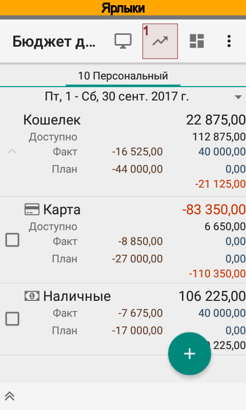
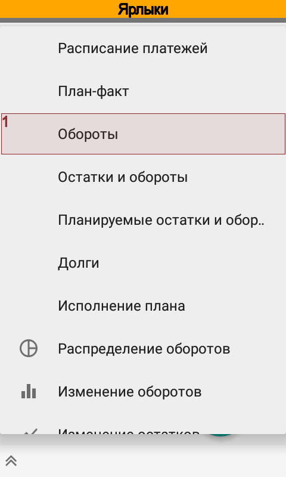
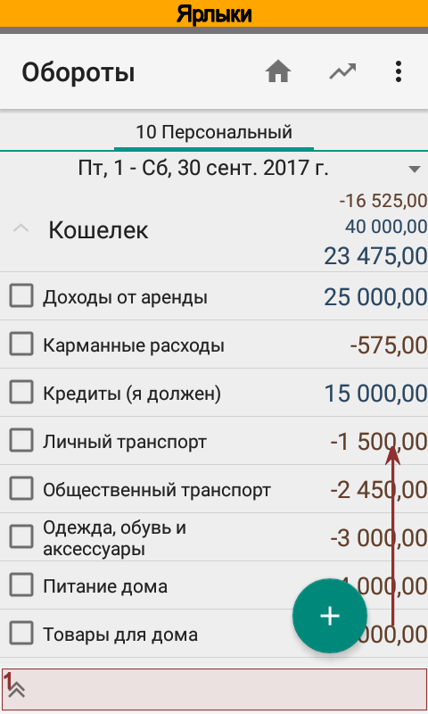

Наша цель --- добиться того, чтобы был быстрый доступ к формированию отчета :samp:`Обороты` с отбором
сразу только по одному счету.

Отредактируем настройки фильтр. Для этого следует вытянуть подвал и нажать на :guilabel:`Фильтр`.
В редакторе фильтра зададим отбор только по одному счету и применим изменения.

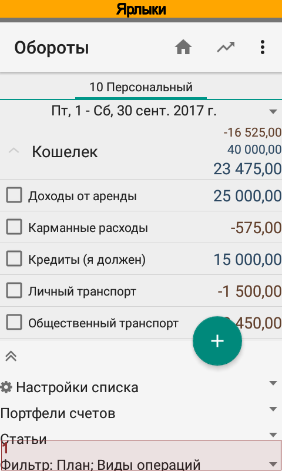
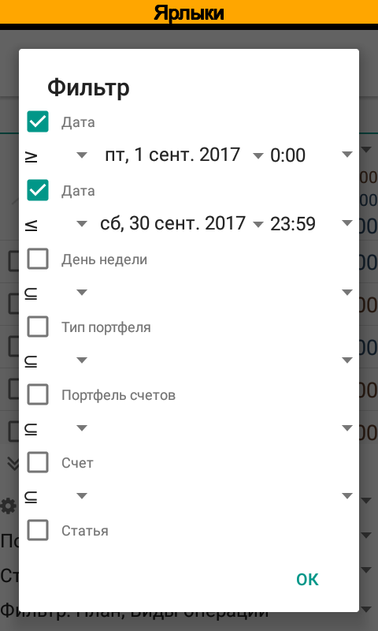
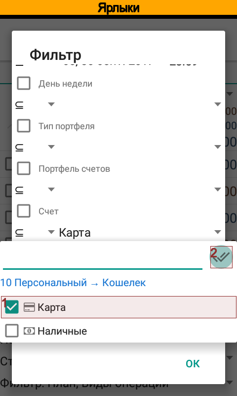

На рисунке видно, что теперь в отчете отображаются данные только одного счета. Теперь создадим и
сохраним настройку. Для этого в подвале следует нажать на :guilabel:`Настройки списка` и в выпадающем списке
выбрать создание новой настройки.

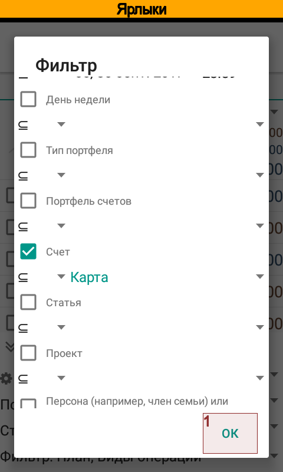
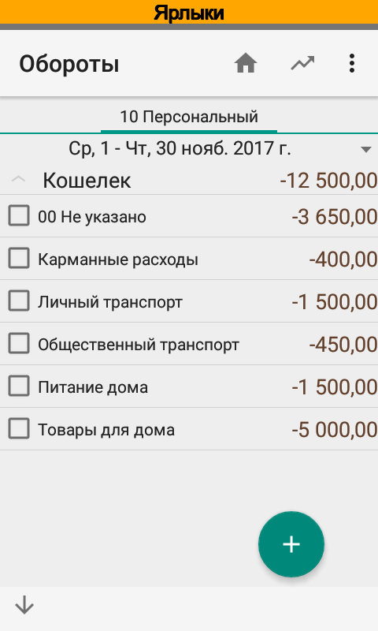
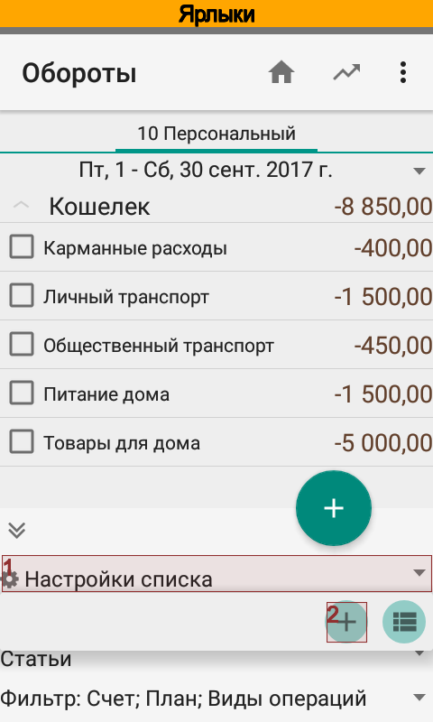

Укажем название новой настройки :dfn:`Обороты по одному счету` и сохраним ее. Теперь в списке настроек доступна
готовая настройка :dfn:`Обороты по одному счету`, при ее выборе в отчете сразу будут установлены нужные группировки
и значения фильтра.

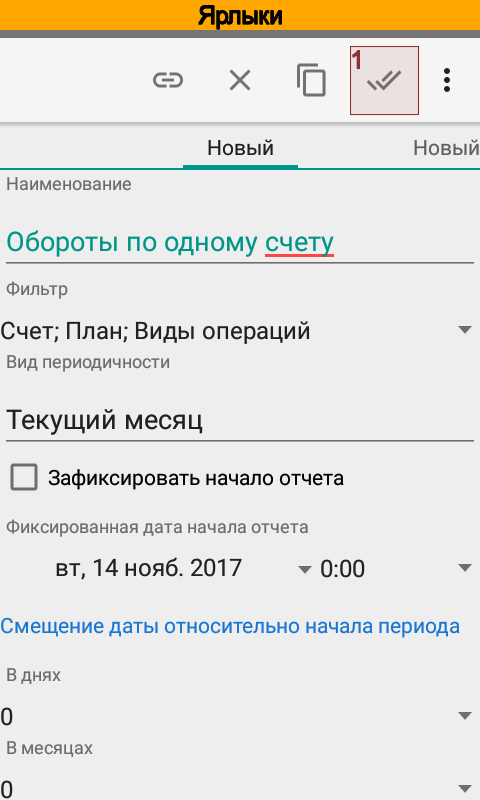
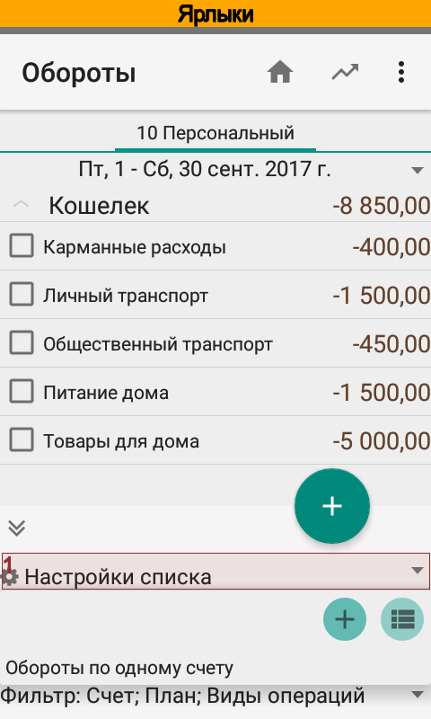

Создание ярлыка
---------------

|бб| позволяет открывать отчеты и список операций прямо из окна оболочки Android. В предыдущей части мы рассмотрели
создание настройки. Предположим, что мы хотим не только создать настройку но и сделать для нее ярлык.

.. note::
  Создание ярлыков доступно в версии Pro.

Вернемся к карточке настройки. Обратите внимание, что в карточке можно задать вид периодичности. От этого зависит,
какой период будет установлен при открытии отчета по ярлыку. По умолчанию установлен текущий месяц, но при
необходимости можно задать другой вид периодичности, например, текущий квартал или полугодие и т.п.

Для создания ярлыка следует нажать :guilabel:`Создать ярлык`.

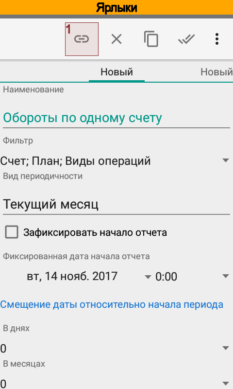
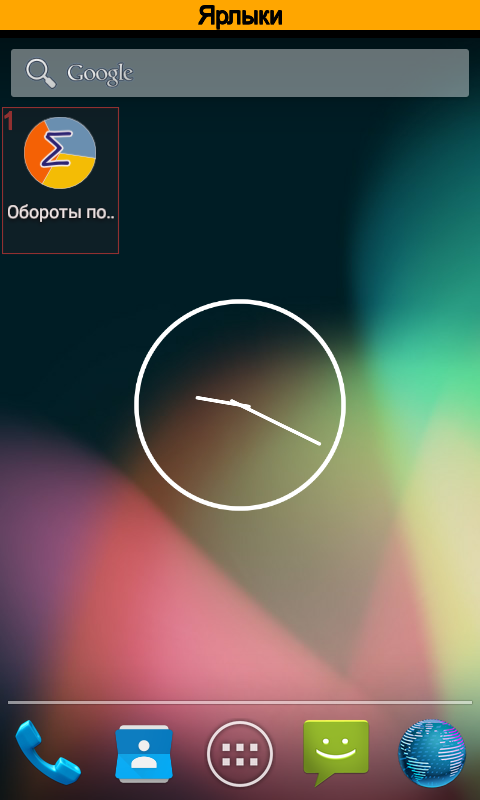

При создании ярлыка приложения автоматически размещает новый ярлык на свободном месте на одном из окон оболочки.

.. note::
  Ярлык связан с настройкой списка. Если удалить настройку, то ярлык перестанет работать.

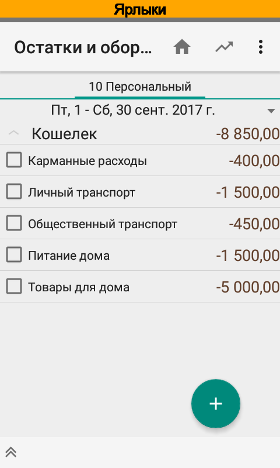
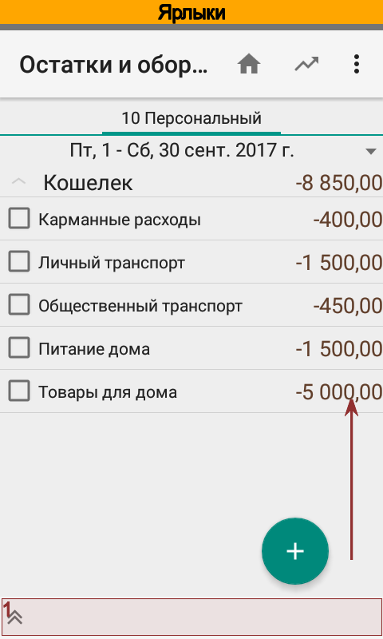
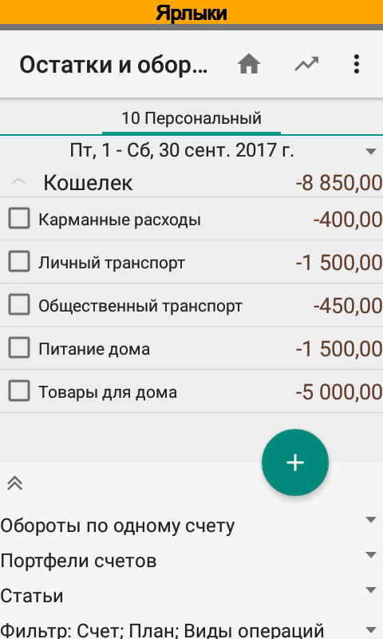

Проверим работу ярлыка. По нажатию открывается отчет, на рисунках видно, что приложение сразу применило заданные
настройки фильтра.

Ярлык --- это только ссылка на настройку, поэтому если в дальнейшем требуется изменить параметры отчета,
то достаточно просто отредактировать сохраненную настройку.
