.. include:: termins.rst
.. _chapter_teamwork:

Коллективная работа
===================

Введение
--------

|бб| позволяет вести совместный учет доходов и расходов. Вот несколько примеров:

#. Полная синхронизация между устройствами;
#. Совместный финансовый учет только по выбранным счетам, проектам, персонам, контрагентам или даже статьям;
#. Сбор данных на одном устройстве, в случае, когда, скажем, родители отслеживают расходы детей.

Любое устройство, на котором установлена программа, может стать узлом обмена (см. :term:`узел обмена`) и получать или передавать изменения. Каждый узел обмена может обмениваться информацией с другими узлами.

.. note:: Версия Free может передавать, но не может принимать сообщения. Версия Pro не содержит ограничений.

Программа имеет гибкие настройки, регулирующие процесс обмена. Так например, можно разрешить принимать только новые операции от одного узла, и запретить принимать измененные. Для каждого узла обмена действуют свои настройки.

В целях повышения безопасности все сообщения между узлами шифруются, для каждого узла можно задать свой пароль, который будет использоваться для шифрования / дешифрования передаваемой информации.

Для совместной работы не требуется учетная запись Dropbox или других сервисов.

Начало работы
-------------

Выбор исходных данных
~~~~~~~~~~~~~~~~~~~~~

Предположим, что Алиса и Боб хотят вести совместный финансовый учет. Предварительно, им нужно определиться какая ситуация для них ближе:

#. В начале работы у Алисы и Боба будут одинаковые данные.
#. Алиса и/или Боб уже давно ведут учет и не хотят объединять все данные, а планируют синхронизировать лишь отдельные счета.

В первом случае Алиса или Боб (для определенности пусть это будет Алиса) делает резервную копию данных. Затем Алиса передает резервную
копию данных Бобу и тот восстанавливает ее у себя на устройстве. Теперь у Алисы и Боба идентичные базы данных. Для корректной работы обмена
необходимо, что идентификаторы баз данных различались, поэтому Боб выполняет дополнительную сервисную операцию, формирует новый идентификатор на своем устройстве.

.. note:: После восстановления данных из резервной копии для нового узла обмена необходимо сформировать новый идентификатор.

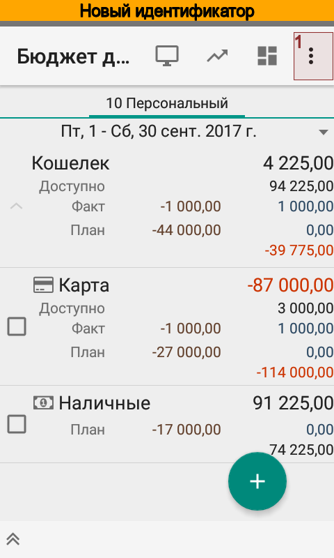
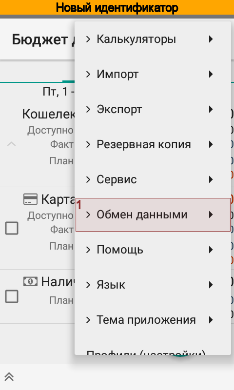
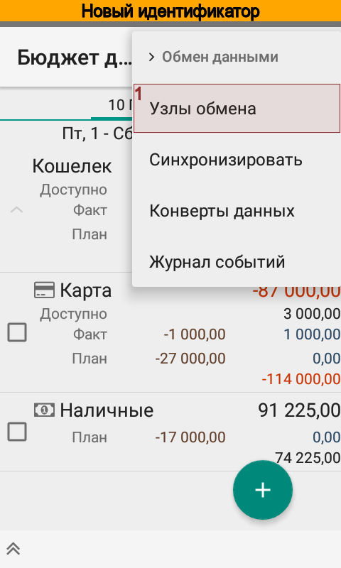
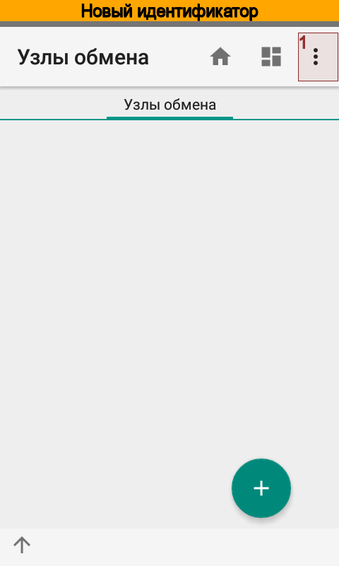
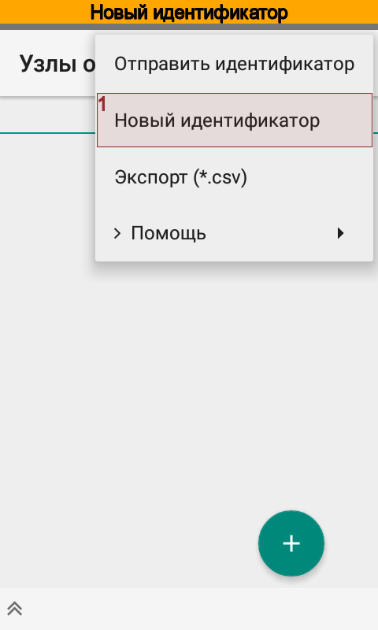

Теперь Алиса и Боб готовы к настройке обмена.

Во втором случае никаких предварительных действий совершать не нужно. Алиса и Боб сразу готовы к настройке обмена.

Обмен идентификаторами
~~~~~~~~~~~~~~~~~~~~~~

Для работы обмена Алисе и Бобу необходимо обменяться идентификаторами узлов обмена и сохранить их в справочнике узлов.
Для этого Алиса открывает справочник |meta_dir_nodes| используя меню |menu_actions_exchange_nodes|. В справочнике
узлов обмена Алиса выбирает пункт меню |menu_send_identity| и отправляет идентификатор своего узла
по электронной почте Бобу.

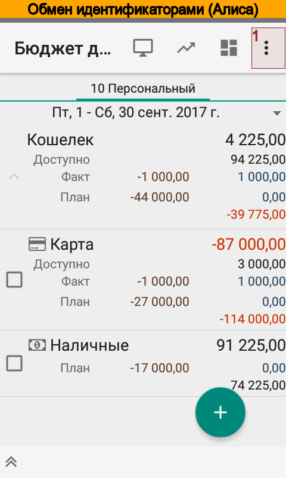
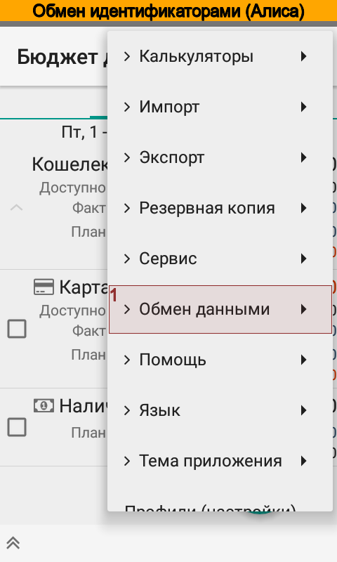
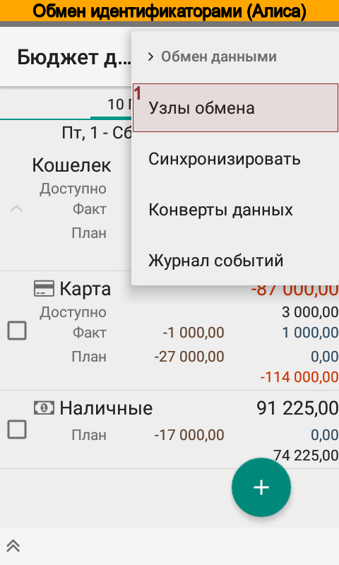
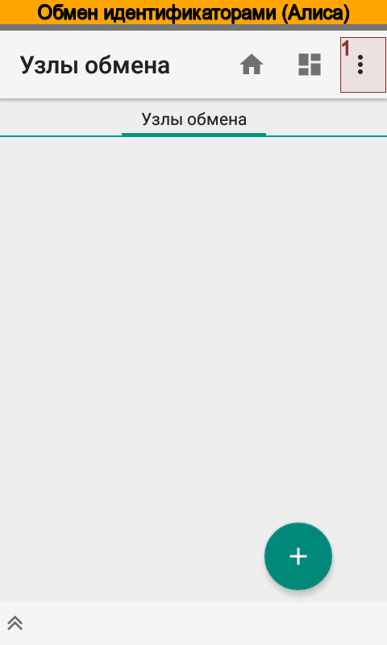
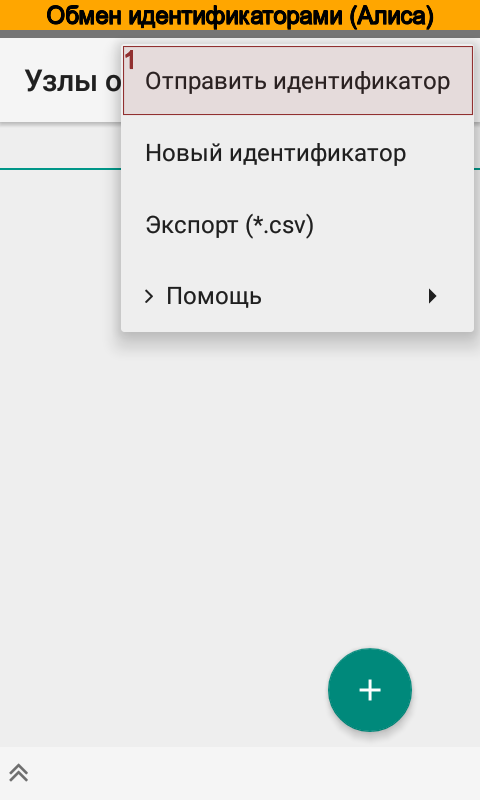
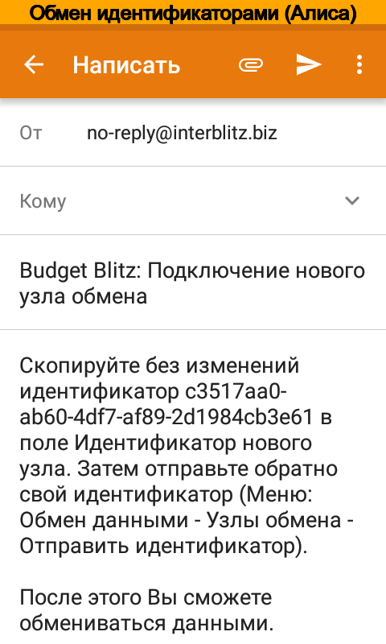

Боб принимает сообщение, создает новый узел обмена, указывает название и копирует полученный идентификатор. После этого отправляет свой идентификатор Алисе.

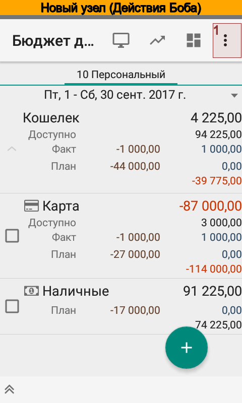
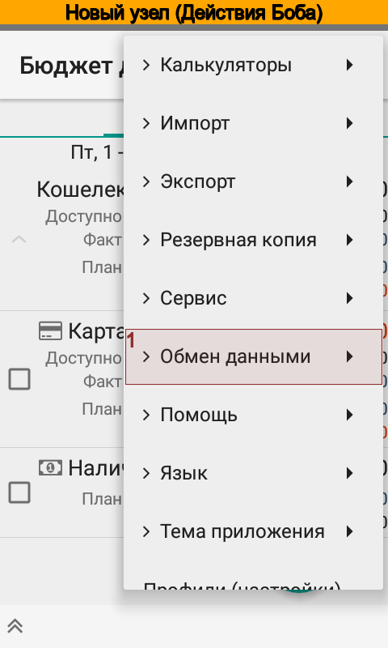
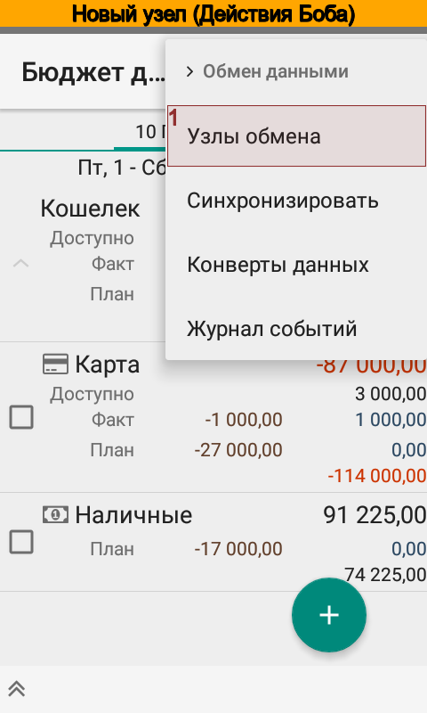
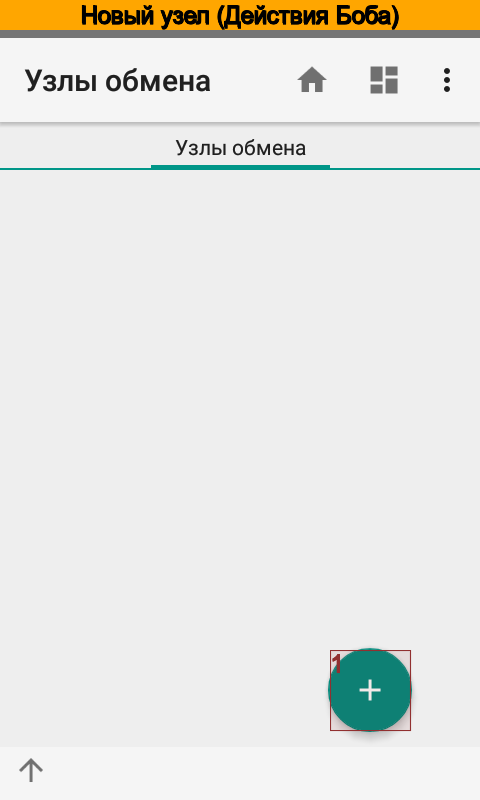
.. image:: images/exchangenewnode-040-setup_node.png
  :width: 25%

Алиса, в свою очередь, принимает сообщение Боба и создает новый узел обмена с идентификатором, который указан в сообщении Боба.

Включение обмена
----------------

После обмена идентификаторами Алиса и Боб включают в активном профиле синхронизацию данных между узлами обмена.

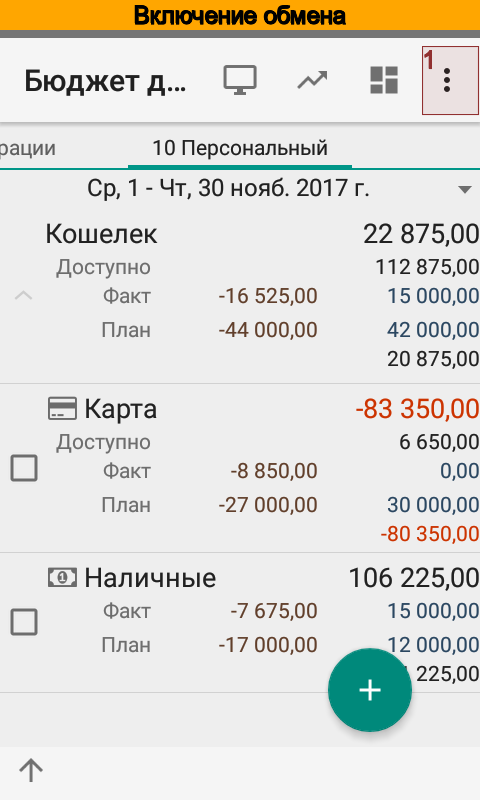
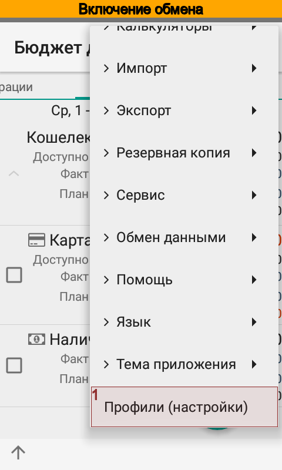
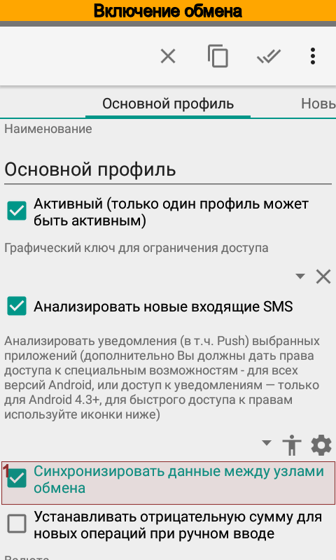

Теперь все изменения, которые делает Алиса отправляются Бобу и наоборот. Приложение синхронизирует изменения
автоматически примерно один раз в пять минут при наличии Wi-Fi или мобильного интернета. Функция синхронизации
автоматически отключается, если нет интернет-соединения или во время сна устройства. Благодаря этому
экономится трафик и электроэнергия аккумулятора.

Вот точный алгоритм запуска обмена:

#. После запуска обмена программа проверяет включен экран телефона или нет.

   #. Если экран включен, то следующее время срабатывания - через 5 мин. от текущего.
   #. Если экран выключен, то следующее время срабатывания - через 60 мин. от текущего.
   #. Оба будильника не имеют права будить телефон.

#. При открытии главного экрана программы выполняется проверка на следующее время срабатывания будильника.

   #. Если следующее время срабатывания находится в пределах 10 мин. от текущего, то ничего не происходит.
   #. Если следующее время срабатывания находится в пределах более 10 мин. от текущего, то запускается обмен в фоновом режиме и далее программа определяет следующее время срабатывания по п. 1

#. Если сети нет, то обмен отключается полностью до следующего появления сети.

При необходимости всегда можно вызвать синхронизацию вручную.

Как работает обмен данными
--------------------------

Приложение |бб| ведет журнал изменений справочников и операций. Каждому узлу обмена отправляются изменения,
которые произошли либо с момента получения предыдущего пакета изменений, либо с момента создания узла.
Важна последовательность обмена: Алиса отправляет сообщение Бобу, Боб - Алисе и т.д. Если узел обмена Алисы не
получит ответ Боба, то не будет отправлять следующий пакет изменений до тех пор, пока не придет ответ.

Синхронизация всех элементов справочников выполняется в несколько этапов:

#. синхронизация по уникальному идентификатору;
#. синхронизация по ключевым фразам или коду;
#. синхронизация по наименованию.

Каждый следующий шаг синхронизации выполняется в случае, если предыдущий закончился неудачей. Если элемент
не удалось найти, то программа создает новый, используя при этом значения по умолчанию, указанные в настройке узла.

Синхронизация операций выполняется только по уникальному идентификатору.

Расширенная настройка
---------------------

Алиса и Боб могут ограничить объем передаваемой информации. Есть два варианта задания ограничений:

#. разрешенная область данных;
#. запрещенная область данных.

Области задаются в справочнике |meta_dir_scopes|. Можно указать любую комбинацию счетов, статей, плательщиков и получателей,
проектов и персон.

В случае, если один и тот же элемент справочника одновременно попадает в разрешенную и запрещенную область, то более
высокий приоритет имеет запрещенная область.

На основании областей данных формируется список операций, постоянных операций и справочников для передачи узлу обмена.

Алиса и Боб могут ограничить объем принимаемой информации. Можно полностью отказаться принимать новые, измененные или удаленные объекты.
Или можно конкретизировать какой тип объектов не принимать в случае создания, изменения или удаления.

Настройка передачи данных
-------------------------

Для повышения безопасности передачи данных следует указать пароль, которым будут зашифрованы сообщения между узлами обмена. Пароль Алисы должен совпадать с паролем Боба.

Также Алисе и Бобу следует указать какой вид коммуникаций использовать для обмена сообщениями: Wi-Fi и/или мобильный интернет.

Значения по умолчанию
---------------------

Справочники на устройствах Алисы и Боба могут не совпадать между собой. Например, Боб уже давно
ведет финансовый учет, а Алиса только что установила приложение. Боб может создать операцию и указать в ней, например,
проект, которого нет в узле обмена Алисы. При поступлении сообщения Боба, приложение на устройстве Алисы
создаст операцию, однако не сможет найти указанный Бобом проект. В этом случае приложение будет использовать
значение проекта по умолчанию, которое Алиса задала для узла обмена Боба.

Перенос данных на новый телефон с сохранением настроек обмена
-------------------------------------------------------------

В случае работающего обмена, переход на новый телефон следует выполнять в порядке:

#. На старом телефоне в настройках выключить синхронизацию.
#. Сделать резервную копию.
#. Восстановить резервную копию на новом телефоне.
#. Включить синхронизацию на новом телефоне.
