.. include:: termins.rst
.. _chapter_transactions:

Финансовые операции
===================

Введение
--------

Любые изменения денежных средств учитываются при помощи операций. Ввод начальных остатков,
изменение кредитного лимита, списание или зачисление средств, снятие наличных в банкомате или
что-то другое --- все это отражается при помощи операций. Такой
подход является наиболее гибким и позволяет хранить историю всех движений.

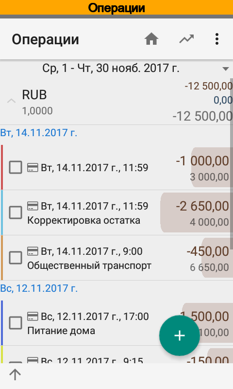
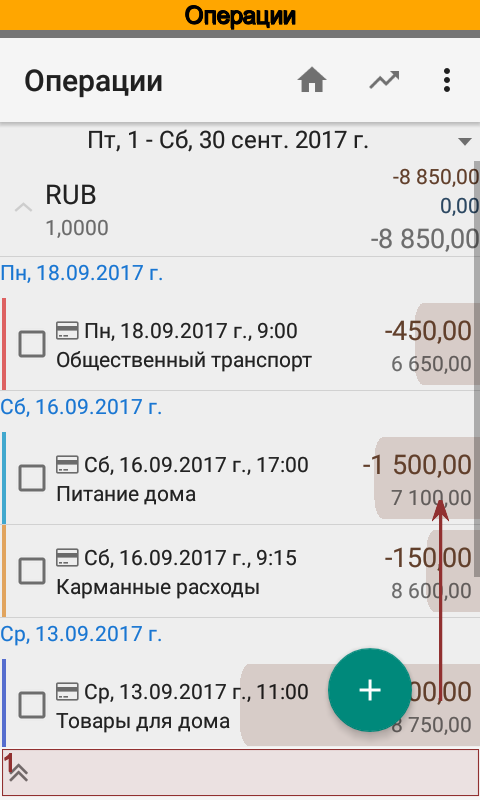
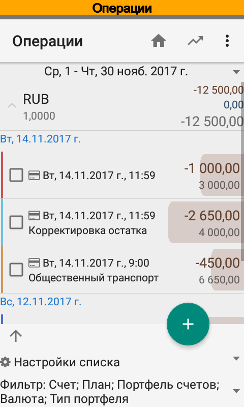

В список операций можно использовать фильтр, который находится в подвале. Также доступен быстрый выбор периода.

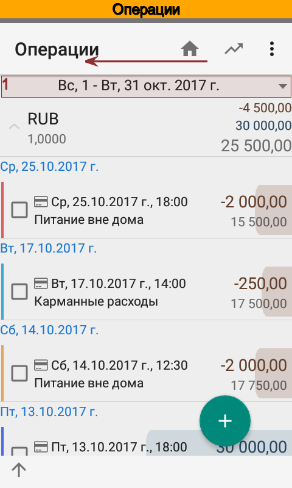
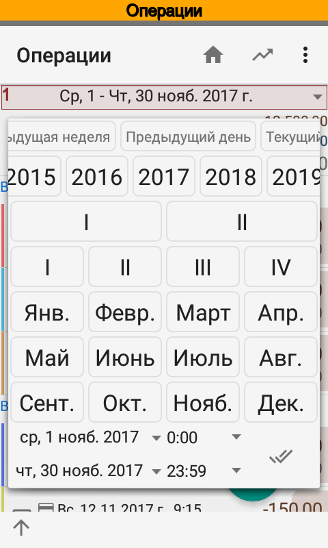
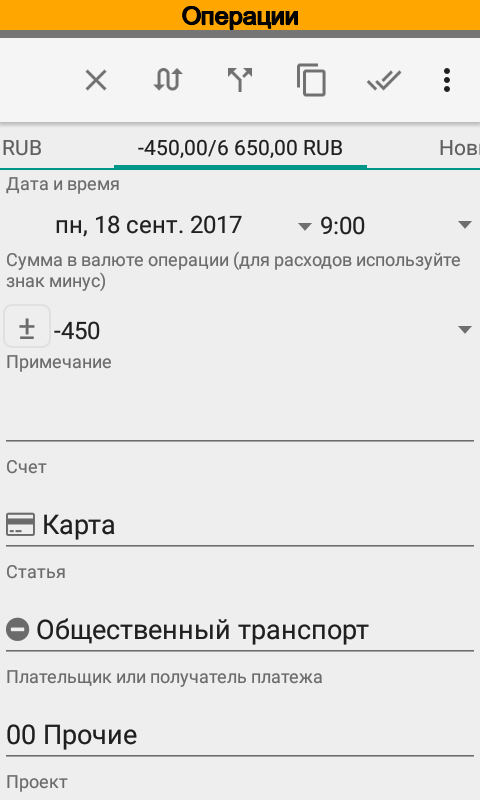

Операция может быть доходной или расходной. Специального признака для вида операции нет, достаточно указать
положительную или отрицательную сумму. Если операция является переводом, то в ней необходимо выбрать статью
с признаком :dfn:`Исключаемая из портфеля`. Сразу после установки приложение содержит статью :dfn:`Перевод в рамках
портфеля`, которую можно использовать при переводах.

Если операция выполнена в валюте, то следует указать валюту и курс валюты операции. Этот курс может отличаться
от курса валюты в справочнике валют. Если операция создается в результате импорта SMS или push-уведомлений, то
курс и валюта определяются автоматически.

Для подробного финансового учета следует правильно указывать статьи, проекты, плательщиков, получателей и персон.

Сплиты
------

Любую операцию можно разбить на несколько, такая операция называется :term:`сплит`. Использовать сплиты удобно, например,
для классификации покупок в супермаркете, когда часть затрат, предположим, ушла на питание дома, часть --- на
хозяйственные товары. Конечно, это далеко не единственный пример использования сплитов.

При редактировании сумма первой части сплита автоматически пересчитывается с учетом новых частей так, чтобы
общая сумма операции оставалась неизменной. Для удаления части сплита, достаточно указать сумму равную 0.

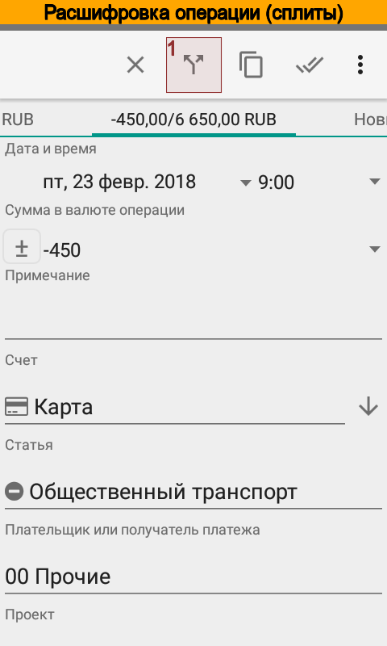
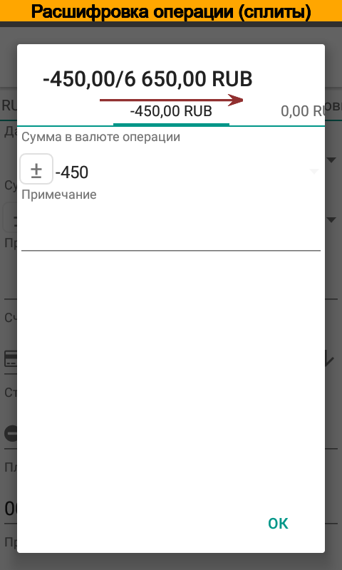
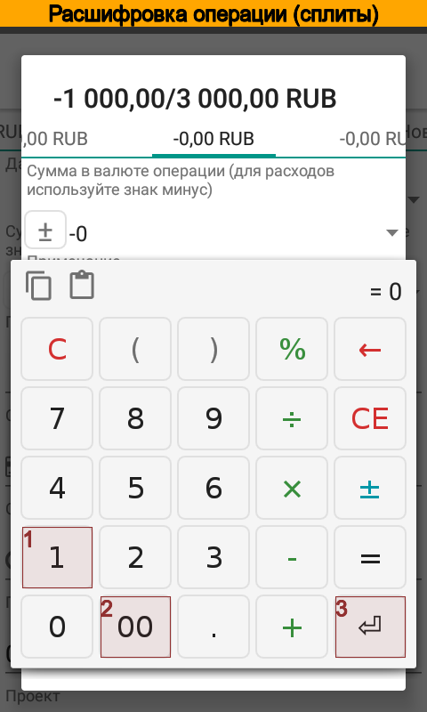
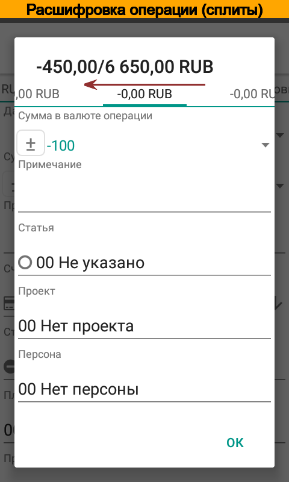
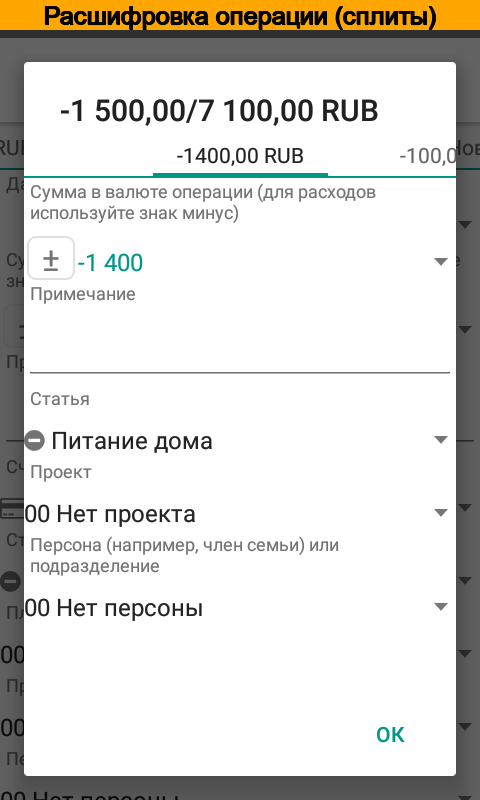

Планируемые операции
--------------------

Операции могут быть фактическими или планируемыми. Планируемая операция отмечается флажком План. Такие операции
учитываются в планируемом движении денежных средств до того момента пока не перестанут быть актуальными.
Актуальность определяется по дате и времени операции. Планировать можно любые операции: расходы, доходы,
возврат долгов, накопления и др. В дальнейшем можно сравнить фактические и планируемые операции при помощи отчетов.

.. image:: /images/transactionplan-010-transaction-set-plan.png
  :width: 25%

Ручные переводы
---------------

Переводы отражаются в приложении двумя операциями. В карточки операции предусмотрен быстрый и удобный способ
создания перевода вручную. Чтобы создать новый перевод:

#. Создайте операцию, укажите сумму.
#. В панели инструментов выберите Создать перевод.
#. Откроется карточка второй операций, в ней уже будет установлена сумма с противоположным знаком.
#. Укажите счет-получатель. После выбора счета, приложение автоматически установит комментарий и статью.
#. При необходимости отредактируйте остальные реквизиты операции.
#. Сохраните операцию.
#. Приложение автоматически обновит комментарий и статью в исходной операции.
#. Сохраните исходную операцию.
#. Приложение автоматически обновит главный экран, сумма переводов отразится в соответствующей строке.

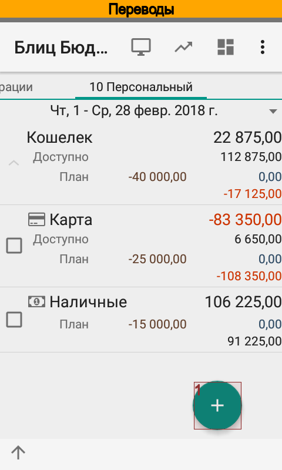
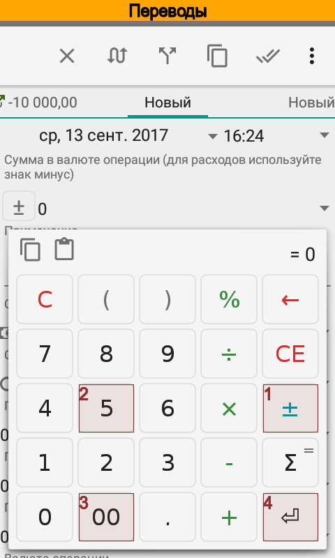
.. image:: images/transactionstransfer-030-transaction-select-transfer.png
  :width: 25%
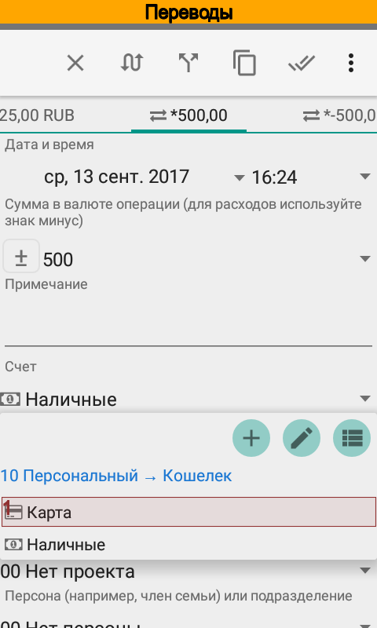
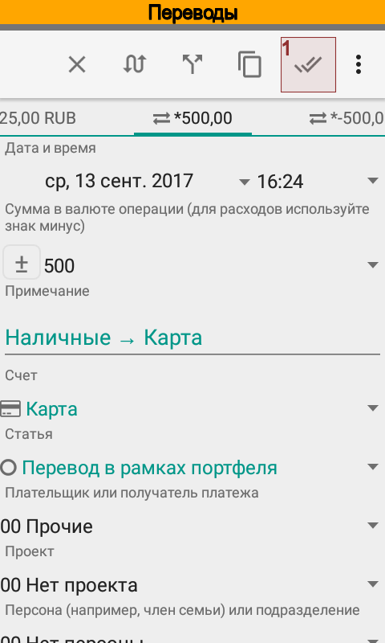
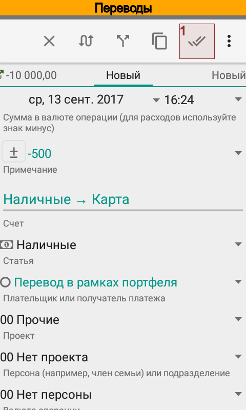
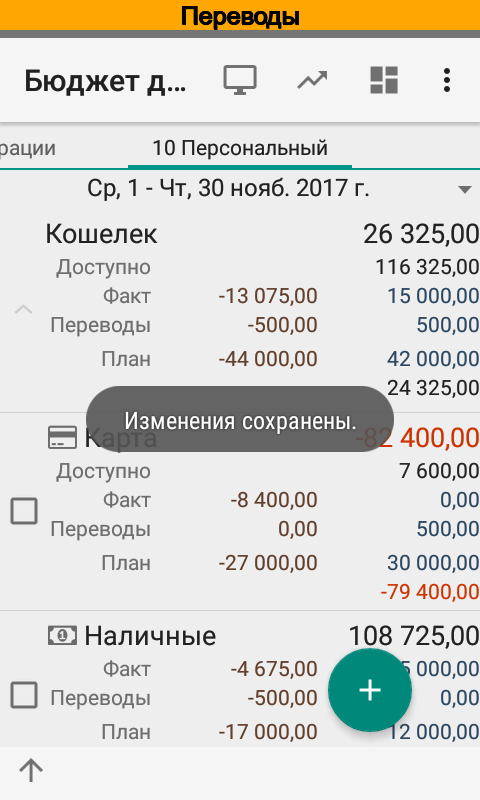

В настоящий момент переводы сохраняются в виде двух не связанных между с собой операций. Не забывайте отредактировать
обе операции при необходимости.

Постоянные операции
-------------------

Многие операции могут повторяться с некоторой периодичностью. Такие операции называются постоянными. Обычно постоянные
операции используют при планировании, однако такие операции могут быть также и фактическими.

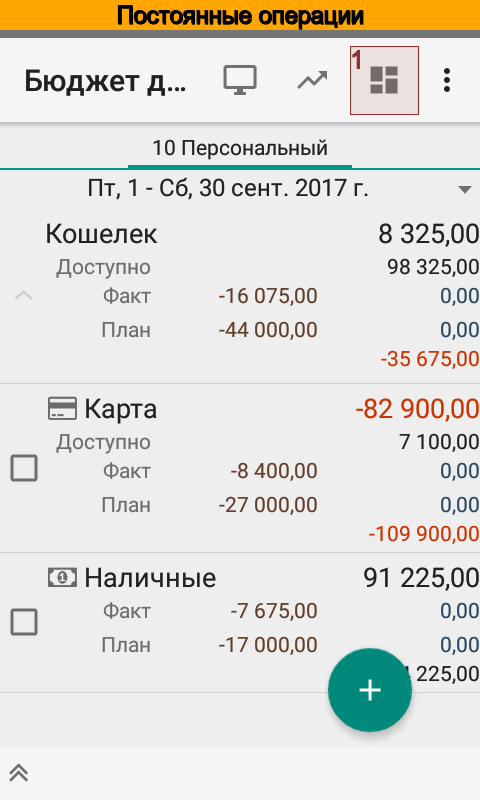
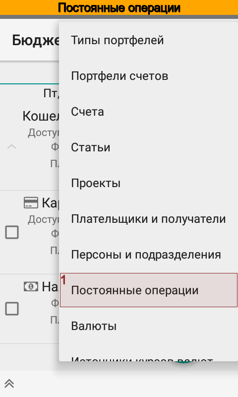
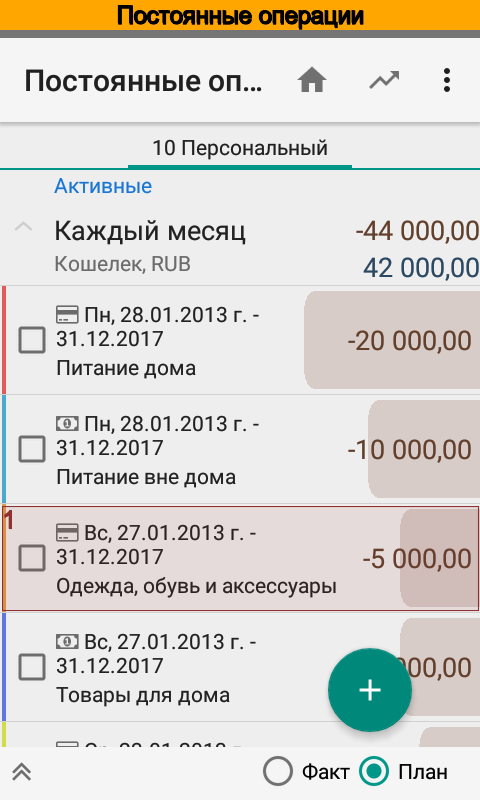
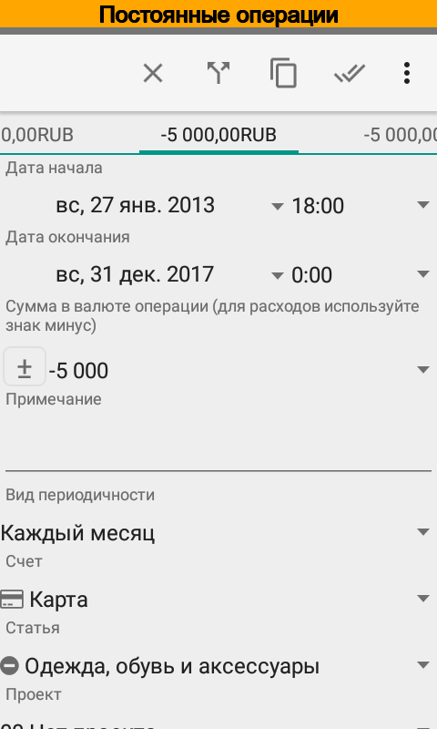
